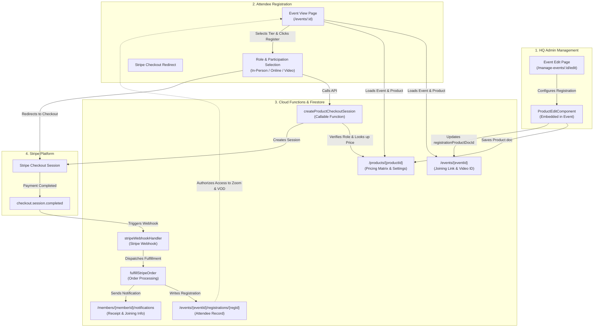

# Event Online Registration & HQ Product Architecture

This document outlines the architecture, data models, security rules, Cloud Functions, and user flows for **Online Registration with HQ** for classes, seminars, and workshops in ILC Members Manager.

---

## 1. Overview & Goals

1. **Centralized HQ Event Registrations**:
   - Allows Headquarters administrators to enable paid or structured online registration directly on any event via Stripe.
   - Replaces manual or external signups with a unified, first-party payment and registration workflow.

2. **1:1 Event-to-Product Binding**:
   - Each event with online registration is paired 1:1 with a Firestore `Product` document (`eventDocId === event.docId` and `event.registrationProductDocId === product.docId`).
   - Managed entirely within the event editor under **"Online Registration with HQ (optional, Admin only)"**.
   - If online registration is removed by an admin, the associated product is safely deleted.

3. **Flexible Role & Participation Pricing Matrix**:
   - **Role Hierarchy**: "Anyone / Public" $\ge$ "Members" $\ge$ "Instructors".
   - **Participation Forms**: In-Person, Online (Zoom), or Video-Only.
   - **Video Add-on**: Optional video recording package bundled with live attendance.
   - Default is a single base price, with optional special discounted prices for Members and Instructors.

4. **Automated Fulfillment & Entitlements**:
   - Secure Stripe Checkout session creation with server-side price resolution and role verification.
   - Automatic creation of `/events/{eventId}/registrations/{regId}` on payment completion.
   - Instant revealing of private **Online Joining Links** (Zoom) to verified attendees.
   - Automatic **Video on Demand (VOD)** streaming entitlement provisioning when event recordings are linked or uploaded.

---

## 2. System Architecture



---

## 3. Data Models

Defined in [`functions/src/data-model.ts`](../functions/src/data-model.ts):

### 3.1 `Product` (Firestore `/products/{productId}`)

Represents the purchasable HQ registration product for an event:

```typescript
export type Product = {
  docId: string;                 // Auto-generated Firestore ID
  title: string;                 // Product title (defaults to Event title)
  description: string;           // Plain text summary
  descriptionMarkdown?: string;  // Detailed markdown overview
  eventDocId: string;            // Linked IlcEvent ID (1:1 relationship)
  currency: string;              // ISO currency code (e.g., 'usd', 'eur')
  stripeProductId?: string;      // Optional linked Stripe Product ID

  // Role Access Control
  allowNonMembers: boolean;      // Anyone / Public can register
  allowMembers: boolean;         // Active members can register
  allowInstructors: boolean;     // Certified instructors can register

  // Participation Forms
  allowInPerson: boolean;        // In-person attendance allowed
  allowOnline: boolean;          // Live online attendance allowed
  allowVideoOnly: boolean;       // Video recording only allowed

  // Add-ons
  allowIncludeVideoOption: boolean; // Option to bundle video with live attendance

  // Pricing Matrix
  tiers: Record<string, PricingTier>; // Keyed by getPricingTierKey(role, attendance, includeVideo)

  createdAt?: string;            // ISO timestamp
  updatedAt?: string;            // ISO timestamp
};

export type PricingTier = {
  enabled: boolean;
  price: number;                 // Price in major units (e.g. 50.00)
};
```

#### Tier Key Format
Pricing tiers are stored in `tiers` using normalized keys generated by `getPricingTierKey`:
- In-Person / Online: `${role}_${attendance}_${includeVideo ? 'video' : 'novideo'}` (e.g. `member_in_person_novideo`, `non_member_online_video`)
- Video-Only: `${role}_video_only` (e.g. `instructor_video_only`)

### 3.2 `EventRegistration` (Firestore `/events/{eventId}/registrations/{registrationId}`)

Created upon successful Stripe payment fulfillment:

```typescript
export type EventRegistration = {
  docId: string;                 // Registration document ID
  eventId: string;               // Target event ID
  productDocId: string;          // Source product ID
  stripeSessionId: string;       // Stripe Checkout Session ID
  memberDocId?: string;          // Member ID if registered while signed in
  customerEmail: string;         // Attendee email
  customerName: string;          // Attendee display name
  role: AttendeeRole;            // 'non_member' | 'member' | 'instructor'
  attendance: AttendanceType;    // 'in_person' | 'online' | 'video_only'
  includeVideo: boolean;         // True if recording package was bundled
  amountTotal: number;           // Total amount paid (in major units)
  currency: string;              // ISO currency
  status: 'pending' | 'completed' | 'cancelled';
  createdAt: string;             // ISO timestamp
  updatedAt: string;             // ISO timestamp
};
```

### 3.3 `IlcEvent` Registration Fields (Firestore `/events/{eventId}`)

Key fields supporting online registration and digital assets:

| Field | Type | Description |
|---|---|---|
| `registrationProductDocId` | `string` | ID of the linked `Product` document. If non-empty, online registration is enabled. |
| `onlineJoiningLink` | `string` | Private Zoom/Google Meet URL. Visible only to registered attendees and organizers. |
| `videoRecording` | `string` | ID of the linked Video on Demand asset (`/videos/{id}`) or external recording URL. |
| `ownerDocId` | `string` | Member doc ID of the event host. |
| `managerDocIds` | `string[]` | List of member doc IDs authorized to manage the event and view rosters. |

---

## 4. Security & Permissions Architecture

### 4.1 Firestore Security Rules (`firestore.rules`)

```
/products/{productId}
  - read: isPublic()
  - create / update / delete: isAdmin()

/events/{eventId}/registrations/{registrationId}
  - read: isAdmin() ||
          isEventOwnerOrManager(eventId) ||
          (isAuthenticated() && (resource.data.memberDocId == getMemberDocId() ||
                                 resource.data.customerEmail == request.auth.token.email))
  - create / update / delete: false (Cloud Functions Admin SDK only)
```

- **Products**: Anyone can read product details to view ticket prices and registration options on public event pages. Only HQ Admins can create, modify, or delete products.
- **Registrations**: Fully tamper-proof. No client can write to registrations directly. Reads are strictly gated to admins, event managers, and the individual registered attendee.

### 4.2 Cloud Function Role Verification (`createProductCheckoutSession`)

Located in [`functions/src/stripe-product-checkout.ts`](../functions/src/stripe-product-checkout.ts):

1. **Unauthenticated Checkouts**:
   - Can only register as `non_member`.
   - Blocked if the product does not have `allowNonMembers: true`.
2. **Member Verification**:
   - Claims for `member` tier require an active membership:
     `hasActiveMembership(member.membershipExpires) === true`
3. **Instructor Verification**:
   - Claims for `instructor` tier require an active instructor license:
     `isInstructorLicensed(member) === true`
4. **Role Hierarchy Enforcement**:
   - A certified instructor is always entitled to member or non-member rates if their role is allowed.
   - An active member is always entitled to non-member rates if non-members are allowed.
5. **Server-Side Price Authority**:
   - The client **never** passes the price. The server looks up `product.tiers[tierKey]` directly from Firestore, applying fallback to lower hierarchy tiers if dedicated discount tiers are not configured.

---

## 5. End-to-End User Workflows

### 5.1 Admin: Enabling Online Registration on an Event

1. Admin navigates to `/manage-events/:id/edit`.
2. Scrolls to **"Online Registration with HQ (optional, Admin only)"**.
3. If no registration product exists:
   - Clicks **"Create Online Registration with HQ"**.
   - An inline `ProductEditComponent` appears without redirecting or scrolling the page.
4. Admin configures:
   - **Who can register?**: "Anyone", "Members", or "Instructors" (role exclusivity).
   - **Forms of Participation**: In-Person, Online, or Video Only.
   - **Video Recording**: Option to bundle the recording.
   - **Pricing Matrix**: Configures the base price, and optionally adds custom member or instructor prices.
   - **Online Joining Link & Video Recording**: Configured directly in the section.
5. Clicks **"Save Registration Details"**:
   - Creates/updates the `/products/{productId}` document.
   - Links `event.registrationProductDocId = productId`.
   - Event listing displays the `"HQ Registration"` badge chip.

### 5.2 Attendee: Selecting Options & Paying

1. Attendee opens `/events/:eventId`.
2. The registration card displays available roles, live vs. online participation, and video bundle toggles.
3. User selects their participation preferences:
   - Dynamic price badge updates according to their selected options and authenticated status.
4. User clicks **"Register & Pay with Stripe"**:
   - Calls `createProductCheckoutSession({ productId, attendance, includeVideo })`.
   - Client is redirected to Stripe Checkout.
5. Attendee completes payment on Stripe.

### 5.3 Webhook Fulfillment & Digital Asset Delivery

1. Stripe fires `checkout.session.completed` to `stripeWebhookHandler`.
2. The fulfillment engine:
   - Records the transaction in `/orders/{orderId}`.
   - Writes the attendee record to `/events/{eventId}/registrations/{regId}`.
   - Sends a confirmation notification to the member.
3. Upon returning to `/events/:eventId`:
   - The user sees their **"Registered"** badge.
   - The private **Online Joining Link** (Zoom) is revealed with a one-click join button.
   - If a video recording was purchased and is linked to the event, the attendee is automatically granted watch access in the VOD library.

### 5.4 Admin: Removing Registration

1. Admin clicks **"Remove Online Registration"** on the event edit page.
2. Confirm dialog verifies removal.
3. The event's `registrationProductDocId` is cleared, and the orphaned `/products/{productId}` document is automatically deleted.
