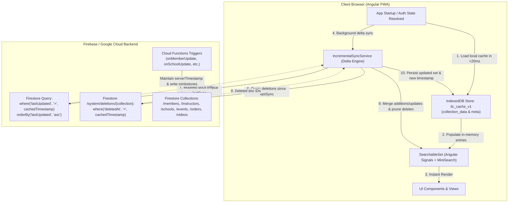

# Incremental Collection Sync & Local Persistence (Delta Sync) Architecture & Reference

This document describes the architectural design, storage engine, Firestore timestamp standardization, delta query protocols, deletion reconciliation, and UI management for **Incremental Collection Sync & Local Persistence** across the ILC Members Manager.

---

## 1. Executive Summary

### Problem
Previously, client services (such as [`DataManagerService`](../src/app/data-manager.service.ts) and [`FindInstructorsService`](../src/app/find-instructors.service.ts)) subscribed to entire Firestore collections (`/members`, `/instructors`, `/schools`, `/events`, `/orders`, `/videos`) on every browser session and page reload. This led to:
- Over 13.7M document reads per month.
- Slow initial page loads on mobile or poor connections.
- Complete inability to use the application offline.

### Solution: Delta Sync + IndexedDB
With the delta sync architecture:
1. **Instant Offline Startup (<20ms)**: On app launch or route navigation, cached records are loaded instantly from browser **IndexedDB** (`ilc_cache_v1`), populating in-memory Angular Signals and [`SearchableSet`](../src/app/searchable-set.ts) MiniSearch indexes immediately (0 network reads).
2. **Bandwidth & Read Optimization (>95% Read Reduction)**: Subsequent background sync queries only documents modified since the last recorded sync (`where('lastUpdated', '>', lastSyncTimestamp)`). If no records changed, the sync costs 0 reads.
3. **Tombstone Reconciliation**: Deleted records are tracked in `/system/deletions/{collectionName}` so deletions are cleanly pruned from local IndexedDB caches.
4. **Role & Multi-User Isolation**: User-specific collections (such as admin member directories or school rosters) are keyed by UID or school ID, ensuring secure scoping.

---

## 2. System Architecture & Data Flow



---

## 3. Storage Layer Design: IndexedDB (`ilc_cache_v1`)

The storage engine uses browser **IndexedDB** via [`IdbStorageService`](../src/app/idb-storage.service.ts), avoiding the 5MB limits and UI-blocking JSON serialization of `localStorage`.

- **Database Name**: `ilc_cache_v1`
- **Object Stores**:
  - `collection_data`:
    - Key: `cacheKey` (e.g. `members_admin_${uid}`, `public_instructors`, `schools`, `admin_orders`, `public_videos`, `admin_videos`, `public_events`)
    - Value: `{ cacheKey: string, lastSyncTimestamp: string, count: number, entries: T[] }`
  - `meta`:
    - Key: `key` (e.g. `schema_version`, `last_cleanup`)
    - Value: `{ key: string, value: unknown }`

---

## 4. Collection Sync Configuration Matrix

| Collection | Cache Key | Scoping / Access Level | Query Constraints / Filters | ID Field |
| :--- | :--- | :--- | :--- | :--- |
| `/instructors` | `public_instructors` | Public (all users & visitors) | None | `instructorId` |
| `/schools` | `schools` | Public (all users & visitors) | None | `schoolId` |
| `/events` | `public_events` | Public (all users & visitors) | None | `docId` |
| `/products` | `products` | Public (all users & visitors) | None | `docId` |
| `/videos` (public) | `public_videos` | Public / Standard Members | `where('isPublished', '==', true)` | `id` |
| `/videos` (admin) | `admin_videos` | HQ Admin only | None (all videos including unpublished) | `id` |
| `/orders` | `admin_orders` | HQ Admin only | None | `docId` |
| `/members` (admin) | `members_admin_${uid}` | HQ Admin only | None (all members) | `docId` |
| `/schools/{id}/members` | `school_members_${schoolDocId}` | School Managers | Scoped to school | `docId` |
| `/instructors/{id}/members` | `my_students_${memberDocId}` | Instructors | Scoped to instructor's students | `docId` |

---

## 5. Deletion & Tombstone Reconciliation

### The Problem
If a document is deleted while a client is offline or between sessions, a delta query on `lastUpdated > timestamp` will never return the deleted record. Without tombstone tracking, the record would remain in the local cache indefinitely.

### Tombstone Architecture
1. **Writing Tombstones**:
   When documents are deleted (via Cloud Functions like [`deleteVideoFromCatalog`](../functions/src/vod/delete-video.ts) or Firestore triggers like `onMemberDeleted`), a tombstone is written to:
   `/system/deletions/{collectionName}/{docId}`:
   ```typescript
   {
     docId: string;
     deletedAt: Timestamp;
   }
   ```
2. **Delta Deletion Fetch**:
   [`IncrementalSyncService.getRecentTombstones`](../src/app/incremental-sync.service.ts) queries `/system/deletions/{collectionName}` for tombstones where `deletedAt > lastSyncTimestamp`.
3. **Cache Pruning**:
   Any IDs found in the tombstone query are removed from the in-memory [`SearchableSet`](../src/app/searchable-set.ts) and deleted from the persistent IndexedDB record set.
4. **Security Rules**:
   [`firestore.rules`](../firestore.rules) allows reading deletion tombstones for public collections (`instructors`, `schools`, `events`, `videos`, `products`) to all users, and restricted collections to admins.

---

## 6. SyncedCollection Abstraction Layer

To prevent low-level caching leaks (such as manually calling `persistEventLocally`, `persistSchoolLocally`, `upsertCachedEntry`, or `forceRefresh` in UI components or services), the [`SyncedCollection<ID, T>`](../src/app/synced-collection.ts) wrapper inherits directly from [`SearchableSet<ID, T>`](../src/app/searchable-set.ts) and encapsulates:
1. **In-Memory Reactive State**: Extends [`SearchableSet<ID, T>`](../src/app/searchable-set.ts), providing Angular Signals (`entries`, `loading`, `loaded`, `error`, `entriesMap`, `uniqueEntries`, `duplicateEntries`, `missingIdEntries`) and client-side fuzzy search via MiniSearch with drop-in compatibility for all UI selectors and autocomplete components.
2. **Persistent Local Cache**: Automatic local storage in IndexedDB (`ilc_cache_v1`) via [`IdbStorageService`](../src/app/idb-storage.service.ts).
3. **Atomic 3-Way Synchronization**:
   - `save(item: T)`: Generates/preserves ID, writes to Firestore with `serverTimestamp()`, updates in-memory signal state, and persists to IndexedDB.
   - `update(id: string, updates: Partial<T>)`: Updates Firestore with `serverTimestamp()`, merges updates into in-memory signals, and persists to IndexedDB.
   - `delete(id: string)`: Deletes from Firestore, writes deletion tombstone to `/system/deletions/{collection}/{id}`, deletes from in-memory signals, and removes from IndexedDB.
   - `getById(id: string)`: Checks in-memory cache first (0 network cost); on cache miss, fetches from Firestore, self-heals local memory and IndexedDB, and returns the result.
   - `loadCache(options?)`: Immediately loads cached bundle from IndexedDB into memory.
   - `sync(options?)`: Delta syncs modified records and prunes tombstones with support for dynamic cache keys, collection paths, query constraints, and client-side filters.
4. **Offline Resilience**: When `networkState.isOffline()` is true, operations are enqueued to [`ActionQueueService`](../src/app/action-queue.service.ts) and applied optimistically to memory and IndexedDB.

All collections using IndexedDB delta caching are backed by `SyncedCollection`:
- `dataService.events`: `SyncedCollection<'docId', IlcEvent>`
- `dataService.products`: `SyncedCollection<'docId', Product>`
- `dataService.schools`: `SyncedCollection<'schoolId', School>`
- `dataService.orders`: `SyncedCollection<'docId', Order>`
- `dataService.videos`: `SyncedCollection<'docId', VideoItem>`
- `dataService.members`: `SyncedCollection<'docId', Member>`
- `dataService.myStudents`: `SyncedCollection<'docId', Member>`
- `findInstructorsService.instructors`: `SyncedCollection<'instructorId', InstructorPublicData>`

---

## 7. Firestore Timestamp Standardization

All synced collections enforce native Firestore `Timestamp` objects for the `lastUpdated` field:
- **Write Operations**: All client services and Cloud Functions must use `serverTimestamp()` or `admin.firestore.FieldValue.serverTimestamp()`. ISO date strings (`new Date().toISOString()`) must not be written to Firestore `lastUpdated` fields.
- **Read Normalization**: When reading documents, `normalizeLastUpdated()` converts native Firestore `Timestamp` or legacy ISO strings into a standard ISO UTC string for Angular components and client models.

---

## 8. Optimistic Caching Updates

To keep the UI responsive and prevent UI rollback before delta sync fires:
- When a document is created or updated locally, the `SyncedCollection` immediately:
  1. Updates the in-memory [`SearchableSet`](../src/app/searchable-set.ts).
  2. Upserts or deletes the record in the persistent IndexedDB cache using [`IdbStorageService`](../src/app/idb-storage.service.ts).

---

## 9. Management UI & Diagnostics

The [Local Cache Settings Component](../src/app/settings/local-cache/local-cache.ts) (`/settings/local-cache`) provides administrative inspection and management:
- **Storage Metrics**: Total entries cached, last sync date/time, and estimated storage consumption.
- **Per-Collection Sync**: Force re-sync or full refresh of any individual collection (`admin_orders`, `public_videos`, `admin_videos`, `public_events`, `products`, `public_instructors`, `schools`, `members_admin_*`).
- **Cache Eviction**: Clear individual collections or all local caches upon confirmation.
