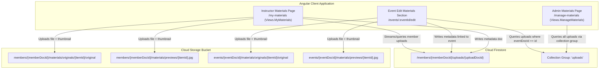

# Materials Management & Uploads Architecture Plan

This document outlines the architecture, data models, security rules, and user interfaces for the **Materials Management** system in ILC Members Manager.

---

## 1. Overview & Goals

- **Instructor Materials Page (`/my-materials`)**: Every licensed instructor has a dedicated dashboard to upload, preview, organize, and search their uploaded materials (videos, images, event recordings, seminar photos).
- **Admin Materials Page (`/manage-materials`)**: Headquarters administrators have a global management console to browse, filter, search, edit metadata, and manage all uploads across all instructors using a Firestore collection group query.
- **Unified Firestore Metadata Subcollection (`/members/{memberDocId}/uploads/{uploadDocId}`)**: Replaces storage-only listings with indexed Firestore metadata records containing organizing dimensions: **Date**, **Location**, **Linked Event**, **Media Type**, **Tags**, and **Notes**.
- **Updated Event Materials Uploader**: The existing event materials uploader on the Event Edit page (`/events/:id/edit`) will catalog uploaded items into this Firestore metadata subcollection while preserving immediate thumbnail generation and event linking.

---

## 2. System Architecture



---

## 3. Data Model & Types

Defined in [`functions/src/data-model.ts`](../functions/src/data-model.ts):

```typescript
export type UploadItemSource = "direct" | "event";

export type UploadItem = {
  docId: string; // Firestore doc ID (auto-generated)
  memberDocId: string; // Member who uploaded the file
  memberId: string; // Cached human-readable member ID (e.g. 'US402')
  memberName: string; // Cached member display name
  instructorId: string; // Cached instructor ID (if applicable, e.g. '1')

  name: string; // Display / file name
  contentType: string; // MIME type (e.g., 'video/mp4', 'image/jpeg')
  size: number; // File size in bytes
  url: string; // Storage download URL (original file)
  previewUrl: string; // Storage download URL (JPEG preview thumbnail)
  storagePath: string; // Cloud storage path of original
  previewStoragePath: string; // Cloud storage path of preview thumbnail

  // Organizing principles
  date: string; // YYYY-MM-DD (media / recording date)
  location: string; // Free-text location / city / venue
  eventDocId: string; // Linked IlcEvent docId (or '' if none)
  eventTitle: string; // Cached event title for display & search
  notes: string; // Description / notes
  tags: string[]; // Searchable tags
  source: UploadItemSource; // 'direct' (materials page) vs 'event' (event edit page)

  createdAt: string; // ISO date string
  lastUpdated: string; // ISO date string
};

export function initUploadItem(): UploadItem {
  return {
    docId: "",
    memberDocId: "",
    memberId: "",
    memberName: "",
    instructorId: "",
    name: "",
    contentType: "",
    size: 0,
    url: "",
    previewUrl: "",
    storagePath: "",
    previewStoragePath: "",
    date: "",
    location: "",
    eventDocId: "",
    eventTitle: "",
    notes: "",
    tags: [],
    source: "direct",
    createdAt: "",
    lastUpdated: "",
  };
}

export function firestoreDocToUploadItem(doc: GenericFirestoreDoc): UploadItem {
  const data = doc.data() as Partial<UploadItem>;
  return {
    ...initUploadItem(),
    ...data,
    docId: doc.id,
    lastUpdated: data.lastUpdated || data.createdAt || new Date().toISOString(),
  };
}
```

---

## 4. Cloud Storage & Firestore Security Rules

### A. Cloud Storage Rules ([`storage.rules`](../storage.rules))

```javascript
// Instructor / member uploaded private materials
match /members/{memberDocId}/materials/{material=**} {
  allow read, write: if isAdmin() || (
    request.auth != null && memberDocId in getUserMemberDocIds()
  );
}

// Event materials (existing rule preserved)
match /events/{eventId}/materials/{material=**} {
  allow read, write: if isAdmin() || (
    request.auth != null && (
      firestore.get(/databases/(default)/documents/events/$(eventId)).data.ownerDocId in getUserMemberDocIds() ||
      getUserMemberDocIds().hasAny(
        firestore.get(/databases/(default)/documents/events/$(eventId)).data.get('managerDocIds', [])
      )
    )
  );
}
```

### B. Firestore Security Rules ([`firestore.rules`](../firestore.rules))

```javascript
match /members/{memberDocId}/uploads/{uploadDocId} {
  function isUploadOwner() {
    return memberDocId in getUserMemberDocIds() ||
           request.auth.token.email in get(/databases/$(database)/documents/members/$(memberDocId)).data.emails;
  }

  function isLinkedEventManager() {
    let eventDocId = resource.data.get('eventDocId', '');
    let eventPath = /databases/$(database)/documents/events/$(eventDocId);
    return eventDocId != '' && exists(eventPath) && (
      get(eventPath).data.ownerDocId in getUserMemberDocIds() ||
      getUserMemberDocIds().hasAny(get(eventPath).data.get('managerDocIds', []))
    );
  }

  // Reads permitted for owner, admins, or managers of the linked event
  allow read: if isAdmin() || isUploadOwner() || isLinkedEventManager();

  // Writes permitted for owner or admins
  allow write: if isAdmin() || isUploadOwner();
}
```

This security rule supports both standard direct reads `/members/{memberDocId}/uploads` and `collectionGroup(db, 'uploads')` queries for admins (and for event managers filtering by `eventDocId`).

---

## 5. UI Features & User Workflows

### A. Instructor Materials Page (`/my-materials`)

1. **Upload Experience**:
   - File & folder selection triggers with drag-and-drop dropzone.
   - Immediate thumbnail generation via `makeThumbnail()` in [`src/app/utils.ts`](../src/app/utils.ts) (supports both videos and images).
   - Batch upload progress bar showing count and current file status.
   - Batch metadata pre-fill: user can optionally set default date, location, or linked event before/during upload.
2. **Organizing & Filtering**:
   - **Search bar**: Instant client-side search across filenames, location, event title, and notes.
   - **Event Filter**: Dropdown of events the instructor is owner/manager of.
   - **Date / Year Filter**: Quick picker for year/month or custom date range.
   - **Media Filter**: All / Videos / Images / Documents.
   - **Sort**: Date (Newest first), Uploaded Date, Name (A–Z).
3. **Card & List Views**:
   - Grid cards with thumbnail, video duration/type badge, date tag, location tag, and linked event chip.
   - Inline or modal editor to modify **Name**, **Date**, **Location**, **Linked Event**, **Tags**, and **Notes**.
   - Direct download / open link.
   - Deletion with confirmation (removes Firestore doc and deletes Cloud Storage original + preview files).

### B. Admin All-Materials Management Page (`/manage-materials`)

1. **Global Collection Group View**:
   - Queries `collectionGroup(db, 'uploads')` with sorting and pagination/real-time streaming.
2. **Admin Filters**:
   - **Instructor / Member Selector**: Autocomplete by instructor or member.
   - **Event Selector**: Autocomplete across all events.
   - **Date Range / Location / Media Type filters**.
   - Global search query across all metadata fields.
3. **Admin Actions**:
   - Edit any material's metadata.
   - Reassign linked event or uploader if needed.
   - Delete any upload file (Firestore + Storage cleanup).

### C. Updated Event Materials Section (`/events/:eventId/edit`)

1. When uploading materials on the event edit page:
   - Saves file to Cloud Storage (`events/{eventDocId}/materials/...`).
   - Automatically writes metadata document to `/members/{currentMemberDocId}/uploads/{uploadDocId}` with:
     - `eventDocId = event.docId`
     - `eventTitle = event.title`
     - `date = event.start.split('T')[0]`
     - `location = event.location`
     - `source = 'event'`
2. Loads event materials via Firestore query (`collectionGroup` where `eventDocId == event.docId`), falling back to listing Storage for any legacy files.
3. Allows editing material date, location, notes, and display name directly in the event editor.

---

## 6. Navigation & Routing Structure

### Routing ([`src/app/app.config.ts`](../src/app/app.config.ts))

- `Views.MyMaterials = 'myMaterials'` → Route `my-materials` (URL params: `q`, `eventId`, `date`, `viewMode`)
- `Views.ManageMaterials = 'manageMaterials'` → Route `manage-materials` (URL params: `q`, `memberId`, `eventId`, `date`)

### Navigation Tree & Breadcrumbs ([`src/app/navigation-tree.ts`](../src/app/navigation-tree.ts))

- `MyMaterials`: Top-level node (`My Materials`), parent is App Root.
- `ManageMaterials`: Top-level node (`Manage Materials`), parent is App Root.

### Navigation Menu ([`src/app/navigation-menu/navigation-menu.component.html`](../src/app/navigation-menu/navigation-menu.component.html))

- **Instructor section**: Add `My Materials` with icon `video_library`.
- **Admin section**: Add `Manage Materials` with icon `perm_media` / `video_library`.

### Dashboard Home Cards ([`src/app/home/home.html`](../src/app/home/home.html))

- **Instructors Grid**: Card for "My Materials" ("Manage and organize your uploaded videos, photos, and event media").
- **Admin Grid**: Card for "Manage Materials" ("Administer all uploaded media and files across all instructors").

---

## 7. Implementation Steps & Verification

```
1. Data Model & Converters
   └── Add UploadItem, initUploadItem(), firestoreDocToUploadItem() in functions/src/data-model.ts
   └── Verify: unit tests for converters

2. Security Rules
   └── Add Storage rules for members/{memberDocId}/materials/** in storage.rules
   └── Add Firestore rules for /members/{memberDocId}/uploads/{uploadDocId} in firestore.rules
   └── Verify: pnpm test:rules test suite additions in tests/firestore.rules.spec.ts

3. DataManagerService Methods
   └── Add getMemberUploads(), getAllUploads(), getEventUploads(), createUploadItem(), updateUploadMetadata(), deleteUploadItem()
   └── Verify: data-manager.service.spec.ts tests

4. Components Implementation
   └── Create MyMaterialsComponent (src/app/my-materials/)
   └── Create ManageMaterialsComponent (src/app/manage-materials/)
   └── Update EventEditComponent (src/app/event-edit/)
   └── Verify: component unit tests with mock data

5. Routing & Navigation Wiring
   └── Update app.config.ts, routing.service.ts, navigation-tree.ts, navigation-menu, and home.html
   └── Verify: navigation links and URL parameter persistence

6. Full Build & Verification
   └── pnpm test
   └── pnpm test:rules
   └── pnpm build
```

---

## 8. Data Migration & Backfill

For existing events that already have files uploaded to Cloud Storage (`events/{eventId}/materials/originals/{itemId}/original`), the migration script [`scripts/backfill-event-materials.ts`](../scripts/backfill-event-materials.ts) scans Storage and creates the corresponding Firestore `UploadItem` records in `/members/{ownerDocId}/uploads/{uploadDocId}`.

### Features
- **Discovery**: Scans Cloud Storage for all event materials and checks corresponding previews.
- **Event & Member Linking**: Resolves event title, date, location, and owner member details.
- **Idempotence**: Skips items that have already been indexed in Firestore.
- **Dry-run mode**: Runs safely by default without making any database writes.

### Usage
```bash
# Dry run: preview discovered files and planned Firestore writes:
pnpm run backfill:event-materials

# Commit: execute the backfill writes:
pnpm run backfill:event-materials --commit

# Target specific project:
pnpm run backfill:event-materials --project=ilc-paris-class-tracker --commit
```

