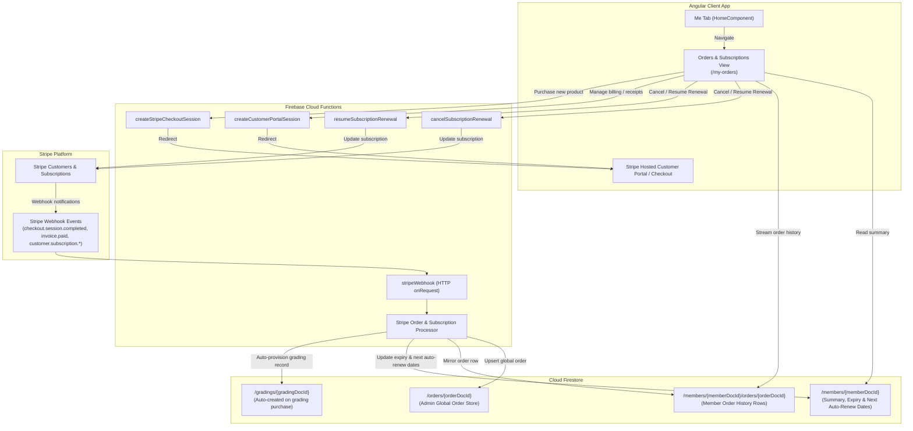
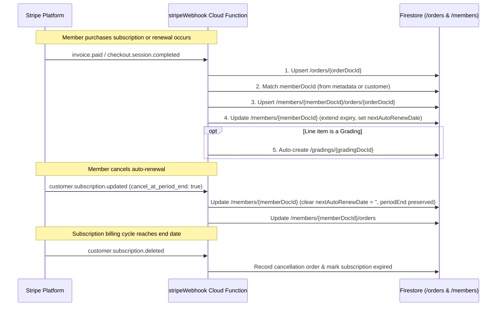

# Orders & Subscriptions Architecture Plan

This document details the architectural plan for implementing the **Orders & Subscriptions** management page on the member-facing portal ("Me" tab), transitioning subscriptions and digital products to **Stripe**, and structuring Firestore data across member documents and subcollections.

---

## 1. Overview & Objectives

### Goals
1. **Member Self-Service Portal**: Provide members with a dedicated dashboard on the "Me" tab (`/my-orders` or `/my-subscriptions`) to:
   - View their active subscriptions (Membership, Instructor License, Class Video Library, and future Video-on-Demand).
   - View renewal statuses and explicit **next auto-renewal dates** (or clear indicators that auto-renewal is off).
   - Cancel subscription auto-renewals with explicit confirmation, keeping access active until the end of the paid period (`cancel_at_period_end: true`).
   - Resume/reactivate auto-renewals prior to period expiration.
   - Access payment methods and official receipts via Stripe Customer Portal.
   - Browse their complete order and renewal history across all platforms (Stripe, Squarespace legacy, Sheets import).
2. **Transition Subscriptions & Digital Products to Stripe**:
   - Memberships (Annual, Senior/Youth, Lifetime).
   - Instructor Licenses (Group Leader, Instructor, Lead Instructor, School License).
   - Gradings (Student Levels 1–11, Application Levels 1–6).
   - Class Video Library (Monthly/Annual recurring).
   - Video on Demand (VOD) rentals / purchases (future extensibility).
3. **Data Model & Firestore Structure**:
   - **Member Document (`/members/{memberDocId}`)**: Contains high-level subscription summaries, next auto-renewal dates (`membershipNextAutoRenewDate`, `instructorLicenseNextAutoRenewDate`, `classVideoLibraryNextAutoRenewDate`), expiry dates, and the member's Stripe Customer ID.
   - **Member Orders Subcollection (`/members/{memberDocId}/orders/{orderDocId}`)**: Contains a chronological row for every order, checkout, renewal invoice, and cancellation, directly linked to or mirrored from `/orders/{orderDocId}`.
4. **Backend Automation & Control Functions**:
   - Cloud Functions to manage Stripe subscriptions (`cancelSubscriptionRenewal`, `resumeSubscriptionRenewal`, `createCustomerPortalSession`).
   - Enhanced Stripe Webhook handling for automated fulfillment, membership/license renewal, and subcollection synchronization.
   - Secure Firestore rules ensuring members can only read their own orders and subscriptions.

---

## 2. System Architecture



---

## 3. Data Model & Schema Design

### 3.1 Member Document Extensions (`/members/{memberDocId}`)

To allow fast and synchronous rendering across the app (including the "Me" tab, status badges, and route guards), the primary `Member` record in [`functions/src/data-model.ts`](../functions/src/data-model.ts) is extended with Stripe customer references and **date-based auto-renewal fields**:

```typescript
export interface MemberSubscriptionItem {
  subscriptionId: string; // Stripe sub_... ID
  type: 'membership' | 'instructor_license' | 'video_library' | 'vod';
  status: 'active' | 'trialing' | 'past_due' | 'canceled' | 'unpaid' | 'incomplete';
  planName: string; // e.g. "Annual Membership", "Class Video Library"
  amount: number; // in currency minor units (cents)
  currency: string; // e.g. 'usd'
  interval: 'month' | 'year';
  currentPeriodStart: string; // YYYY-MM-DD
  currentPeriodEnd: string; // YYYY-MM-DD (when current access expires)
  
  // Date when the next automatic charge will occur.
  // Set to YYYY-MM-DD when auto-renew is active; set to empty string '' when auto-renew is cancelled.
  nextAutoRenewDate: string; // YYYY-MM-DD or ''
  
  cancelAtPeriodEnd: boolean; // true if renewal was cancelled
  canceledAt?: string; // YYYY-MM-DD or ISO string if cancelled
  stripePriceId?: string;
  stripeProductId?: string;
}

export type Member = {
  // Existing fields...
  docId: string;
  memberId: string;
  name: string;
  emails: string[];
  
  // Stripe Customer Linkage
  stripeCustomerId: string; // e.g. 'cus_...' or ''

  // Membership & Renewals
  membershipType: MembershipType;
  firstMembershipStarted: string;
  lastRenewalDate: string;
  currentMembershipExpires: string; // YYYY-MM-DD (when access ends)
  
  // Next automatic renewal charge date (YYYY-MM-DD).
  // Matches current period end when active; set to '' when renewal is cancelled / off.
  membershipNextAutoRenewDate: string; // YYYY-MM-DD or ''
  membershipSubscriptionId: string; // Active Stripe subscription ID or ''

  // Instructor License & Renewals
  instructorId: string;
  instructorLicenseType: InstructorLicenseType;
  instructorLicenseRenewalDate: string;
  instructorLicenseExpires: string; // YYYY-MM-DD (when license ends)
  instructorLicenseNextAutoRenewDate: string; // YYYY-MM-DD or ''
  instructorLicenseSubscriptionId: string; // Active Stripe subscription ID or ''

  // Class Video Library
  classVideoLibrarySubscription: boolean;
  classVideoLibraryLastRenewalDate: string;
  classVideoLibraryExpirationDate: string; // YYYY-MM-DD (when video access ends)
  classVideoLibraryNextAutoRenewDate: string; // YYYY-MM-DD or ''
  classVideoLibrarySubscriptionId: string; // Active Stripe subscription ID or ''

  // Structured Active Subscriptions Map (keyed by subscriptionId or product category)
  subscriptions?: Record<string, MemberSubscriptionItem>;

  // ...other existing fields (tags, gradings, profile info, etc.)
};
```

#### How Expiry and Next Auto-Renew Dates Interact:

| Scenario | `currentMembershipExpires` | `membershipNextAutoRenewDate` | Display on UI |
|---|---|---|---|
| **Active Sub with Auto-Renew** | `2027-05-15` | `2027-05-15` | **"Auto-renews on May 15, 2027"** with `<button>Cancel Auto-Renewal</button>` |
| **Auto-Renew Cancelled** | `2027-05-15` | `''` (empty) | **"Expires on May 15, 2027"** *(Auto-renewal cancelled; access remains active until this date)* with `<button>Resume Auto-Renewal</button>` |
| **One-time Purchase / Lapsed** | Past date or empty | `''` (empty) | **"Expired"** with `<button>Renew Membership</button>` |
| **Lifetime Member** | `9999-12-31` | `''` (empty) | **"Lifetime Access"** (No renewal needed) |

---

### 3.2 Member Orders Subcollection (`/members/{memberDocId}/orders/{orderDocId}`)

Each document in this subcollection represents a distinct transaction (initial checkout, subscription renewal invoice, one-off purchase, or cancellation):

```typescript
export type MemberOrderKind = 'stripe' | 'squarespace' | 'sheets-import';

export interface MemberOrderLineItem {
  productId: string | null;
  priceId: string | null;
  description: string;
  quantity: number | null;
  amountTotal: number;
  currency: string;
  category?: 'membership' | 'instructor_license' | 'grading' | 'video_library' | 'event' | 'other';
}

export interface MemberOrder {
  docId: string; // Same as /orders/{docId} for 1:1 mirroring
  orderDocId: string; // Global order reference ID
  memberDocId: string;
  memberId: string;
  
  // Source information
  orderKind: MemberOrderKind;
  orderType: 'checkout' | 'renewal' | 'cancellation' | 'one_time';
  orderNumber?: string; // Human-readable (e.g. Stripe invoice #, Squarespace order #)
  
  // Dates
  date: string; // YYYY-MM-DD (transaction date)
  created: string; // ISO timestamp
  lastUpdated: string; // ISO timestamp
  
  // Financials & Status
  amountTotal: number | null; // Cents or null for cancellations
  currency: string | null;
  paymentStatus: 'paid' | 'unpaid' | 'no_payment_required' | 'refunded' | null;
  fulfillmentStatus: 'fulfilled' | 'pending' | 'cancelled';
  
  // Line items
  description: string; // Main summary description for row header
  lineItems: MemberOrderLineItem[];
  
  // Stripe references & Receipt Links
  subscriptionId?: string;
  stripeInvoiceId?: string;
  stripeReceiptUrl?: string; // Hosted invoice or receipt URL from Stripe
  
  // Linked entity references
  gradingDocId?: string; // If this order purchased a grading
}

export function initMemberOrder(): MemberOrder {
  return {
    docId: '',
    orderDocId: '',
    memberDocId: '',
    memberId: '',
    orderKind: 'stripe',
    orderType: 'checkout',
    orderNumber: '',
    date: new Date().toISOString().split('T')[0],
    created: new Date().toISOString(),
    lastUpdated: new Date().toISOString(),
    amountTotal: 0,
    currency: 'usd',
    paymentStatus: 'paid',
    fulfillmentStatus: 'fulfilled',
    description: '',
    lineItems: [],
  };
}
```

---

## 4. Stripe Products, Subscriptions & Digital Products Transition

### 4.1 Product Catalog Mapping

Stripe Products and Prices will map to digital products in ILC:

| Digital Product | Stripe Product ID / SKU | Price Type | Interval | Auto-Fulfillment Action |
|---|---|---|---|---|
| **Annual Membership (Adult)** | `prod_membership_annual` | Recurring | 1 Year | Extends `currentMembershipExpires` by +1 year; sets `membershipNextAutoRenewDate = currentMembershipExpires`; updates `membershipType = Annual`. |
| **Annual Membership (Senior/Youth)** | `prod_membership_concession` | Recurring | 1 Year | Extends `currentMembershipExpires` by +1 year; sets `membershipNextAutoRenewDate = currentMembershipExpires`. |
| **Lifetime Membership** | `prod_membership_life` | One-Time | N/A | Sets `membershipType = Life`, `currentMembershipExpires = '9999-12-31'`, `membershipNextAutoRenewDate = ''`. |
| **Group Leader License** | `prod_license_gl` | Recurring | 1 Year | Extends `instructorLicenseExpires` by +1 year; sets `instructorLicenseNextAutoRenewDate = instructorLicenseExpires`; sets `instructorLicenseType = GroupLeader`. |
| **Instructor License** | `prod_license_inst` | Recurring | 1 Year | Extends `instructorLicenseExpires` by +1 year; sets `instructorLicenseNextAutoRenewDate = instructorLicenseExpires`; sets `instructorLicenseType = Instructor`. |
| **Lead Instructor License** | `prod_license_li` | Recurring | 1 Year | Extends `instructorLicenseExpires` by +1 year; sets `instructorLicenseNextAutoRenewDate = instructorLicenseExpires`; sets `instructorLicenseType = LeadInstructor`. |
| **School License (Annual)** | `prod_license_school` | Recurring | 1 Year | Extends school license expiry date in `/schools/{schoolDocId}`. |
| **Class Video Library** | `prod_video_library` | Recurring | 1 Month / 1 Year | Sets `classVideoLibrarySubscription = true`, extends `classVideoLibraryExpirationDate`, sets `classVideoLibraryNextAutoRenewDate = classVideoLibraryExpirationDate`. |
| **Grading (Student Levels 1–11)** | `prod_grading_student` | One-Time | N/A | Creates new `/gradings/{gradingDocId}` doc linked to student, updates student's `gradingDocIds`. |
| **Grading (Application 1–6)** | `prod_grading_app` | One-Time | N/A | Creates new `/gradings/{gradingDocId}` doc linked to student, updates student's `gradingDocIds`. |
| **Video On Demand (Future)** | `prod_vod_<slug>` | One-Time / Rental | N/A | Adds VOD grant record to member's purchased materials library. |

### 4.2 Linking Authenticated Members to Stripe Customers
- When an authenticated member initiates checkout:
  - If `member.stripeCustomerId` exists, `createStripeCheckoutSession` passes `customer: member.stripeCustomerId`.
  - If not, it creates/retrieves the Stripe Customer with `email: member.emails[0]`, `name: member.name`, `metadata: { memberDocId: member.docId, memberId: member.memberId }` and stores `stripeCustomerId` in the member document.
  - The Checkout Session sets `client_reference_id: member.docId` and passes metadata `{ memberDocId: member.docId, memberId: member.memberId }`.
- When an unauthenticated visitor checks out:
  - Webhook looks up member by `customer_details.email`. If found, links order to that member; if not found, marks as unlinked for admin review or post-registration linking.

---

## 5. Cloud Functions & Backend Automation

### 5.1 New & Updated Callable Functions

File: [`functions/src/stripe-subscriptions.ts`](../functions/src/stripe-subscriptions.ts)

1. **`cancelSubscriptionRenewal`**:
   - **Auth**: Requires authenticated user owning the member document (or Admin).
   - **Input**: `{ subscriptionId: string }`.
   - **Operation**:
     1. Verifies that the subscription belongs to the caller (`member.stripeCustomerId` or `member.subscriptions[subId]`).
     2. Calls Stripe API:
        ```typescript
        await stripe.subscriptions.update(subscriptionId, {
          cancel_at_period_end: true,
        });
        ```
     3. Updates the member document in Firestore (`cancelAtPeriodEnd: true`, `*NextAutoRenewDate: ''`).
     4. Creates an activity log entry / updates the subcollection record.
   - **Response**: `{ success: true, periodEnd: string }`.

2. **`resumeSubscriptionRenewal`**:
   - **Auth**: Requires authenticated user owning the member document (or Admin).
   - **Input**: `{ subscriptionId: string }`.
   - **Operation**:
     1. Verifies ownership.
     2. Calls Stripe API:
        ```typescript
        const sub = await stripe.subscriptions.update(subscriptionId, {
          cancel_at_period_end: false,
        });
        ```
     3. Derives next auto-renew date from `sub.current_period_end` (YYYY-MM-DD).
     4. Updates the member document in Firestore (`cancelAtPeriodEnd: false`, `*NextAutoRenewDate: nextDate`).
   - **Response**: `{ success: true, nextAutoRenewDate: string }`.

3. **`createCustomerPortalSession`**:
   - **Auth**: Requires authenticated user.
   - **Input**: `{ returnUrl: string }`.
   - **Operation**:
     1. Retrieves or creates `stripeCustomerId` for the member.
     2. Calls:
        ```typescript
        const session = await stripe.billingPortal.sessions.create({
          customer: member.stripeCustomerId,
          return_url: returnUrl,
        });
        ```
   - **Response**: `{ url: session.url }`.

### 5.2 Stripe Webhook Enhancements

File: [`functions/src/stripe-webhook.ts`](../functions/src/stripe-webhook.ts)

The webhook handler is updated to handle full lifecycle subscription events:



### 5.3 Order Fulfillment Logic (`functions/src/stripe-fulfillment.ts`)

Extracts fulfillment into modular handlers matching Stripe product metadata/SKUs:
- `fulfillMembership(memberRef, lineItem, periodEnd)`: Calculates new expiration date (`max(currentExpires, today) + 1 year`), updates `membershipNextAutoRenewDate = newExpires`, and sets renewal dates.
- `fulfillInstructorLicense(memberRef, lineItem, periodEnd)`: Extends instructor license expiry date and updates `instructorLicenseNextAutoRenewDate`.
- `fulfillVideoLibrary(memberRef, lineItem, periodEnd)`: Activates video library access, updates expiration date, and sets `classVideoLibraryNextAutoRenewDate`.
- `fulfillGrading(memberRef, lineItem, orderId)`: Automatically instantiates a `Grading` document with `status = 'pending'` and adds `gradingDocId` to `member.gradingDocIds`.

---

## 6. Frontend UI & UX (Angular 21)

### 6.1 "Me" Tab Card Addition

In [`src/app/home/home.html`](../src/app/home/home.html) under `@case ('me')`:

```html
<!-- Orders & Subscriptions Card -->
<a class="card" [href]="routingService.hrefForView(Views.MyOrders)">
  <div class="icon-container">
    <app-icon name="bullet_list" width="48px" height="48px"></app-icon>
  </div>
  <div class="content">
    <h2>Orders &amp; Subscriptions</h2>
    <p>Manage your active subscriptions, renewals, and purchase history</p>
  </div>
</a>
```

### 6.2 New Route & View Configuration

1. In [`src/app/app.config.ts`](../src/app/app.config.ts):
   ```typescript
   export enum Views {
     // ...
     MyOrders = 'myOrders',
   }
   
   export const initPathPatterns = {
     // ...
     [Views.MyOrders]: addUrlParams(pathPattern`my-orders`, ['tab']),
   };
   ```

2. In [`src/app/app.html`](../src/app/app.html):
   ```html
   @case (Views.MyOrders) {
     <app-member-orders></app-member-orders>
   }
   ```

### 6.3 Member Orders & Subscriptions Component Layout

File: `src/app/member-orders/member-orders.ts`, `member-orders.html`, `member-orders.scss`

#### Screen Layout & Features:
1. **Top Header & Navigation**:
   - Breadcrumb: `Home > Me > Orders & Subscriptions`
   - Back button returning to `/me`.
   - "Manage Payment Methods & Invoices" action button (opens Stripe Customer Portal via `createCustomerPortalSession`).
2. **Section 1: Active Subscriptions & Digital Products (Cards)**:
   - For each active subscription category (Membership, Instructor License, Class Video Library):
     - **Title & Badge**: Plan Name + Status badge (`Active`, `Set to Cancel`, `Past Due`).
     - **Renewal Details**:
       - If `nextAutoRenewDate` is set: *"Auto-renews on **May 15, 2027** for **$85.00/year**"*
       - If `nextAutoRenewDate` is empty (`''`): *"Expires on **May 15, 2027** (Auto-renewal is turned off. You will retain full access until this date.)"*
     - **Actions**:
       - If `nextAutoRenewDate` is set: `<button class="secondary cancel-btn">Cancel Auto-Renewal</button>` (triggers a modal confirmation dialog).
       - If `nextAutoRenewDate` is empty: `<button class="primary resume-btn">Resume Auto-Renewal</button>`.
3. **Section 2: Order & Renewal History (Table / List)**:
   - Chronological table of all orders and renewal receipts from `/members/{memberDocId}/orders/`.
   - **Columns**:
     - Date (`YYYY-MM-DD`)
     - Description / Items (`Annual Membership Renewal`, `Grading Student Level 3`, etc.)
     - Order Type (`Initial Checkout`, `Annual Renewal`, `Monthly Subscription`, `One-Time`)
     - Amount & Currency (`$85.00 USD`)
     - Status (`Paid`, `Fulfilled`)
     - Actions (`View Receipt / Invoice`)
4. **Cancellation Confirmation Modal**:
   - Explicitly explains:
     > *"Are you sure you want to cancel auto-renewal? Your membership will remain active with full benefits until **May 15, 2027**. You will not be charged again unless you choose to renew."*
   - Buttons: `Keep Subscription` and `Confirm Cancellation`.

---

## 7. Firestore Security Rules

Update [`firestore.rules`](../firestore.rules) to protect the new subcollection:

```javascript
match /members/{memberDocId} {
  // Existing member rules...

  // Member Orders Subcollection
  match /orders/{orderDocId} {
    function isOrderOwner() {
      return (request.auth.token.email in get(/databases/$(database)/documents/members/$(memberDocId)).data.emails) ||
             (memberDocId in getUserMemberDocIds());
    }
    // Members can read their own orders; Admins can read all orders.
    allow read: if isOrderOwner() || isAdmin();
    // Orders cannot be modified directly by client applications.
    // Writes are exclusively performed by Cloud Functions via the Admin SDK.
    allow write: if isAdmin();
  }
}
```

---

## 8. Backfill & Historical Data Migration

To ensure existing members see their historical purchases:
1. **Backfill Script (`functions/scripts/backfill-member-orders.ts`)**:
   - Iterates through existing records in `/orders/` (Squarespace orders, Sheets imports, and initial Stripe orders).
   - Resolves the matching `memberDocId` (via `ilcAppMemberIdInferred`, `externalId`, `email`, or customer details).
   - Writes mirrored `/members/{memberDocId}/orders/{orderDocId}` records.
   - Syncs baseline `currentMembershipExpires`, `instructorLicenseExpires`, and `classVideoLibraryExpirationDate` onto the member record.
2. CLI Command in `package.json`:
   ```bash
   pnpm --prefix functions run backfill-member-orders
   ```

---

## 9. Implementation Phases & Verification Plan

### Phase 1: Data Model & Security Rules
- [ ] Define `MemberOrder`, `MemberSubscriptionItem`, and extended date fields (`membershipNextAutoRenewDate`, `instructorLicenseNextAutoRenewDate`, `classVideoLibraryNextAutoRenewDate`) on `Member` in `functions/src/data-model.ts`.
- [ ] Update `initMember()` and `firestoreDocToMember()` converters.
- [ ] Add `/members/{memberDocId}/orders/{orderDocId}` security rules in `firestore.rules`.
- [ ] Write unit tests for rules in `tests/firestore.rules.spec.ts` (`pnpm test:rules`).

### Phase 2: Cloud Functions for Stripe Management
- [ ] Implement `cancelSubscriptionRenewal`, `resumeSubscriptionRenewal`, and `createCustomerPortalSession` in `functions/src/stripe-subscriptions.ts`.
- [ ] Update `createStripeCheckoutSession` to link authenticated member customer IDs and metadata.
- [ ] Update `stripeWebhook` to handle `customer.subscription.updated`, `customer.subscription.deleted`, `invoice.paid`, and order mirroring to `/members/{memberDocId}/orders/`.
- [ ] Implement fulfillment router in `functions/src/stripe-fulfillment.ts` to update expiration and `*NextAutoRenewDate` fields.
- [ ] Write functions unit tests (`pnpm test:functions`).

### Phase 3: Angular UI & Client Service
- [ ] Add `Views.MyOrders` route pattern in `src/app/app.config.ts`.
- [ ] Add `cancelSubscriptionRenewal`, `resumeSubscriptionRenewal`, and `createCustomerPortalSession` to `src/app/stripe.service.ts`.
- [ ] Create `MemberOrdersComponent` (`src/app/member-orders/`) with Active Subscriptions cards, cancellation dialog, and Order History table.
- [ ] Add "Orders & Subscriptions" card to "Me" tab in `src/app/home/home.html` and `home.ts`.
- [ ] Add unit tests for `MemberOrdersComponent` (`pnpm test`).

### Phase 4: Verification & Migration
- [ ] Run historical orders backfill script against emulator dataset.
- [ ] Verify full purchase & renewal cancellation loop in Firebase Emulator with Stripe mock / test clock.
- [ ] Verify `pnpm build` and `pnpm build:functions` pass without errors.
