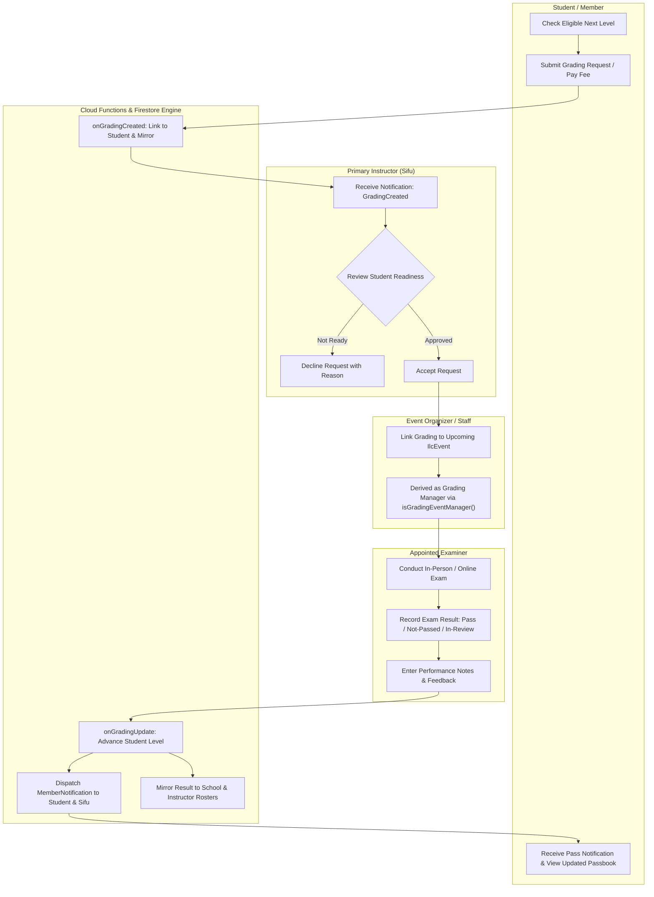
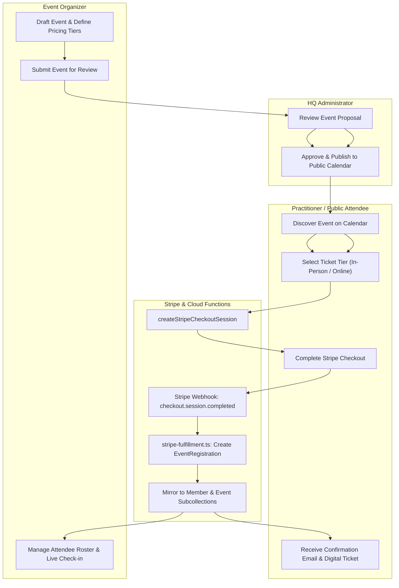
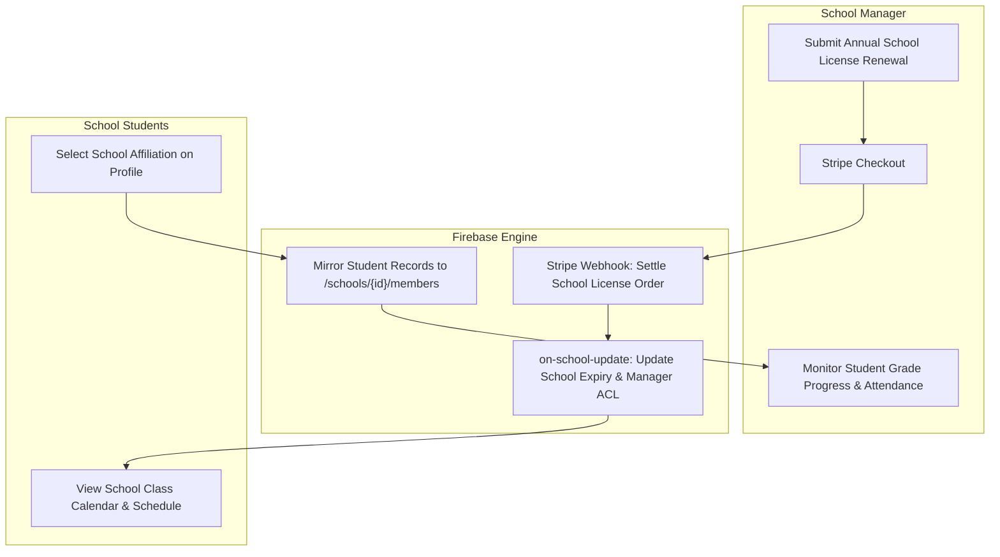

# Documentation Website & 5-View Unified Knowledge System Plan

This document details the architectural plan for rewriting and unifying the system documentation for **ILC Members Manager** into an interactive **Documentation Website**, backed by a dedicated TypeScript documentation library (`@ilc/docs-core`), providing **five interrelated and interlinked perspectives** on the codebase, with 100% file and data component coverage, multi-user collaborative interaction graphs (plans), dual-mode code links (Visual Studio Code & GitHub), and automated integrity validation.

---

## 1. Executive Summary & Vision

### Current State & Problem Statement
The ILC Members Manager codebase has matured into a sophisticated, production-grade Progressive Web App (PWA) with:
- **875+ tracked files** spanning Angular 21 (Signals, Signal Forms, Standalone Components, zoneless change detection), Firebase Cloud Functions, Firestore Security Rules, Web Components (`events-viewer-wc`, `find-an-instructor-wc`, `markdown-editor-wc`), and offline IndexedDB storage.
- An asynchronous backend with complex multi-stage pipelines: Firestore document triggers (`on-grading-update`, `on-member-update`, `on-school-update`), Stripe e-commerce & subscription webhooks, Google Cloud Transcoder video streaming pipelines, and ACL caching.
- Documentation that is currently **fragmented** across standalone HTML documents (`docs/README.html`, `authentication.html`, `guided-purchase-flows.html`, `orders-and-subscriptions.html`) and markdown notes (`gradings.md`, `materials-management.md`, `event-online-registrations.md`, `push-notifications.md`, `user-stories/`, `plans/`).

### Identified Gaps
1. **Isolated Single-User Flow Descriptions:** Existing docs describe user flows in isolation, obscuring how multiple actors interact with each other (e.g. Student requests a grading -> Sifu receives notification and reviews -> Event Manager links grading to event -> Examiner records result -> System upgrades member level). These multi-user collaborations form **directed node-edge graphs (plans)** that need visual exploration.
2. **Missing Site Surface Mapping:** No comprehensive mapping exists showing what each user actor can do on each of the 97+ application views.
3. **Data Types Lack Domain Grouping & Multi-Level Granularity:** Data models are presented in flat tables without hierarchical depth (executive summary vs security/flow vs technical field dictionary).
4. **Abstract Patterns Undocumented:** Crucial architectural patterns that make this app work (e.g. the Firestore timestamp concurrency pattern, the `initXxx()` zero-default object pattern, the `SearchableSet` signal wrapper) are scattered across code comments instead of documented as formal patterns.
5. **No Direct IDE Integration:** Existing documentation has plain text references or relative markdown paths that cannot be opened with a single click in Visual Studio Code during local pair programming.

### Target Solution: The 5-View Unified Mental Model

```
                      ┌───────────────────────────────────────┐
                      │                VIEW 1                 │
                      │       Setup & Instance Creation       │
                      │  (Dev, Emulators, GCP, Provisioning)  │
                      └──────────────────┬────────────────────┘
                                         │
                                         │ seeds & configures
                                         ▼
┌────────────────────────┐  interlinks   ┌────────────────────────┐
│         VIEW 2         │ ────────────> │         VIEW 3         │
│ User Journeys & Graphs │ <──────────── │    Core Data Types     │
│ (Actors, Plans, Views) │   operates on │ (Groups, Schema, Dims) │
└───────────┬────────────┘               └───────────┬────────────┘
            │                                        │
            │ initiates                  mutates &   │
            │ actions                   persists to  │
            ▼                                        ▼
┌─────────────────────────────────────────────────────────────────┐
│                             VIEW 4                              │
│             Information Flow & System Architecture              │
│         (Signals, Triggers, Mirroring, Webhooks, VOD)           │
└────────────────────────────────┬────────────────────────────────┘
                                 │
                                 │ implements abstract patterns from
                                 ▼
┌─────────────────────────────────────────────────────────────────┐
│                             VIEW 5                              │
│              Core Architectural & Data Patterns                 │
│         (initXxx, Timestamps, SearchableSet, ACL Cache)         │
└─────────────────────────────────────────────────────────────────┘
```

---

## 2. Deep Architecture Across the 5 Views

### View 1: Setup & Instance Creation
*Answers: "How do I get this running, seed it, configure external platforms, and spin up an isolated production instance?"*

1. **Local Development Environment Setup:**
   - Workstation prerequisites: Node.js `^22.x`, pnpm `^11.x` (strict prohibition of npm/npx), Java JRE (required for Firebase Local Emulator Suite), Google Cloud SDK (`gcloud`), and Firebase CLI (`firebase-tools`).
   - Repository initialization, dependency installation (`pnpm install`, which triggers `postinstall` for `functions/`), and environment file configuration (`src/environments/environment.local.ts` and `functions/src/environment/environment.ts`).
2. **Firebase Emulator Suite Orchestration:**
   - The strict 5-step startup sequence:
     ```bash
     pnpm build:functions   # 1. MUST build functions dist first
     pnpm emulator:start    # 2. Start Auth (9099), Firestore (8080), Functions (5001), Storage (9199), UI (4000)
     pnpm export:anonymized # 3. Optional: refresh anonymized seed data from production
     pnpm seed:emulator     # 4. Seed Firestore documents and Auth accounts
     pnpm start:emulator    # 5. Launch Angular dev server on port 4200 wired via eager IIFE
     ```
   - Test Accounts Matrix:
     | Persona | Email | Password | Pre-seeded Permissions |
     |---|---|---|---|
     | **HQ Admin** | `member-us536@example.com` | `testpassword123` | `isAdmin: true`, full read/write, system settings |
     | **Regular Member** | `member-pl100@example.com` | `testpassword123` | Active membership, Student Level 3, own passbook |
     | **Instructor** | `member-us289@example.com` | `testpassword123` | Valid instructor license, student roster access |
     | **School Manager** | `member-fr102@example.com` | `testpassword123` | School doc owner, school member roster |
   - Known gotchas & failure modes: Functions dist caching, FieldValue in trigger emulators, email lowercase normalization for `/acl/{email}` keys.
3. **Production Instance Provisioning & GCP Setup:**
   - Provisioning a brand-new Firebase / Google Cloud project from scratch:
     - Project creation (`firebase use <project-id>`).
     - Cloud Firestore database initialization in chosen multi-region.
     - Firebase Authentication setup (Email/Password, Action URL templates, password reset).
     - Firebase Cloud Storage bucket provisioning, rules, and CORS configuration (`storage.rules`).
     - Cloud Functions deployment (`pnpm deploy:functions`).
     - Security Rules deployment (`pnpm deploy:rules`).
   - Third-Party Platform Integrations:
     - Stripe platform registration: Webhook secret configuration (`pnpm register:stripe-webhook`), Stripe products & prices synchronization (`pnpm sync:video-products`).
     - Google Cloud Transcoder API & Cloud Pub/Sub topics configuration for automated VOD encoding.
     - Web Push VAPID keys generation and configuration.
   - Initial HQ Admin member bootstrap script.
   - Standalone Web Components build & deploy (`pnpm build:events-wc`, `pnpm build:find-instructor-wc`, `pnpm deploy:events-wc`, `pnpm deploy:find-instructor-wc`).
   - Automated Database Backups: Scheduled Cloud Functions (`backup.ts`) exporting collections to Cloud Storage.

---

### View 2: Users, Key Journeys & Multi-User Interaction Graphs (Plans)
*Answers: "Who uses the system, what can they do on each screen, and how do they interact and collaborate in multi-step plans?"*

#### 1. User Personas & Responsibilities
- **ILC Admins (HQ):** Global governance across all members, schools, instructors, orders, gradings, system counters, manual overrides, and backups.
- **School Managers:** School profile curation, student roster tracking, school gradings, school license renewals.
- **Instructors / Sifus:** Mentorship roster, grading evaluations (accept/decline/result entry), public directory profile (`/instructors/{id}`), licensing renewals.
- **Students / Members:** Digital passbook, grading requests/payments, event registrations, VOD video streaming, material downloads, profile updates.
- **Event Organizers:** Event proposals, ticket tier management, attendee check-in, event-linked grading management.
- **Public / Anonymous Visitors:** Instructor locator, school locator, public calendar, free video trailers, membership applications.

#### 2. Site Surface Map: What Users Do on Each Part of the Site
Every screen in the application (from `Views` enum in `src/app/app.config.ts`) is cataloged with:
- Accessible Roles & Authentication Gates (Public vs Member vs Instructor vs School Manager vs Admin).
- Primary Screen Objective.
- Available User Actions & State Mutations (Forms, buttons, dialogs, filters).
- Connected Services and Data Models.

*Representative Sample of the 97+ Views Surface Map:*
| View | Path Pattern | Permitted Roles | Actions & Capabilities |
|---|---|---|---|
| `Home` / `MyProfile` | `/` or `/me` | All Authenticated | View digital passbook, active levels, expiration dates, renew membership, edit personal contact details. |
| `GradingView` | `/gradings/:id` | Student, Sifu, Event Manager, Admin | Inspect status workflow, link event, accept/decline request, record final exam results and feedback. |
| `ManageGradings` | `/manage-gradings` | Sifu, School Manager, Admin | Filter gradings across pending/in-progress/completed, batch export, search by student or level. |
| `EventsCalendar` | `/events` | Public, All Members | Browse upcoming workshops and retreats, filter by location/instructor, view event detail. |
| `EventEdit` | `/events/:id/edit` | Event Organizer, Admin | Edit event details, configure ticket pricing tiers, manage co-managers, publish to public calendar. |
| `Videos` / `VideoView` | `/videos`, `/videos/:id` | Public, Members | Preview free trailers, stream full VOD class recordings with HLS player, track playback progress, cache for offline. |
| `ManageVod` | `/manage-vod` | Admin | Upload video masters, trigger GCP transcoding, curate catalog metadata, tag chapters, attach Stripe products. |
| `SchoolView` / `SchoolMembers`| `/schools/:id`, `/schools/:id/members` | School Manager, Admin | View school details, manage student roster, monitor student grade levels, renew school license. |
| `DownloadResource` | `/resources/:tier/:name` | Tier-Gated (Member/Inst/Admin) | Downloads protected instructional materials verified via `assertResourceAccess` Cloud Function. |

#### 3. Multi-User Collaborative Interaction Graphs (Plans)
Real-world operations are not single-user workflows; they are **directed node-edge graphs (plans)** where actions by one actor trigger states and responsibilities for others.

The documentation website incorporates an **Interactive Plan & Graph Explorer** visualizing these multi-actor collaborations:

##### Plan A: The Grading Examination & Progression Plan


##### Plan B: The Event Hosting, Ticketing & Registration Plan


##### Plan C: The School Affiliation & Licensing Plan


---

### View 3: Core Data Types, Groups & Levels of Detail
*Answers: "What are the core entities, where do they live in Firestore, how are they structured, and what rules govern them?"*

#### 1. Eight Functional Domain Groups
All Firestore collections (`FirestoreCollection`) and subcollections (`FirestoreSubcollection`) are organized into functional domains:

1. **Identity, Membership & Authorization Domain:**
   - Top-level: `/members/{docId}` (`Member`), `/acl/{email}` (`ACL`), `/instructors/{docId}` (`InstructorPublicData`).
   - Subcollections: `/members/{id}/notifications/{id}` (`MemberNotification`).
2. **Organizational & School Domain:**
   - Top-level: `/schools/{docId}` (`School`).
   - Subcollections: `/schools/{id}/members/{id}` (cached school members), `/schools/{id}/gradings/{id}` (cached school gradings), `/instructors/{id}/members/{id}` (cached instructor students), `/instructors/{id}/gradings/{id}` (cached instructor gradings).
3. **Curriculum & Grading Domain:**
   - Top-level: `/gradings/{docId}` (`Grading`).
   - Supporting modules: `curriculum.ts` (progression order, interleaved Student & Application levels, `nextGradingPayment()`).
4. **Events & Ticketing Domain:**
   - Top-level: `/events/{docId}` (`IlcEvent`), `/products/{docId}` (`Product`).
   - Subcollections: `/events/{id}/registrations/{id}` & `/members/{id}/registrations/{id}` (`EventRegistration`).
5. **Media & VOD Streaming Domain:**
   - Top-level: `/videos/{docId}` (`VideoItem`).
   - Subcollections: `/members/{id}/videoGrants/{id}` (`VideoGrant`), `/members/{id}/videoProgress/{id}` (`VideoProgress`), `/videos/{id}/videoTimeRanges/{id}` (`VideoTimeRange`).
6. **Commerce & Fulfillment Domain:**
   - Top-level: `/orders/{docId}` (`StripeOrder | SquareSpaceOrder | SheetsImportOrder`).
   - Subcollections: `/members/{id}/orders/{id}` (mirrored order rows).
7. **Community & Content Domain:**
   - Top-level: `/members-post/{id}`, `/articles-post/{id}`, `/news-post/{id}` (`Post`).
   - Cache modules: `content-cache.ts` (Squarespace blog feed mirrors).
8. **System & Operational Infrastructure Domain:**
   - Top-level: `/system/{doc}` (`Counters`, `CacheMetadata`), `/statistics/{doc}` (`Statistics`).
   - Subcollections: `/members/{id}/pushSubscriptions/{id}` (`PushSubscription`).

#### 2. Three Hierarchical Levels of Detail
To avoid overwhelming developers while providing complete specifications, the documentation website presents data models across three selectable tabs/levels:

- **Level 1: Executive & Domain Overview**
  - High-level business purpose of the entity.
  - Primary collection path, subcollections, and cardinality.
  - Ownership model and core relationships to other entities.
- **Level 2: Data Flow & Security Rules Context**
  - Access Control Matrix: Who can read, create, update, or delete this document.
  - Relevant `firestore.rules` blocks with affected key constraints.
  - Attached Cloud Function triggers and mirroring targets.
  - Associated user journeys and multi-user plans.
- **Level 3: Full Technical Schema & Specification**
  - Exact TypeScript interface definition from `functions/src/data-model/*.ts`.
  - Zero-default constructor (`initXxx()`) values.
  - Converter logic (`firestoreDocToXxx()`) with timestamp and ID handling.
  - Granular field-by-field dictionary: Field Name, Data Type, Required/Optional, Default Value, Constraints, Description.

---

### View 4: Information Flow & System Architecture
*Answers: "How does data travel through the app from user click to cloud storage and back to client screens?"*

#### The 5 End-to-End Information Pipelines
1. **Pipeline 1: Client Reactivity & State Management**
   - User interaction in Angular Component -> Signals & Signal Forms -> `DataManagerService` singleton -> Firestore real-time snapshot listener (`onSnapshot`) -> `SearchableSet` with `MiniSearch` fuzzy index -> Derived signals (`computed()`) -> `OnPush` DOM rendering.
2. **Pipeline 2: Document Mutation & Cloud Trigger Mirroring**
   - Client `setDoc` / `updateDoc` -> `firestore.rules` validation -> Firestore write -> Cloud Triggers (`onGradingUpdate`, `onMemberUpdate`, `onSchoolUpdate`, `mirrorInstructorsToPublicProfile`) -> Subcollection mirroring (`/schools/{id}/members`, `/instructors/{id}/members`, `/schools/{id}/gradings`) -> ACL document regeneration (`/acl/{email}`) -> In-app notification creation (`/members/{id}/notifications`) -> Client snapshot updates automatically.
3. **Pipeline 3: E-Commerce & Stripe Webhook Fulfillment**
   - Client triggers `createStripeCheckoutSession` -> Redirect to Stripe Checkout -> Payment completes -> Stripe dispatches `checkout.session.completed` / `invoice.paid` webhook -> `stripeWebhook` Cloud Function verifies HMAC signature -> Creates record in `/orders/{docId}` -> `stripe-fulfillment.ts` routes item fulfillment (extends membership dates, settles grading record, grants VOD license, creates event registrations) -> Trigger sends confirmation email & in-app notification.
4. **Pipeline 4: VOD Media Transcoding & HLS Streaming**
   - Video uploaded to GCS incoming bucket -> Pub/Sub trigger -> GCP Cloud Transcoder API generates multi-bitrate HLS (.m3u8 playlists + .ts fragments) -> Output written to streaming GCS bucket -> `onTranscodeFinished` Cloud Function updates `/videos/{id}` status to `ready` -> User requests playback -> `getVideoPlaybackSession` validates permissions -> Generates signed playback token -> Angular `VideoPlayerComponent` uses `Hls.js` to render stream -> Offline storage service downloads fragments into browser IndexedDB.
5. **Pipeline 5: Web Components Embedding & Public Integration**
   - Standalone Angular Elements builds (`events-viewer-wc`, `find-an-instructor-wc`) -> Exported as standalone JS/CSS bundles -> Embedded into external sites via `<script>` and custom HTML elements -> Execute scoped read queries against public Firestore collections.

#### Programmatic Orthogonal Architecture Diagrams
- Generated via `@ilc/diagram-router` (`docs/minitools/diagram-router/`).
- Sharp, orthogonal, 90-degree bend SVG graphs representing system tiers (Client App, Cloud Functions, External APIs, Cloud Firestore) with centered corridor channels and zero crossing errors.

---

### View 5: Core Architectural & Data Patterns in the Abstract
*Answers: "What design patterns, conventions, and architectural idioms govern how this application is constructed?"*

This view documents the foundational patterns of the codebase in the abstract, complete with problem statements, architectural solutions, and canonical code examples:

#### Pattern 1: The Firestore Timestamp Concurrency & Deserialization Pattern
- **Problem:** Client devices have untrusted local clocks; concurrent updates can overwrite newer data; Firestore stores dates as `Timestamp` objects (`{ _seconds, _nanoseconds }`) which crash client libraries if treated as JavaScript `Date` or ISO strings.
- **Pattern:**
  - *Write Validation:* In `firestore.rules`, non-admin updates require `request.resource.data.lastUpdated == request.time`.
  - *Client Write:* Clients always pass `serverTimestamp()` as the update payload.
  - *Read Normalization:* The `firestoreDocToXxx()` converter immediately converts `docData.lastUpdated.toDate().toISOString()` into a standard ISO 8601 string.
  - *Emulator Seeding:* Export and seed scripts reconstruct `admin.firestore.Timestamp.fromDate(new Date(...))` from JSON dumps to preserve converter contracts.

#### Pattern 2: The `initXxx()` Zero-Default & Converter Anti-Partial-Data Pattern
- **Problem:** Firestore is schemaless. If a document is written with missing fields or an older schema version, client UI components throw runtime errors (`Cannot read properties of undefined`).
- **Pattern:**
  - Every domain model exports an `initXxx(): DomainType` function that constructs an object with complete, non-null, zero-default values for every single field.
  - Every domain model exports a `firestoreDocToXxx(doc: DocumentSnapshot): DomainType` function that spreads database data over `initXxx()`.
  - Application logic and Angular templates can safely access all properties without optional chaining (`?.`) boilerplate or `undefined` checks.

#### Pattern 3: The SearchableSet + AutocompleteComponent Pattern
- **Problem:** Client needs fast fuzzy search over thousands of members and instructors while staying reactive to real-time Firestore updates, without leaking UI concerns into data services.
- **Pattern:**
  - `SearchableSet<ID, T>` encapsulates a `MiniSearch` inverted index inside Angular Signals.
  - Exposes `.entries()` (all items signal), `.get(id)` (O(1) synchronous lookup), and `.search(term)` (fuzzy search returning IDs).
  - Decoupled `AutocompleteComponent` consumes `SearchableSet` and uses regex display adapters (`toChipId`, `toName`) to extract raw IDs (`(US402) Lucas Dixon` -> `US402`).

#### Pattern 4: The Zoneless Signals & OnPush Reactivity Pattern
- **Problem:** Traditional Angular zone.js monkey-patching causes unnecessary change detection cycles and performance degradation in real-time apps; RxJS observables lead to memory leaks if unmanaged.
- **Pattern:**
  - Zoneless change detection enabled via `provideZonelessChangeDetection()` in `app.config.ts`.
  - All components use `ChangeDetectionStrategy.OnPush`.
  - Reactive state managed exclusively via Signals (`signal()`, `computed()`, `effect()`); RxJS is converted at service boundaries via `toSignal()`; components never call `.subscribe()`.
  - Native template control flow syntax (`@if`, `@for`, `@switch`).
  - Angular Signal Forms (`form()` from `@angular/forms/signals`) with fine-grained field disabling.

#### Pattern 5: The Subcollection Mirroring & Fan-Out Cache Pattern
- **Problem:** Querying collections with multi-tenant filters (e.g. "show all gradings for School X" or "show all students of Instructor Y") across millions of documents in Firestore requires complex composite indexes and expensive read rules.
- **Pattern:**
  - Document mutation triggers a Cloud Function (`onGradingUpdate`, `onMemberUpdate`).
  - The function mirrors copies of the document into scoped subcollections (`/schools/{schoolId}/gradings/{docId}`, `/instructors/{instructorId}/members/{docId}`).
  - School and instructor views execute simple, lightning-fast queries directly against their own subcollections with simple read rules.

#### Pattern 6: The Dynamic Derived Permissions Pattern
- **Problem:** Hardcoding or caching permission lists on documents (e.g. storing an array of all event managers on a grading doc) causes cache desynchronization whenever event organizers change.
- **Pattern:**
  - `Grading` stores only `gradingEventDocId` pointing to an `IlcEvent`.
  - In `firestore.rules`, `isGradingEventManager()` executes a guarded `get()` on `/events/{gradingEventDocId}` to check if the caller's email is an owner or manager of the linked event.
  - In the Angular UI, `GradingEditComponent` loads the event reactively to derive `userIsEventManager`. Permissions update immediately when event staff change, with zero database backfills required.

#### Pattern 7: The Fast-Lookup ACL Email Key Cache Pattern
- **Problem:** Firestore rules do not support complex joins or cross-collection lookups on every read/write. Checking if a user has an active membership or instructor license during every database operation would exceed rule evaluation limits.
- **Pattern:**
  - Document `/acl/{lowercaseEmail}` acts as an aggregated, pre-calculated permissions document.
  - Maintained by server triggers (`onMemberUpdate`, `onSchoolUpdate`) that watch member profiles and licenses.
  - Rules inspect `get(/databases/$(database)/documents/acl/$(request.auth.token.email.lower()))` in a single read.

#### Pattern 8: Early Domain Typing on Snapshots & Typed `Partial<T>` Update Accumulators
- **Problem:** Untyped Firestore reads and writes lead to silent schema divergence, typo-ridden property updates, and runtime errors.
- **Pattern:**
  - Anti-pattern forbidden: `doc.data()['myProperty']` or `Record<string, unknown>`.
  - Snapshots are cast immediately to domain models: `docSnap.data() as IlcEvent | undefined`.
  - Update payloads are strictly typed with `Partial<DomainType>` (e.g. `const update: Partial<Grading> = { status: GradingStatus.Passed }`) ensuring property names and types are compiler-checked.

#### Pattern 9: Protected VOD Streaming & Offline IndexedDB Storage Pattern
- **Problem:** Video on Demand requires restricting video playback to authorized members/purchasers while supporting smooth offline playback on mobile devices without exposing raw master MP4 files.
- **Pattern:**
  - Media pipeline ingests master video, transcodes to HLS (.m3u8 playlists + .ts fragments) via GCP Cloud Transcoder.
  - Video player calls Cloud Function `getVideoPlaybackSession(videoId)` to verify `VideoGrant` or subscription tier.
  - Function returns short-lived signed URL or playback token.
  - `VodOfflineStorageService` utilizes browser `IndexedDB` (`idb-storage.service.ts`) to cache HLS fragments for offline viewing when authenticated.

#### Pattern 10: Autonomous Micro-Frontend Web Components Pattern
- **Problem:** External affiliate schools and organizers want to embed the ILC event calendar and instructor search directory on external WordPress or Squarespace sites without loading the entire application.
- **Pattern:**
  - Angular CLI projects `events-viewer-wc` and `find-an-instructor-wc` package components using `@angular/elements`.
  - Bundled as lightweight, self-contained JavaScript widgets.
  - Third-party webmasters embed via `<script src="https://.../events-viewer-wc.js"></script>` and custom HTML tags `<events-viewer></events-viewer>`.

---

## 3. Mandatory 5-Way Interlinking Matrix

Every document in the documentation system must explicitly link to relevant entities in the other four views:

```mermaid
matrix
    title 5-Way Cross-View Interlinking Matrix
```

| Source View | Target View: Setup (V1) | Target View: Journeys (V2) | Target View: Data (V3) | Target View: Architecture (V4) | Target View: Patterns (V5) |
|---|---|---|---|---|---|
| **Setup & Instances (V1)** | — | Test credentials to exercise setup | Seed datasets & collection initialization | Pipelines booted & services configured | Config & seed script patterns |
| **User Journeys & Graphs (V2)** | Emulator steps to reproduce journey | — | Data types read/written by actor | Reactive flows & triggers executed | Behavioral patterns employed |
| **Data Types (V3)** | Seed script & environment config | Personas with read/edit access | — | Triggers, rules & mutation pipelines | initXxx, converters, rules patterns |
| **Architecture Flow (V4)**| Prerequisites & emulator flags | User actions triggering the flow | Schemas transformed across pipeline | — | System & pipeline patterns |
| **Patterns (V5)** | Seed scripts illustrating pattern | Journeys employing pattern | Models structured by pattern | Information flows using pattern | — |

---

## 4. Codebase Referencing & Dual-Link Standards

### 100% Codebase File Catalog
Every single source file in the repository (across `src/`, `functions/src/`, `scripts/`, `tests/`, and `docs/minitools/`) will be registered in the **Codebase File Registry** (`docs/lib/src/catalog/files-catalog.ts`):
- **Relative Path:** e.g. `src/app/data-manager.service.ts`
- **Architectural Layer:** Client Core Service, UI Component, Cloud Function, Data Model, Script, Test Fixture, or Tool.
- **Responsibility Summary:** Clear explanation of what the file does.
- **Key Symbols Exported:** Classes, interfaces, functions, enums.
- **Related User Journeys & Plans:** Which multi-user plans touch this file.
- **Related Data Models:** Which Firestore collections it reads or writes.
- **Related User Stories:** Stories implemented or tested by this file.

### Dual Code Link Convention
All code references in the documentation website support dual actions:
1. **VS Code Protocol Link (`vscode://file/...`):**
   - Directly opens the file in the developer's local VS Code editor at the exact line number.
   - Format: `vscode://file/<repo_root>/<relative_path>:<line_number>`
   - Example: `vscode://file//Users/ldixon/code/zxd/ilc-members-manager/src/app/data-manager.service.ts:150`
2. **GitHub Web Link:**
   - Opens the file on the remote GitHub repository at the corresponding branch and line anchor.
   - Format: `https://github.com/iislucas/ilc-members-manager/blob/main/<relative_path>#L<start>-L<end>`
   - Example: `https://github.com/iislucas/ilc-members-manager/blob/main/src/app/data-manager.service.ts#L150-L180`
3. **Interactive Code Action Component:**
   The documentation site renders code badges with hover actions:
   `[ 💻 Open in VS Code ]` | `[ 🌐 View on GitHub ]` | `[ 📋 Copy Path ]`

---

## 5. Documentation Library & Website Architecture

### Library Architecture: `@ilc/docs-core` (`docs/lib/`)
```
docs/lib/
├── package.json               # Package definition (@ilc/docs-core)
├── tsconfig.json              # Strict TypeScript config (~5.9.x)
├── vitest.config.ts           # Vitest configuration for unit & integrity tests
├── src/
│   ├── index.ts               # Public API exports
│   ├── models/                # TypeScript interfaces for documentation entities
│   │   ├── code-file.ts       # CodeFileEntry schema
│   │   ├── data-type.ts       # DataTypeEntry schema
│   │   ├── user-journey.ts    # UserJourneyEntry schema
│   │   ├── interaction-plan.ts# InteractionPlanEntry schema (directed graph)
│   │   ├── user-story.ts      # UserStoryEntry schema
│   │   ├── arch-flow.ts       # ArchFlowEntry schema
│   │   ├── setup-guide.ts     # SetupGuideEntry schema
│   │   └── pattern-doc.ts     # PatternEntry schema (View 5)
│   ├── catalog/               # Authoritative metadata registries
│   │   ├── files-catalog.ts   # 100% repository file index
│   │   ├── data-types-catalog.ts # All 8 data groups & collections
│   │   ├── journeys-catalog.ts# All user personas and 97+ view surface map
│   │   ├── plans-catalog.ts   # Multi-user collaborative directed interaction graphs
│   │   ├── stories-catalog.ts # All user stories from docs/user-stories/*.md
│   │   ├── flows-catalog.ts   # All architectural information flows
│   │   ├── setup-catalog.ts   # All setup & instance creation guides
│   │   └── patterns-catalog.ts# All 10 abstract architectural patterns
│   ├── resolvers/             # Link generators
│   │   ├── code-link-resolver.ts # VS Code and GitHub link generator
│   │   └── interlink-resolver.ts # 5-way cross-reference graph builder
│   ├── search/                # Full-text search engine
│   │   └── docs-search-index.ts  # MiniSearch index builder
│   ├── validator/             # Automated test & verification suite
│   │   ├── completeness-checker.ts # Verifies 100% of git files are cataloged
│   │   └── link-integrity-checker.ts # Verifies zero broken internal links
│   └── renderer/              # Website build generator
│       ├── page-builder.ts    # Compiles markdown & catalogs into HTML
│       ├── navigation-builder.ts # Generates 5-view tabbed sidebar & menus
│       ├── plan-graph-renderer.ts# Generates interactive SVG multi-user plans
│       └── diagram-embedder.ts# Integrates @ilc/diagram-router SVGs
└── test/
    ├── catalog-completeness.spec.ts # Asserts 100% file coverage
    ├── link-integrity.spec.ts       # Asserts zero broken cross-links
    └── resolver.spec.ts             # Asserts correct VS Code / GitHub URLs
```

### Documentation Website Features
1. **5-View Perspective Switcher:**
   - Prominent top navigation switcher allowing users to toggle between:
     - 🚀 **1. Setup & Instances**
     - 👥 **2. Users, Journeys & Plans**
     - 📦 **3. Core Data Types**
     - ⚡ **4. Information Flow & Architecture**
     - 🧩 **5. Architectural Patterns**
2. **Interactive Plan Graph Explorer:**
   - Visual directed node-edge graph viewer for multi-user collaboration plans with node inspection and actor filtering.
3. **Instant Fuzzy Search (`MiniSearch`):**
   - Global search input (with `/` and `Cmd+K` keyboard shortcuts) querying across all 5 views, files, data types, user stories, and code symbols.
4. **Interactive Orthogonal Diagrams:**
   - Embedded interactive SVG diagrams with node hover highlighting, connecting corridors, and port tooltips.
5. **Codebase File Explorer & Catalog:**
   - Filterable table of all 875+ files with layer badges, search, and direct VS Code / GitHub launch buttons.
6. **Story Explorer:**
   - Clean rendering of all `docs/user-stories/*.md` with Given/When/Then scenarios, test statuses, and code links.

---

## 6. Phased Implementation Roadmap

```mermaid
gantt
    title Documentation Website & System Implementation Roadmap
    dateFormat  YYYY-MM-DD
    section Phase 1: Standards
    Documentation Skill Creation (.agent/skills/)   :done, p1_1, 2026-09-11, 1d
    Architectural Plan in docs/plans/              :done, p1_2, 2026-09-11, 1d
    section Phase 2: Engine
    Create @ilc/docs-core library structure         :active, p2_1, 2026-09-12, 2d
    Build link resolvers & MiniSearch indexer      :p2_2, after p2_1, 2d
    Create completeness & link integrity tests      :p2_3, after p2_2, 1d
    section Phase 3: Catalogs
    Index 100% of codebase files (875+ files)      :p3_1, after p2_3, 3d
    Catalog 8 Data Groups & 3 Levels of Detail     :p3_2, after p3_1, 2d
    Catalog Users, Surface Map & Multi-User Plans  :p3_3, after p3_2, 2d
    Catalog Architecture Flows & Setup Guides       :p3_4, after p3_3, 2d
    Catalog View 5 Architectural Patterns          :p3_5, after p3_4, 2d
    section Phase 4: Website
    Build Website Renderer & Multi-View Layout     :p4_1, after p3_5, 3d
    Build Interactive Plan Graph Explorer          :p4_2, after p4_1, 2d
    Integrate @ilc/diagram-router orthogonal SVGs   :p4_3, after p4_2, 2d
    Build Instant Search Modal & Filter Panels     :p4_4, after p4_3, 2d
    section Phase 5: Verification
    Run Vitest tests & build verification          :p5_1, after p4_4, 2d
    Wire pnpm scripts (build:docs, test:docs)       :p5_2, after p5_1, 1d
```

---

## 7. Verification & Quality Assurance Plan

### Automated Validation Tests (`pnpm test:docs`)
1. **Catalog Completeness Verification:**
   - A Vitest test executes `git ls-files` across the repository.
   - Asserts that every file under `src/`, `functions/src/`, `scripts/`, `tests/`, and `docs/minitools/` exists in `files-catalog.ts`.
   - Fails if a new source file is created without being registered in documentation.
2. **Data Model Coverage Verification:**
   - Inspects `FirestoreCollection` and `FirestoreSubcollection` enums in `collections.ts`.
   - Asserts that every single collection and subcollection has a matching entry in `data-types-catalog.ts` across all 3 detail levels.
3. **5-Way Cross-Link Integrity:**
   - Traverses all entries in all 5 catalogs.
   - Asserts that all linked IDs (data types, journeys, plans, flows, setup guides, stories, patterns) exist in their respective registries.
   - Asserts that no dead links or dangling cross-references exist.
4. **Code Link Validity:**
   - Tests that generated `vscode://file/...` links point to valid absolute file paths.
   - Tests that generated GitHub URLs point to valid repository paths on `main`.

---

## 8. Summary of Deliverables

| Deliverable | Location | Description |
|---|---|---|
| **Documentation Agent Skill** | `.agent/skills/documentation-system/SKILL.md` | Authoring rules, 5-view model, multi-user plans, dual code links, and completeness standards. |
| **Architectural Master Plan** | `docs/plans/documentation-website-and-system.md` | Comprehensive design specification (this document). |
| **Documentation Core Library** | `docs/lib/` (`@ilc/docs-core`) | Strongly typed models, 100% file catalog, search indexing, link resolvers, plan graph generators, and automated integrity tests. |
| **Interactive Documentation Website** | `docs/index.html`, `docs/dist/` | Tabbed 5-view web portal with interactive plan explorer, instant search, orthogonal diagrams, and dual-link code exploration. |
| **Build & Test Scripts** | Root `package.json` (`build:docs`, `test:docs`, `start:docs`) | One-command build, validation, and local serving of documentation. |
