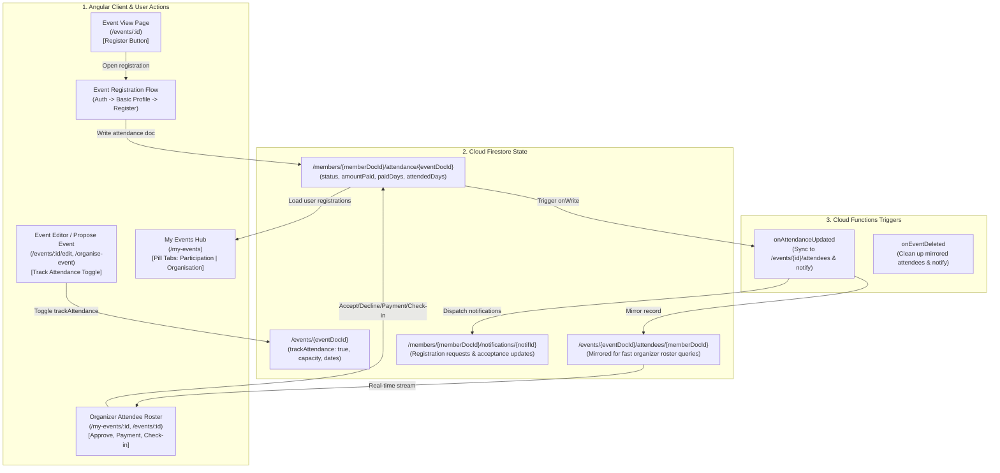
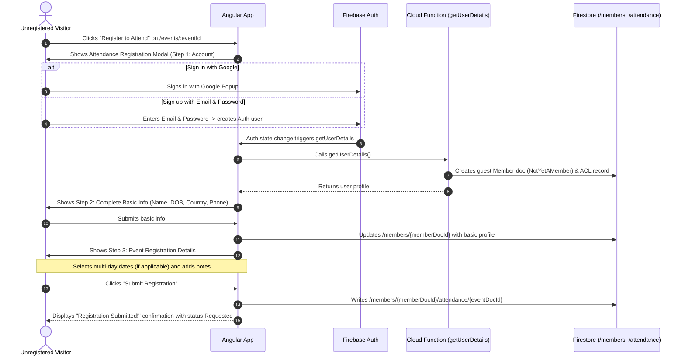
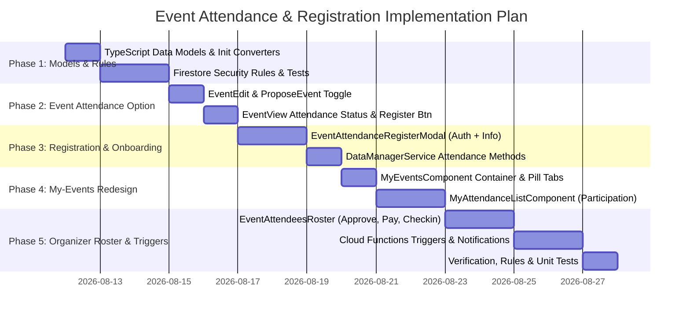

# Event Attendance Registration, Multi-Day Tracking & My-Events Redesign Plan

This document defines the architecture, data models, user onboarding and registration flows, Firestore security rules, backend Cloud Functions triggers, and Angular frontend components for **event attendance registration**, **multi-day tracking**, **organizer attendance management**, and the **redesigned My-Events page** with **Participation** and **Organisation** tabs.

---

## 1. Executive Summary & Core Requirements

### 1.1 Goals
1. **Attendance Tracking on Events**:
   - Event organizers and admins can toggle attendance tracking on any event (`trackAttendance: boolean`).
   - When enabled, the event detail page displays attendance information and a clear **Register to Attend** button.
   - For multi-day events, allows selecting specific days or all days of the event.
2. **Frictionless Onboarding for New Users**:
   - Users without an account follow the same lightweight onboarding flow as the start of membership (`become-a-member` / `complete-profile`):
     1. Create account / Sign in with Email/Password or Google.
     2. Collect basic profile information (Full Name, Date of Birth, Country, Phone).
     3. Complete event registration in a seamless, single-session flow.
3. **Dedicated Member Attendance Subcollection**:
   - Each member's attendance records live in `/members/{memberDocId}/attendance/{eventDocId}`.
   - Tracks:
     - **Attendance Status**: `Requested`, `Accepted`, `Declined`, `Cancelled`, `Waitlisted`.
     - **Organizer Decisions**: Status acceptance/rejection with optional explanation notes (e.g. venue space limits, prerequisites, missing payment).
     - **Payment Tracking**: Amount paid, currency, payment status (`Unpaid`, `Partial`, `Paid`, `Complimentary`), payment notes, and specific days paid for multi-day events.
     - **Turn-Up / Check-In Tracking**: Overall attendance flag (`attended`) and specific days attended (`attendedDays`) for multi-day events.
     - **Participant & Organizer Notes**: Special requests, dietary requirements, or private organizer notes.
4. **Organizer Roster & Attendance Management**:
   - Organizers and event managers can view all registrations on their event management dashboard, accept/decline participants, record offline/cash payments, and perform check-ins per day.
5. **Redesigned My-Events (`/my-events`) Page**:
   - **Participation Tab (Default)**: Lists all events the member has registered for or attended, with live status chips, payment details, and check-in badges.
   - **Organisation Tab**: Dedicated pill-tab showing events the member is organizing or managing (the existing event management view).
   - Clean URL parameter synchronization (`?tab=participation` vs `?tab=organisation`).

---

## 2. System Architecture & Flow



---

## 3. Data Models & TypeScript Types

All types follow the codebase conventions in `functions/src/data-model.ts`: strict TypeScript enums, complete interfaces with no optional properties on core types, explicit `initXxx()` defaults constructors, and `firestoreDocToXxx()` converters.

### 3.1 Attendance Enums

```typescript
/** Status of a member's attendance at an event. */
export enum AttendanceStatus {
  Requested = 'requested',   // Participant registered; awaiting organizer confirmation
  Accepted = 'accepted',     // Organizer accepted the attendance request
  Declined = 'declined',     // Organizer declined (e.g. full capacity, lack of payment)
  Cancelled = 'cancelled',   // Participant withdrew/cancelled their registration
  Waitlisted = 'waitlisted', // Event at capacity; placed on waitlist
}

/** Payment status of an event registration. */
export enum AttendancePaymentStatus {
  Unpaid = 'unpaid',
  Partial = 'partial',
  Paid = 'paid',
  Complimentary = 'complimentary',
  Refunded = 'refunded',
}
```

### 3.2 Member Event Attendance Model (`/members/{memberDocId}/attendance/{eventDocId}`)

Using `{eventDocId}` as the document ID inside `/members/{memberDocId}/attendance/` guarantees uniqueness (one attendance document per member per event) and provides constant-time lookups.

```typescript
export interface EventAttendance {
  docId: string;                     // Matches eventDocId
  eventDocId: string;                // Reference to /events/{eventDocId}
  memberDocId: string;               // Reference to /members/{memberDocId}
  
  // Member Snapshot (for fast offline check-in & organizer display)
  memberId: string;                  // Human-readable ID, e.g. 'US402'
  memberName: string;                // Snapshot: e.g. 'Jane Doe'
  memberEmail: string;               // Snapshot: 'jane@example.com'
  memberPhone: string;               // Snapshot: '+123456789'
  memberCountry: string;             // Snapshot: 'United States'
  
  // Event Snapshot (for instant rendering in the Participation tab without extra gets)
  eventTitle: string;                // Event title snapshot
  eventStart: string;                // ISO start datetime/date
  eventEnd: string;                  // ISO end datetime/date
  eventLocation: string;             // Location snapshot
  eventHeroImageThumbUrl: string;    // Thumbnail URL snapshot
  
  // Attendance State & Decision
  status: AttendanceStatus;          // AttendanceStatus enum
  statusReason: string;              // Organizer note on decline/waitlist (e.g. 'Capacity full')
  statusChangedByMemberDocId: string;// DocId of person who last changed status
  statusChangedByName: string;       // Snapshot of actor name
  acceptedDate: string;              // ISO datetime when accepted
  
  // Payment Tracking
  paymentStatus: AttendancePaymentStatus;
  amountPaid: number;                // Monetary amount recorded (e.g. 150.00)
  currency: string;                  // 3-letter currency code (e.g. 'USD', 'EUR', 'GBP')
  paymentNotes: string;              // e.g. 'Cash at door', 'Bank transfer', 'Stripe'
  paidDate: string;                  // ISO date paid
  paidDays: string[];                // Multi-day dates paid for: e.g. ['2026-09-10', '2026-09-11']
  
  // Turn-Up & Check-In Tracking
  attended: boolean;                 // Main flag: did participant attend the event?
  attendedDays: string[];            // Multi-day dates checked in: e.g. ['2026-09-10', '2026-09-11']
  checkedInByMemberDocId: string;    // DocId of organizer/staff who performed check-in
  checkedInByName: string;           // Name snapshot of check-in staff
  
  // Notes & Communication
  participantNotes: string;          // Notes from participant during registration
  organiserNotes: string;            // Private notes for event organizers
  
  createdAt: string;                 // ISO datetime
  lastUpdated: string;               // ISO datetime
}

export function initEventAttendance(
  memberDocId: string = '',
  eventDocId: string = ''
): EventAttendance {
  return {
    docId: eventDocId,
    eventDocId,
    memberDocId,
    memberId: '',
    memberName: '',
    memberEmail: '',
    memberPhone: '',
    memberCountry: '',
    eventTitle: '',
    eventStart: '',
    eventEnd: '',
    eventLocation: '',
    eventHeroImageThumbUrl: '',
    status: AttendanceStatus.Requested,
    statusReason: '',
    statusChangedByMemberDocId: '',
    statusChangedByName: '',
    acceptedDate: '',
    paymentStatus: AttendancePaymentStatus.Unpaid,
    amountPaid: 0,
    currency: 'USD',
    paymentNotes: '',
    paidDate: '',
    paidDays: [],
    attended: false,
    attendedDays: [],
    checkedInByMemberDocId: '',
    checkedInByName: '',
    participantNotes: '',
    organiserNotes: '',
    createdAt: new Date().toISOString(),
    lastUpdated: new Date().toISOString(),
  };
}

export function firestoreDocToEventAttendance(
  doc: { id: string; data(): Record<string, unknown> | undefined }
): EventAttendance {
  const data = doc.data() || {};
  return {
    ...initEventAttendance(
      String(data['memberDocId'] || ''),
      doc.id || String(data['eventDocId'] || '')
    ),
    ...data,
    docId: doc.id,
    eventDocId: String(data['eventDocId'] || doc.id),
    memberDocId: String(data['memberDocId'] || ''),
    paidDays: Array.isArray(data['paidDays']) ? (data['paidDays'] as string[]) : [],
    attendedDays: Array.isArray(data['attendedDays']) ? (data['attendedDays'] as string[]) : [],
    lastUpdated: data['lastUpdated'] instanceof Object && 'toDate' in (data['lastUpdated'] as any)
      ? (data['lastUpdated'] as any).toDate().toISOString()
      : String(data['lastUpdated'] || new Date().toISOString()),
  };
}
```

### 3.3 Additions to `IlcEvent` (`functions/src/data-model.ts`)

Extend `IlcEvent` and `initEvent()` to support attendance tracking configuration:

```typescript
export type IlcEvent = {
  // ... existing fields ...

  // Attendance tracking configuration
  trackAttendance: boolean;          // Enable/disable registration & attendance tracking
  attendanceCapacity?: number;       // Maximum allowed attendees (0 or undefined = unlimited)
  attendanceRequirements?: string;   // Prerequisites / instructions for attendees
  attendanceFeeDescription?: string; // Information on pricing (e.g. '$50/day or $120 full weekend')
  autoAcceptAttendance?: boolean;    // Automatically move registrations to Accepted (default false)
  attendeeCount?: number;            // Cached count of accepted attendees
};
```

Update `initEvent()`:
```typescript
trackAttendance: false,
attendanceCapacity: 0,
attendanceRequirements: '',
attendanceFeeDescription: '',
autoAcceptAttendance: false,
attendeeCount: 0,
```

### 3.4 Multi-Day Event Schedule Helper

A utility function `getEventDays(start: string, end: string): string[]` that expands a start and end ISO date string into an array of individual calendar dates (`YYYY-MM-DD`). For single-day events, returns `[start.split('T')[0]]`. For multi-day events spanning 3 days, returns `['2026-09-10', '2026-09-11', '2026-09-12']`.

---

## 4. User Journeys & Detailed Flows

### 4.1 Unauthenticated / New User Registration Journey



### 4.2 Existing Member Registration Journey

1. **Viewing the Event (`/events/:eventId`)**:
   - If `trackAttendance == true`:
     - If not registered: Displays a highlighted card with event dates, pricing notes, and a prominent **Register to Attend** button.
     - If already registered: Displays the **My Attendance Status** card showing:
       - Current status badge (`Requested`, `Accepted`, `Declined`, `Cancelled`).
       - Registered days and recorded payment status.
       - Option to update registration notes or click **Cancel Registration**.
2. **Registration Modal**:
   - Opens prefilled with member's contact information.
   - For multi-day events, presents checkboxes for each day with an "All Days" shortcut.
   - Field for optional participant notes.
   - Clicking **Confirm Registration** immediately writes to `/members/{memberDocId}/attendance/{eventDocId}`.

### 4.3 Organizer Management & Check-in Journey

1. **Event Management Page (`/my-events/:id` or `/events/:id`)**:
   - Organizer sees an **Attendance & Roster** panel.
   - **Summary Stats Bar**:
     - Total Registered (`Requested` + `Accepted`)
     - Accepted Attendees (vs Capacity limit if set)
     - Checked-In / Attended Count
     - Total Payments Received
2. **Attendee Action Controls**:
   - **Accept Request**: 1-click accept moves status to `Accepted`, stamps `acceptedDate`, `acceptedByMemberDocId`, and notifies participant.
   - **Decline Request**: Prompts organizer for a reason (e.g. "Event is at full capacity" or "Prerequisite level not met"), moves status to `Declined`, and notifies participant.
   - **Record Payment**:
     - Set `paymentStatus` (`Paid`, `Partial`, `Complimentary`).
     - Enter `amountPaid`, `currency`, and `paymentNotes` (e.g. "Cash at registration").
     - Multi-day checkbox selection for `paidDays`.
   - **Check-In / Turn-Up Tracking**:
     - Checkbox for `attended` (overall).
     - Individual day check-in toggles for `attendedDays` on multi-day events.
3. **Export / Print**:
   - **Export CSV** button downloads the attendee roster formatted for spreadsheet use.
   - **Print Check-In Sheet** renders a clean, printable roster grouped alphabetically.

---

## 5. My-Events Page Redesign (`/my-events`)

The `/my-events` view will be updated to feature top-level **pill-tabs** using the project's global styling standard.

### 5.1 Tab Layout & Navigation

```html
<div class="my-events-container">
  <div class="header-section">
    <h1>My Events</h1>
    <div class="pill-tabs">
      <button
        class="pill-tab"
        data-label="Participation"
        [class.active]="activeTab() === 'participation'"
        (click)="setTab('participation')"
      >
        Participation
        @if (activeRegistrationsCount() > 0) {
          <span class="tab-badge">{{ activeRegistrationsCount() }}</span>
        }
      </button>
      <button
        class="pill-tab"
        data-label="Organisation"
        [class.active]="activeTab() === 'organisation'"
        (click)="setTab('organisation')"
      >
        Organisation
        @if (organisedEventsCount() > 0) {
          <span class="tab-badge">{{ organisedEventsCount() }}</span>
        }
      </button>
    </div>
  </div>

  @if (activeTab() === 'participation') {
    <app-my-attendance-list></app-my-attendance-list>
  } @else {
    <app-event-list [collectionPath]="'members/' + user.member.docId + '/events'"></app-event-list>
  }
</div>
```

### 5.2 Participation Tab Features (`<app-my-attendance-list>`)
- **Real-Time Subscription**: Listens to `/members/{memberDocId}/attendance`.
- **Search & Filters**:
  - Filter by status: `All`, `Upcoming`, `Past`, `Action Required` (e.g. Unpaid / Requested).
  - Search by event title or location.
- **Attendance Card Summary**:
  - Event Hero Image thumbnail.
  - Event Title, Date Range, Location.
  - **Attendance Status Chip**:
    - `Requested` (Amber / Warning): "Pending Organizer Approval"
    - `Accepted` (Green / Success): "Attendance Confirmed ✓"
    - `Declined` (Red / Error): "Declined (Reason provided)"
    - `Cancelled` (Muted / Gray): "Cancelled"
  - **Payment Badge**: "Paid ($150)", "Unpaid", or "Complimentary".
  - **Multi-day Days Badge**: Displays days registered/paid (e.g. "Day 1 & Day 2 (2 of 3 days)").
  - **Turned-Up Badge**: "Attended ✓" for completed events.
  - Quick action links: `View Event Details`, `Manage Registration / Notes`, `Add to Calendar`.

---

## 6. Firestore Security Rules (`firestore.rules`)

Update `firestore.rules` to enforce secure authorization for the attendance subcollections:

```javascript
// ==========================================
// 1. Member Attendance Subcollection
// Path: /members/{memberDocId}/attendance/{eventDocId}
// ==========================================
match /members/{memberDocId}/attendance/{eventDocId} {
  function isMemberOwner() {
    return request.auth != null && (
      request.auth.token.email in get(/databases/$(database)/documents/members/$(memberDocId)).data.emails ||
      memberDocId in getUserMemberDocIds()
    );
  }

  function isLinkedEventManager() {
    let eventPath = /databases/$(database)/documents/events/$(eventDocId);
    return exists(eventPath) && (
      get(eventPath).data.ownerDocId in getUserMemberDocIds() ||
      getUserMemberDocIds().hasAny(get(eventPath).data.get('managerDocIds', []))
    );
  }

  function hasValidTimestamp() {
    return request.resource.data.lastUpdated == request.time;
  }

  // Reads:
  // - The participant member can read their own attendance records
  // - The organizer / managers of the linked event can read the attendance record
  // - Admins have full read access
  allow read: if isMemberOwner() || isLinkedEventManager() || isAdmin();

  // Creates:
  // - Participant can create their attendance record (must start with status 'requested' or 'cancelled')
  // - Event managers or admins can create attendance records (e.g. manual offline registration)
  allow create: if (isMemberOwner() && request.resource.data.status in ['requested', 'cancelled']) ||
                   isLinkedEventManager() ||
                   isAdmin();

  // Updates:
  // - Participant can update their own notes, registered days, or cancel registration
  // - Event managers can update status (Accepted/Declined), payment fields, and check-in (attended) fields
  // - Admin has full update access
  allow update: if hasValidTimestamp() && (
    (isMemberOwner() && request.resource.data.diff(resource.data).affectedKeys().hasOnly([
      'lastUpdated', 'status', 'participantNotes', 'paidDays', 'statusChangedByMemberDocId', 'statusChangedByName'
    ]) && (
      request.resource.data.status == resource.data.status ||
      request.resource.data.status == 'cancelled'
    )) ||
    (isLinkedEventManager() && request.resource.data.diff(resource.data).affectedKeys().hasOnly([
      'lastUpdated', 'status', 'statusReason', 'acceptedDate', 'statusChangedByMemberDocId', 'statusChangedByName',
      'paymentStatus', 'amountPaid', 'currency', 'paymentNotes', 'paidDate', 'paidDays',
      'attended', 'attendedDays', 'checkedInByMemberDocId', 'checkedInByName', 'organiserNotes'
    ])) ||
    isAdmin()
  );

  allow delete: if isAdmin();
}

// ==========================================
// 2. Event Attendees Mirrored Subcollection
// Path: /events/{eventDocId}/attendees/{memberDocId}
// ==========================================
match /events/{eventDocId}/attendees/{memberDocId} {
  function isLinkedEventManager() {
    let eventPath = /databases/$(database)/documents/events/$(eventDocId);
    return exists(eventPath) && (
      get(eventPath).data.ownerDocId in getUserMemberDocIds() ||
      getUserMemberDocIds().hasAny(get(eventPath).data.get('managerDocIds', []))
    );
  }

  function isAttendee() {
    return request.auth != null && memberDocId in getUserMemberDocIds();
  }

  // Readable by the event organizers, the attendee, or admin
  allow read: if isLinkedEventManager() || isAttendee() || isAdmin();
  
  // Direct client writes locked down — maintained by Cloud Functions trigger
  allow write: if isAdmin();
}
```

---

## 7. Cloud Functions & Notifications

### 7.1 `onAttendanceUpdated` / `onAttendanceCreated`
- **Location**: `functions/src/attendance.ts`
- **Trigger**: `onDocumentWritten('/members/{memberDocId}/attendance/{eventDocId}')`
- **Actions**:
  1. **Mirroring**:
     - If document was deleted: remove `/events/{eventDocId}/attendees/{memberDocId}`.
     - If document was created or updated: mirror full `EventAttendance` to `/events/{eventDocId}/attendees/{memberDocId}`.
  2. **Notification Dispatch**:
     - **New Registration Request** (`status === AttendanceStatus.Requested`):
       - Send `NotificationKind.EventAttendanceRequested` to the event owner and managers.
       - Markdown: `[${memberName}](/members/${memberDocId}) has registered to attend [${eventTitle}](/my-events/${eventDocId}).`
     - **Attendance Accepted** (`before.status !== 'accepted' && after.status === 'accepted'`):
       - Send `NotificationKind.EventAttendanceAccepted` to the participant (`memberDocId`).
       - Markdown: `Your registration for [${eventTitle}](/events/${eventDocId}) has been confirmed by the organiser!`
     - **Attendance Declined** (`before.status !== 'declined' && after.status === 'declined'`):
       - Send `NotificationKind.EventAttendanceDeclined` to the participant.
       - Markdown: `Your attendance request for [${eventTitle}](/events/${eventDocId}) was declined: ${statusReason || 'Capacity limits'}.`
  3. **Attendee Aggregate Counts**:
     - Count total `accepted` attendees for the event and update `/events/{eventDocId}.attendeeCount`.

### 7.2 Notification Types (`NotificationKind`)

Add to `NotificationKind` in `functions/src/data-model.ts`:
```typescript
EventAttendanceRequested = 'EventAttendanceRequested',
EventAttendanceAccepted = 'EventAttendanceAccepted',
EventAttendanceDeclined = 'EventAttendanceDeclined',
```

---

## 8. Angular UI Components Breakdown

| Component | Path | Role & Purpose |
|---|---|---|
| `MyEventsComponent` | `src/app/my-events/` | Top-level container hosting **Participation** and **Organisation** pill-tabs |
| `MyAttendanceListComponent` | `src/app/my-attendance-list/` | Renders member's registered events, statuses, payment chips, and multi-day badges |
| `EventAttendanceRegisterModal` | `src/app/event-attendance-register/` | Registration modal with Auth check, basic info onboarding, multi-day picker, notes |
| `EventAttendeesRosterComponent` | `src/app/event-attendees-roster/` | Organizer table: approve/decline, record payments, day check-in, CSV export |
| `EventViewComponent` (Update) | `src/app/events-calendar/event-view/` | Displays attendance status box & **Register to Attend** button when enabled |
| `EventEditComponent` (Update) | `src/app/event-edit/` | Adds Attendance Tracking toggle, capacity input, pricing notes, multi-day config |
| `DataManagerService` (Update) | `src/app/data-manager.service.ts` | Adds real-time `myAttendance` signals, `registerForEvent()`, `updateAttendance()` |

---

## 9. Phased Implementation Roadmap



### Phase Breakdown & Deliverables

#### Phase 1: Data Models, Security Rules & Unit Tests
- [ ] Add `AttendanceStatus`, `AttendancePaymentStatus`, `EventAttendance`, `initEventAttendance`, `firestoreDocToEventAttendance` to `functions/src/data-model.ts`.
- [ ] Add `trackAttendance`, `attendanceCapacity`, `attendanceRequirements`, `attendanceFeeDescription`, `autoAcceptAttendance`, `attendeeCount` to `IlcEvent` and `initEvent()`.
- [ ] Add `EventAttendanceRequested`, `EventAttendanceAccepted`, `EventAttendanceDeclined` to `NotificationKind`.
- [ ] Add `/members/{memberDocId}/attendance/{eventDocId}` and `/events/{eventDocId}/attendees/{memberDocId}` rules to `firestore.rules`.
- [ ] Write security rules unit tests in `tests/firestore.rules.spec.ts`.

#### Phase 2: Event Configuration & Event Page Updates
- [ ] Update `EventEditComponent` (`src/app/event-edit/`) and `ProposeEventComponent` (`src/app/organise-events/organise-event/`) to include the **Track Attendance** section and configuration fields.
- [ ] Update `EventViewComponent` (`src/app/events-calendar/event-view/`) to display registration status, attendance prerequisites/fee notes, and the **Register to Attend** button when `trackAttendance == true`.

#### Phase 3: Attendance Registration Flow & Guest Onboarding
- [ ] Build `<app-event-attendance-register>` modal:
  - Step 1: Sign in / Create account (reusing `FirebaseStateService` email & Google auth).
  - Step 2: Basic profile completion (Name, DOB, Country, Phone).
  - Step 3: Registration selection (Multi-day date checkboxes, participant notes).
- [ ] Add client methods to `DataManagerService`: `registerForEvent()`, `cancelRegistration()`, `getEventAttendance()`.

#### Phase 4: Redesigned My-Events Page (`/my-events`)
- [ ] Create `MyEventsComponent` (`src/app/my-events/`) as the route view for `Views.MyEvents`.
- [ ] Implement global pill-tabs: **Participation** (default) and **Organisation**.
- [ ] Build `MyAttendanceListComponent` (`src/app/my-attendance-list/`) displaying registered events, status badges, payment chips, multi-day details, and calendar links.
- [ ] Bind `tab` URL parameter in `app.config.ts` (`my-events?tab=participation|organisation`).

#### Phase 5: Organizer Attendee Roster & Cloud Functions
- [ ] Build `EventAttendeesRosterComponent` (`src/app/event-attendees-roster/`) for event managers:
  - Acceptance / Decline with reason modal.
  - Payment recording (amount, currency, notes, paid days).
  - Turn-up & multi-day check-in toggles.
  - CSV export & printable check-in sheet.
- [ ] Implement `onAttendanceUpdated` Cloud Function in `functions/src/attendance.ts` to mirror records to `/events/{id}/attendees` and send member notifications.
- [ ] Verify with end-to-end test suite: `pnpm test`, `pnpm test:rules`, `pnpm test:functions`, and `pnpm build`.

---

## 10. Summary Verification Matrix

| Requirement | Implementation Surface | Verification Method |
|---|---|---|
| Track attendance toggle on events | `EventEditComponent`, `IlcEvent.trackAttendance` | Form dirty state & Firestore write tests |
| Register to attend button | `EventViewComponent` | UI test when `trackAttendance == true` |
| Onboarding for users without account | `EventAttendanceRegisterModal` | Auth -> Basic Info -> Attendance step progression |
| `/members/{id}/attendance/{id}` subcollection | `functions/src/data-model.ts`, `firestore.rules` | Rules unit tests (`pnpm test:rules`) |
| Acceptance status & decline reason | `EventAttendance.status`, `statusReason` | Organizer accept/decline action tests |
| Payment tracking & paid days | `amountPaid`, `paymentStatus`, `paidDays` | Organizer payment modal tests |
| Turn-up & attended days tracking | `attended`, `attendedDays` | Organizer check-in action tests |
| My-Events Participation (default) & Organisation tabs | `MyEventsComponent`, pill-tab styles | URL param sync & component render tests |
