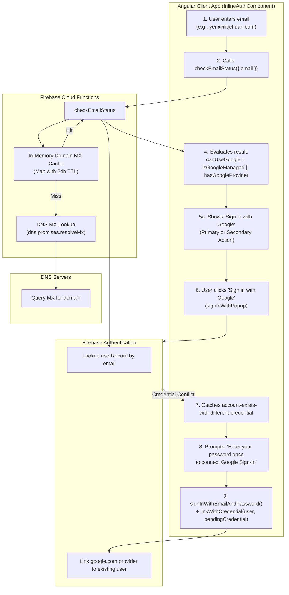

# Google Workspace Domain Detection & Google Sign-In Linking Plan

This document details the architectural and implementation plan for dynamically detecting Google-managed email domains (Google Workspace, e.g., `@iliqchuan.com`) and enabling seamless Google Sign-In and account linking for existing password-based members.

---

## 1. Overview & Objectives

### Background & Problem Statement
Currently, [functions/src/check-email-status.ts](vscode://file//Users/ldixon/code/zxd/ilc-members-manager/functions/src/check-email-status.ts:19) uses a hardcoded domain list:
```typescript
const GOOGLE_EMAIL_DOMAINS = ['gmail.com', 'googlemail.com'];
```
When a member with a Google Workspace domain (such as `yen@iliqchuan.com` or custom company domains) enters their email:
1. `isGoogleManaged` evaluates to `false` (unless the user already has a `google.com` provider attached to their Firebase Auth account).
2. The UI in [src/app/inline-auth/inline-auth.component.ts](vscode://file//Users/ldixon/code/zxd/ilc-members-manager/src/app/inline-auth/inline-auth.component.ts:230) computes `canUseGoogle = false`, routing the user to the password step and **completely hiding the "Sign in with Google" button**.
3. If an existing member who created their account with a password attempts Google Sign-In, Firebase Auth throws `auth/account-exists-with-different-credential` (due to "One account per email" policy), blocking sign-in unless their account is linked.

### Objectives
1. **Dynamic MX-based Google Workspace Detection:** Automatically detect whether any custom email domain is hosted on Google Workspace by checking DNS MX records in the `checkEmailStatus` Cloud Function.
2. **Domain Cache:** Cache MX lookup results in-memory with a TTL to ensure sub-millisecond responses on repeated lookups without redundant DNS traffic.
3. **Seamless Account Linking on Conflict:** When an existing password-based member signs in via Google, handle `auth/account-exists-with-different-credential` gracefully by prompting for their password once to link the Google provider permanently.
4. **Self-Service Linking in Profile:** Provide a "Link Google Account" button in the member's profile/settings so members can link Google while already logged in.

---

## 2. Architecture & Data Flow



---

## 3. Implementation Steps

### Phase 1: Dynamic MX Detection in Cloud Functions

#### 1.1 In-Memory Cache & DNS Resolver
In [functions/src/check-email-status.ts](vscode://file//Users/ldixon/code/zxd/ilc-members-manager/functions/src/check-email-status.ts):
* Define standard Google Workspace mail exchange patterns:
  ```typescript
  const GOOGLE_MX_SUFFIXES = [
    'google.com',
    'googlemail.com',
    'smtp.goog',
  ];
  ```
* Implement `isGoogleManagedDomain(domain: string): Promise<boolean>`:
  1. Check static known domains (`gmail.com`, `googlemail.com` -> `true`).
  2. Check in-memory LRU/Map cache (`domainMxCache` with 24-hour expiration).
  3. Execute `dns.promises.resolveMx(domain)` with a 1500ms timeout fallback.
  4. Inspect MX record exchanges: return `true` if any exchange hostname ends with one of `GOOGLE_MX_SUFFIXES` (e.g. `aspmx.l.google.com`).
  5. Cache and return the result.
* On DNS timeouts or unresolvable domains, fail safe to `false` without blocking the request.

#### 1.2 Update `checkEmailStatus`
* Calculate `isGoogleDomain = await isGoogleManagedDomain(domain)`.
* Compute `isGoogleManaged = isGoogleDomain || hasGoogleProvider`.

#### 1.3 Unit Tests
In `functions/src/check-email-status.spec.ts`:
* Test known domains (`gmail.com` -> `true` without DNS call).
* Test mock Google Workspace MX responses (`aspmx.l.google.com` -> `true`).
* Test mock third-party MX responses (`mta.yahoo.com`, `outlook.com` -> `false`).
* Test DNS resolution timeout/failure gracefully returns `false`.
* Test cache prevents duplicate DNS calls for the same domain.

---

### Phase 2: Frontend Account Linking on Credential Conflict

#### 2.1 Catch Credential Conflict in `FirebaseStateService`
In [src/app/firebase-state.service.ts](vscode://file//Users/ldixon/code/zxd/ilc-members-manager/src/app/firebase-state.service.ts:461):
* When `signInWithPopup` throws `auth/account-exists-with-different-credential`:
  * Extract the pending credential:
    ```typescript
    const credential = GoogleAuthProvider.credentialFromError(error);
    ```
  * Return `{ success: false, errorCode: error.code, pendingCredential: credential }`.

#### 2.2 Add Password-to-Link Flow in `InlineAuthComponent`
In [src/app/inline-auth/inline-auth.component.ts](vscode://file//Users/ldixon/code/zxd/ilc-members-manager/src/app/inline-auth/inline-auth.component.ts):
* When `loginWithGoogle()` receives `auth/account-exists-with-different-credential`:
  1. Store `pendingGoogleCredential`.
  2. Transition to a linking step (`InlineAuthStep.LinkGoogleAccount` or prompt inside `PasswordLogin`).
  3. Guidance message:
     > *"We found your existing account for {{ email() }}. Please enter your password once to connect Google Sign-In."*
  4. When the user enters their password and clicks *"Connect & Sign In"*:
     - Authenticate: `signInWithEmailAndPassword(auth, email, password)`.
     - Link: `linkWithCredential(userCredential.user, pendingGoogleCredential)`.
     - Remember successful Google login via `rememberSuccessfulLogin('google')`.
     - Complete login transition seamlessly.

---

### Phase 3: Self-Service Provider Linking in Profile Settings

In [src/app/member-details/member-details.html](vscode://file//Users/ldixon/code/zxd/ilc-members-manager/src/app/member-details/member-details.html):
* In the member's account/security card, display linked sign-in providers:
  * Google icon + "Connected" if `user.firebaseUser.providerData` contains `google.com`.
  * If not connected: "Connect Google Account" button calling `linkWithPopup(auth.currentUser, new GoogleAuthProvider())`.
  * Allows members to link Google proactively at any time while already signed in.

---

## 4. Verification & Testing Checklist

1. **DNS MX Detection:**
   - [ ] Verify `checkEmailStatus('yen@iliqchuan.com')` returns `isGoogleManaged: true`.
   - [ ] Verify `checkEmailStatus('member@gmail.com')` returns `isGoogleManaged: true`.
   - [ ] Verify `checkEmailStatus('member@yahoo.com')` returns `isGoogleManaged: false`.
2. **UI Step Guidance:**
   - [ ] Entering `yen@iliqchuan.com` offers Google Sign-In.
   - [ ] Password step displays the secondary *"Sign in with Google"* action.
3. **Conflict Resolution:**
   - [ ] Clicking Google for an unlinked password account prompts for password linking.
   - [ ] Successful password submission links Google provider to the user's Firebase Auth record.
   - [ ] Subsequent logins with Google succeed directly in one click.
4. **Regression Protection:**
   - [ ] Standard password sign-in for `@iliqchuan.com` and other domains continues to work without friction.
   - [ ] Standard Google sign-in for `@gmail.com` accounts remains unaffected.
