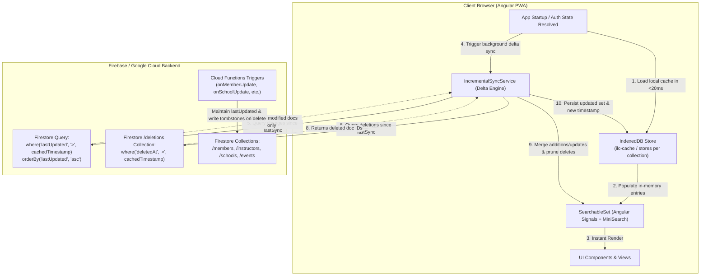

# Incremental Collection Sync & Local Persistence (Delta Sync) Architecture Plan

This document defines the architectural design, storage strategy, Firestore timestamp standardization, delta query protocols, deletion reconciliation, and implementation roadmap for **Incremental Collection Sync & Local Persistence** in the ILC Members Manager.

---

## 1. Executive Summary & Goals

### Problem Statement
Currently, whenever an administrator, instructor, or visitor opens the application, client services (e.g. `DataManagerService`, `FindInstructorsService`) subscribe to entire Firestore collections (such as `/members`, `/instructors`, `/schools`, `/events`) using unbounded `onSnapshot()` queries:

```typescript
// Current pattern: Reads all ~3,000–5,000 documents on every session/tab
const q = query(this.membersCollection, orderBy('lastUpdated', 'desc'));
onSnapshot(q, (snapshot) => { ... });
```

This architecture leads to:
1. **High Firestore Read Volumes**: Over 13.7 million document reads per month (~$10+/mo on Firestore read billing), with spikes of 3M+ reads/day during heavy usage or development.
2. **Slow Initial Load on Mobile/Poor Connections**: Downloading thousands of documents over the network on every app launch delays time-to-interactive.
3. **Lack of Offline Usability**: If network connectivity drops or the user is offline (e.g. at an martial arts seminar in a gym with no reception), the app cannot display cached members, instructors, or events.

### Core Objectives
1. **>95% Reduction in Firestore Reads**: Initial session loads read from local storage instantly (0 reads); subsequent syncs query only records where `lastUpdated > lastSyncTimestamp` (typically 0–20 reads per session).
2. **Instant (<20ms) Offline-Ready Startup**: Populate Angular Signals and `SearchableSet` MiniSearch indexes immediately from persistent browser storage before any network request completes.
3. **Robust Delta Merging**: Efficiently upsert updated/created records into memory and persistent storage without UI stutter.
4. **Reliable Deletion / Tombstone Handling**: Detect and prune deleted documents or removed memberships from the local cache.
5. **Secure Multi-User / Profile Scoping**: Partition cached data by user ID and role so unprivileged sessions never inherit cached admin data.
6. **Zero-Dependency Asynchronous Storage**: Utilize modern browser **IndexedDB** (capable of hundreds of megabytes) rather than synchronous `localStorage` (which has a 5MB limit and blocks the UI thread).

---

## 2. System Architecture & Data Flow



---

## 3. Storage Layer Design: IndexedDB vs LocalStorage

### Technology Selection: IndexedDB
| Aspect | LocalStorage | IndexedDB (Selected) |
|---|---|---|
| **Storage Capacity** | Strict 5MB ceiling per domain | Hundreds of MBs / GBs (>50% free disk) |
| **Thread Impact** | **Synchronous & blocking**: `JSON.parse(5MB)` freezes UI | **Asynchronous**: Non-blocking background I/O |
| **Data Types** | String-only (requires full stringify/parse) | Native structured objects & arrays |
| **Scalability** | Crashes with `QuotaExceededError` as member count grows | Effortlessly stores 10,000+ member records |

### IndexedDB Schema (`ilc_cache_db`)
Database Name: `ilc_cache_v1`
Object Stores:
- `collection_data`:
  - Key: `cacheKey` (e.g. `members_admin_${uid}`, `public_instructors`, `schools`, `events`)
  - Value: `{ cacheKey: string, lastSyncTimestamp: string, count: number, entries: T[] }`
- `meta`:
  - Key: `key` (e.g. `schema_version`, `last_cleanup`)
  - Value: `{ key: string, value: unknown }`

---

## 4. Firestore Timestamp Standardization & Trigger Audit

For delta queries (`where('lastUpdated', '>', cachedTimestamp)`) to be accurate, every document written to Firestore **must** carry a valid `lastUpdated` Timestamp.

### Collection Timestamp Matrix

| Collection | Model Type | Current `lastUpdated` Status | Required Action |
|---|---|---|---|
| `/members/{docId}` | `Member` | `lastUpdated: Timestamp` on write, ISO string on read | Fully supported; ensure all update paths set `serverTimestamp()` |
| `/instructors/{docId}` | `InstructorPublicData` | **Missing `lastUpdated`** | Add `lastUpdated` to `InstructorPublicData`, update converter & trigger |
| `/schools/{docId}` | `School` | `lastUpdated: Timestamp` on write | Fully supported |
| `/events/{docId}` | `IlcEvent` | `lastUpdated: string` (ISO string) | Ensure all updates refresh `lastUpdated` |
| `/schools/{id}/members/{docId}` | `Member` | Mirrored from member | Mirror carries `lastUpdated` |
| `/instructors/{id}/members/{docId}` | `Member` | Mirrored from member | Mirror carries `lastUpdated` |
| `/gradings/{docId}` | `Grading` | `lastUpdated: Timestamp` on write | Fully supported |

### Data Model Updates (`functions/src/data-model.ts`)
```typescript
export type InstructorPublicData = {
  docId: string;
  name: string;
  memberId: string;
  // ... other fields ...
  lastUpdated: string; // ISO 8601 UTC date string
};
```

---

## 5. Deletion & Tombstone Architecture

### The Orphan Problem in Delta Sync
If document `X` is deleted in Firestore while a client is offline, `where('lastUpdated', '>', timestamp)` will **never** return document `X`. Without explicit deletion tracking, document `X` would remain in the client's local cache forever.

### Dual-Layer Solution: Tombstones + Sanity Reconciliation

#### 1. Lightweight Tombstones (`/system/deletions/{collectionName}`)
When a document is deleted via Firestore trigger (`onMemberDeleted`, `onSchoolDeleted`, `onEventDeleted`, `onGradingDeleted`), Cloud Functions record a tombstone:

```typescript
// Path: /system/deletions/{collection}/entries/{docId}
export type Tombstone = {
  docId: string;
  deletedAt: Timestamp;
};
```

During delta sync, the client executes two lightweight queries:
1. `collection.where('lastUpdated', '>', lastSyncTimestamp)` -> Modified/Added docs.
2. `deletions.where('deletedAt', '>', lastSyncTimestamp)` -> Deleted doc IDs to prune from local cache.

#### 2. Periodic Header Check & Force Refresh
- Store global collection counts / revision in `/system/counters` (already subscribed to in real time).
- If the local cache count diverges significantly from the system counter, or if the user clicks "Refresh Data", perform a full clean fetch and reset the cache timestamp.

---

## 6. Client Sync Engine Implementation (`IncrementalSyncService`)

### Sync Protocol Walkthrough

```typescript
export interface CachedCollection<T> {
  entries: T[];
  lastSyncTimestamp: string; // ISO string
}

export class IncrementalSyncService {
  private idb = inject(IdbStorageService);

  /**
   * Syncs a collection with local cache + remote delta.
   */
  async syncCollection<ID extends string, T extends { [key in ID]: string }>(
    config: {
      cacheKey: string;
      collectionName: string;
      idField: ID;
      targetSet: SearchableSet<ID, T>;
      docConverter: (doc: GenericFirestoreDoc) => T;
      baseQuery?: (colRef: CollectionReference) => Query;
    }
  ): Promise<void> {
    // 1. Instant local load (<20ms)
    const cached = await this.idb.get<CachedCollection<T>>(config.cacheKey);
    if (cached && cached.entries.length > 0) {
      config.targetSet.setEntries(cached.entries);
    }

    const lastSync = cached?.lastSyncTimestamp || '1970-01-01T00:00:00.000Z';
    const lastSyncTimestamp = Timestamp.fromDate(new Date(lastSync));

    // 2. Fetch remote delta (modified since lastSync)
    const colRef = collection(this.db, config.collectionName);
    let deltaQuery = query(
      config.baseQuery ? config.baseQuery(colRef) : colRef,
      where('lastUpdated', '>', lastSyncTimestamp),
      orderBy('lastUpdated', 'asc')
    );

    const [deltaSnap, tombstoneSnap] = await Promise.all([
      getDocs(deltaQuery),
      this.getRecentTombstones(config.collectionName, lastSyncTimestamp),
    ]);

    if (deltaSnap.empty && tombstoneSnap.length === 0) {
      // Nothing changed remotely; cache is completely fresh!
      return;
    }

    // 3. Merge delta in-memory
    const currentMap = new Map<string, T>();
    if (cached?.entries) {
      for (const item of cached.entries) {
        currentMap.set(item[config.idField], item);
      }
    }

    // Apply updates/additions
    let maxTimestamp = lastSync;
    for (const d of deltaSnap.docs) {
      const item = config.docConverter(d);
      currentMap.set(item[config.idField], item);
      const itemTime = (item as any).lastUpdated;
      if (itemTime && itemTime > maxTimestamp) {
        maxTimestamp = itemTime;
      }
    }

    // Apply deletions
    for (const deletedId of tombstoneSnap) {
      currentMap.delete(deletedId);
    }

    const updatedEntries = Array.from(currentMap.values());

    // 4. Update SearchableSet signals
    config.targetSet.setEntries(updatedEntries);

    // 5. Persist merged dataset back to IndexedDB
    await this.idb.set(config.cacheKey, {
      entries: updatedEntries,
      lastSyncTimestamp: maxTimestamp,
    });
  }
}
```

---

## 7. Security, Auth Scoping & Role Isolation

Cached documents must respect user permissions:
1. **Admin Cache Key**: `members_admin_${user.firebaseUser.uid}` (Only created/accessed if `user.isAdmin === true`).
2. **Instructor Student Cache Key**: `students_instructor_${instructorMemberDocId}`.
3. **School Member Cache Key**: `school_members_${schoolDocId}`.
4. **Public Catalogs**: `public_instructors`, `public_schools`, `public_events` (Shared across visitors/members).
5. **Logout Cleardown**: On `logout()`, in-memory signals are cleared. Private user caches can be retained encrypted by UID or cleared.

---

## 8. Firestore Security Rules & Composite Index Requirements

### Security Rules Impact
- Firestore security rules evaluate rules per-query.
- Queries with `where('lastUpdated', '>', timestamp)` on `/members` (for admins) or `/instructors` (public) require `lastUpdated` to be indexed.
- Single-field queries on `lastUpdated` use Firestore's automatic single-field ascending/descending indexes (no complex manual indexing needed).
- Filtered queries (e.g. `where('primarySchoolId', '==', id).where('lastUpdated', '>', timestamp)`) will have composite index definitions added to `firestore.indexes.json`.

---

## 9. Phased Implementation Roadmap

### Phase 1: Storage Infrastructure & Backend Prep
- [ ] Create `IdbStorageService` (`src/app/idb-storage.service.ts`) with lightweight IndexedDB wrapper.
- [ ] Add `lastUpdated` to `InstructorPublicData` in `data-model.ts` and `mirror-instructors-to-public-profile.ts`.
- [ ] Implement tombstone recording in `on-member-update.ts`, `on-school-update.ts`, `proposed-events.ts`.
- [ ] Create backfill script `backfill-collection-timestamps.ts` to ensure all existing production documents have valid `lastUpdated` timestamps.

### Phase 2: Public Collections Delta Sync
- [ ] Refactor `FindInstructorsService` to use `IncrementalSyncService` with `public_instructors` IndexedDB cache.
- [ ] Refactor `updateSchoolsSync` in `DataManagerService` to use incremental delta sync.
- [ ] Refactor `getRecentEvents` / public event catalog to use local caching.
- [ ] Verify instant startup and offline capability.

### Phase 3: Authenticated & Admin Collections Sync
- [ ] Refactor `updateMembersSync(user)` (Admin full members list) to use user-scoped IndexedDB cache.
- [ ] Refactor `updateMyStudentsSync(user)` and school manager member lists.
- [ ] Add "Clear Cache / Force Refresh" button in Admin Settings.

### Phase 4: Verification & Performance Testing
- [ ] Run rules tests (`pnpm test:rules`) and unit tests (`pnpm test`).
- [ ] Verify Cloud Monitoring metrics: confirm Firestore reads drop by >95%.
- [ ] Test offline behavior in Chrome DevTools (Network: Offline).

---

## 10. Summary of Benefits

| Metric | Before Delta Sync | After Delta Sync | Improvement |
|---|---|---|---|
| **Firestore Reads per Admin Load** | 3,000–5,000 reads | 0–10 reads | **>99.7% reduction** |
| **Monthly Read Volume** | ~13.7M reads | ~200k–400k reads | **Save ~$8–$12/month** |
| **App Startup Time to Interactive** | 1.5s–3.0s | <50ms (instant UI) | **~30x faster** |
| **Offline Usability** | Broken / blank screens | Fully searchable offline | **100% offline support** |
