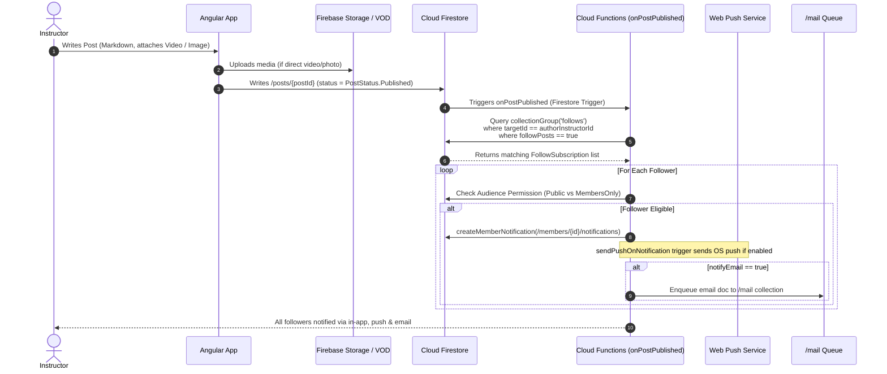
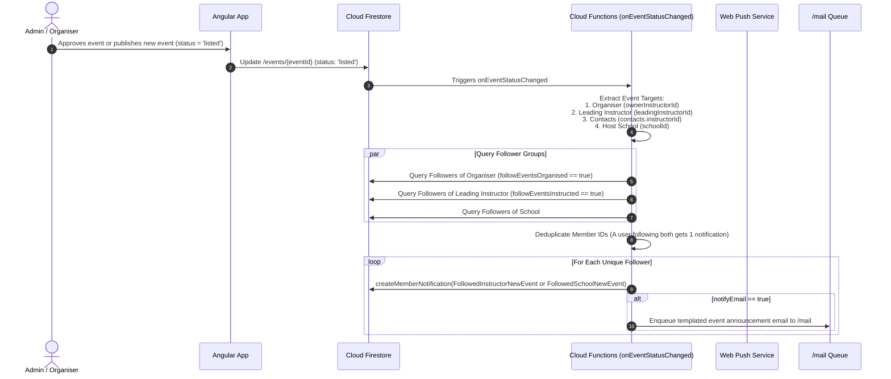
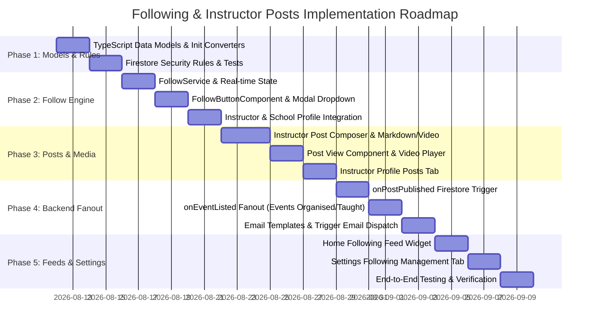

# Following Instructors & Schools, Instructor Posts, and Event Notification Plan

This document defines the end-to-end architecture, domain models, permission rules, backend fanout pipelines, and client-side UI components for allowing members to **follow instructors** (events organised, events instructed, and posts/videos) and **follow schools** (school events and updates), with delivery via **in-app notification feeds**, **background web push**, and **email notifications**.

---

## 1. Executive Summary & Core Requirements

### 1.1 Goals
1. **Granular Following of Instructors**:
   - **Events Organised**: Receive notifications when an instructor organises/creates a newly listed event (as event owner/creator or manager).
   - **Events Instructed**: Receive notifications when an instructor is teaching at an event (as leading instructor or listed teaching contact).
   - **Instructor Posts & Videos**: Receive notifications when an instructor publishes a post or video update.
2. **Following Schools**:
   - **School Events**: Receive notifications when a followed school hosts or associates with a newly listed event.
   - **School Updates**: Receive notifications when a school publishes announcements or updates.
3. **Instructor Posts with Video & Media**:
   - Instructors can author articles and announcements in rich Markdown.
   - Posts can embed or attach media: **direct video uploads / VOD streaming**, video links (YouTube/Vimeo), and photo galleries.
   - Visibility/Audience controls: `Public` (all visitors), `Members Only` (active ILC members), or `Students Only` (students registered with that instructor/school).
4. **Multi-Channel Notification Delivery**:
   - **In-App Notification Feed**: Stored in `/members/{memberDocId}/notifications/{notifId}` and rendered in real-time on the home feed and notifications center.
   - **Background Web Push**: Dispatched via standard Web Push (VAPID) to registered devices via `sendPushOnNotification`.
   - **Email Notifications**: Triggered via Cloud Functions writing to `/mail` using customizable Markdown email templates.
5. **Centralized User Control & Preferences**:
   - 1-click **Follow** button on Instructor Profile (`/instructors/:id`), School Profile (`/school-profile/:id`), and Event detail cards.
   - Preferences modal/dropdown allowing members to customize what they follow (organised events, instructed events, posts) and how they are notified (In-App, Push, Email).
   - Central "Following" management hub in Settings (`/settings?tab=following`) to review, toggle, and unfollow.

---

## 2. System Architecture & Flow

```mermaid
flowchart TD
    subgraph Client_App["1. Angular Client & User Actions"]
        UI_Follow["Follow Button / Modal\n(/instructors/:id, /school-profile/:id)"]
        UI_PostEditor["Instructor Post Composer\n(/instructors-area/posts/new)"]
        UI_EventEditor["Event Proposal / Edit\n(/organise-event, /events/:id/edit)"]
        UI_Feed["Home Following Feed & Notifications\n(/home, /notifications)"]
    end

    subgraph Firestore_State["2. Cloud Firestore State"]
        FS_Follows["/members/{memberDocId}/follows/{targetKey}\n(Target: Instructor or School)"]
        FS_Posts["/posts/{postId}\n(Author, Markdown, Video, Status)"]
        FS_Events["/events/{eventId}\n(Status: Listed, Leading Instructor, School)"]
        FS_Notifs["/members/{memberDocId}/notifications/{notifId}"]
        FS_Mail["/mail/{mailId}\n(Trigger Email queue)"]
    end

    subgraph Functions_Triggers["3. Cloud Functions Fanout Engine"]
        CF_OnPost["onPostPublished\n(Firestore Trigger on /posts/{id})"]
        CF_OnEvent["onEventListed\n(Firestore Trigger on /events/{id})"]
        CF_SendPush["sendPushOnNotification\n(Web Push to service worker)"]
    end

    subgraph Delivery_Channels["4. Notification Delivery"]
        Chan_InApp["In-App Feed & Badge\n(NotificationService stream)"]
        Chan_Push["OS Web Push Banner\n(ngsw-worker.js)"]
        Chan_Email["Email Dispatch\n(SMTP / SendGrid via /mail)"]
    end

    UI_Follow -->|Write follow preferences| FS_Follows
    UI_PostEditor -->|Publish post| FS_Posts
    UI_EventEditor -->|Approve/List event| FS_Events

    FS_Posts -->|onWrite (status == 'published')| CF_OnPost
    FS_Events -->|onWrite (status == 'listed')| CF_OnEvent

    CF_OnPost -->|Query collectionGroup('follows')| FS_Follows
    CF_OnEvent -->|Query collectionGroup('follows')| FS_Follows

    CF_OnPost -->|Batch write| FS_Notifs
    CF_OnPost -->|Enqueue emails| FS_Mail

    CF_OnEvent -->|Deduplicate & batch write| FS_Notifs
    CF_OnEvent -->|Enqueue emails| FS_Mail

    FS_Notifs -->|Real-time onSnapshot| UI_Feed
    FS_Notifs -->|onDocumentCreated| CF_SendPush

    CF_SendPush --> Chan_Push
    UI_Feed --> Chan_InApp
    FS_Mail --> Chan_Email
```

---

## 3. Data Models & TypeScript Types

All data structures follow the codebase standards: typed domain models, TypeScript enums (no plain string unions), `initXxx()` initializers, and `firestoreDocToXxx()` converters in `functions/src/data-model.ts`.

### 3.1 Enums

```typescript
/** Types of entities that can be followed. */
export enum FollowTargetType {
  Instructor = 'instructor',
  School = 'school',
}

/** Audience visibility for an instructor post. */
export enum PostAudience {
  Public = 'public',
  MembersOnly = 'members_only',
  StudentsOnly = 'students_only',
}

/** Publication state of a post. */
export enum PostStatus {
  Draft = 'draft',
  Published = 'published',
  Archived = 'archived',
}

/** Media attachment type in a post. */
export enum PostMediaType {
  Video = 'video',
  Image = 'image',
  Youtube = 'youtube',
  Vimeo = 'vimeo',
}
```

### 3.2 Follow Subscription Document (`/members/{memberDocId}/follows/{targetKey}`)

The target key in the subcollection is formatted as `instructor_${instructorId}` or `school_${schoolId}` to prevent duplicate entries and allow instant existence checks.

```typescript
export interface FollowSubscription {
  docId: string;                     // Matches 'instructor_1' or 'school_SCH-100'
  memberDocId: string;               // Follower's member document ID
  memberEmail: string;               // Follower's email snapshot
  targetType: FollowTargetType;       // FollowTargetType.Instructor | FollowTargetType.School
  targetId: string;                 // Human-readable ID ('1', 'SCH-100')
  targetDocId: string;              // Firestore doc ID of instructor or school
  targetName: string;               // Cached display name ('Sam Chin', 'Boulder School')
  targetThumbUrl: string;           // Cached avatar/logo for UI

  // Granular Follow Preferences
  followEventsOrganised: boolean;   // Events where instructor is owner/creator/manager
  followEventsInstructed: boolean;  // Events where instructor is leading or listed contact
  followPosts: boolean;             // Instructor posts, articles, and video releases

  // Channel Preferences
  notifyInApp: boolean;             // In-app notification feed (default true)
  notifyPush: boolean;              // Background web push (default true)
  notifyEmail: boolean;             // Direct email notification (default false/opt-in)

  createdAt: string;                // ISO Date
  lastUpdated: string;              // ISO Date
}

export function initFollowSubscription(
  memberDocId: string,
  targetType: FollowTargetType,
  targetId: string
): FollowSubscription {
  return {
    docId: `${targetType}_${targetId}`,
    memberDocId,
    memberEmail: '',
    targetType,
    targetId,
    targetDocId: '',
    targetName: '',
    targetThumbUrl: '',
    followEventsOrganised: true,
    followEventsInstructed: true,
    followPosts: true,
    notifyInApp: true,
    notifyPush: true,
    notifyEmail: false,
    createdAt: new Date().toISOString(),
    lastUpdated: new Date().toISOString(),
  };
}
```

### 3.3 Post Media Item

```typescript
export interface PostMediaItem {
  id: string;                       // Unique client ID or storage UUID
  type: PostMediaType;              // Enum: Video, Image, Youtube, Vimeo
  url: string;                      // Firebase Storage download URL, VOD manifest, or embed URL
  thumbnailUrl?: string;            // Video preview poster or image thumb
  title?: string;                   // Optional caption/title
  durationSeconds?: number;         // Video duration if applicable
  vodDocId?: string;                // Reference to /videos/{videoId} if transcoded via VOD pipeline
}
```

### 3.4 Instructor Post Document (`/posts/{postId}`)

```typescript
export interface InstructorPost {
  docId: string;                     // Auto-generated Firestore document ID
  slug: string;                      // URL slug (e.g. 'spinning-hands-drills-march-2026')
  
  // Author & Affiliation Details
  authorMemberDocId: string;         // Author's memberDocId
  authorInstructorId: string;        // Human-readable instructorId ('1')
  authorName: string;                // Snapshot: 'Sam Chin [INST-001]'
  authorThumbUrl: string;            // Avatar thumbnail URL
  schoolId?: string;                 // Associated school ID if published on behalf of a school
  schoolName?: string;               // Associated school name snapshot

  // Content
  title: string;                     // Post title
  excerpt: string;                   // Short teaser text (1-2 sentences)
  bodyMarkdown: string;              // Markdown body content
  coverImageUrl?: string;            // Optional header banner image
  coverImageThumbUrl?: string;       // Thumbnail for card view
  media: PostMediaItem[];            // Attached videos, photos, embed links
  tags: string[];                    // Searchable tags (e.g. ['spinning_hands', 'level_3'])

  // Visibility & State
  audience: PostAudience;            // Public | MembersOnly | StudentsOnly
  status: PostStatus;                // Draft | Published | Archived
  publishedAt?: string;              // ISO Timestamp
  
  // Stats & Counters
  viewCount: number;                 // Read counter
  likeCount: number;                 // Future-ready engagement counter

  createdAt: string;                 // ISO Date
  lastUpdated: string;               // ISO Date
}

export function initInstructorPost(): InstructorPost {
  return {
    docId: '',
    slug: '',
    authorMemberDocId: '',
    authorInstructorId: '',
    authorName: '',
    authorThumbUrl: '',
    title: '',
    excerpt: '',
    bodyMarkdown: '',
    media: [],
    tags: [],
    audience: PostAudience.Public,
    status: PostStatus.Draft,
    viewCount: 0,
    likeCount: 0,
    createdAt: new Date().toISOString(),
    lastUpdated: new Date().toISOString(),
  };
}
```

### 3.5 Notification Kinds & Payloads

Add new kinds to `NotificationKind` in `functions/src/data-model.ts`:

```typescript
export enum NotificationKind {
  // ... existing kinds ...

  // Sent when an instructor a member follows publishes a new post or video
  FollowedInstructorNewPost = 'FollowedInstructorNewPost',

  // Sent when an instructor a member follows is organising or instructing a new event
  FollowedInstructorNewEvent = 'FollowedInstructorNewEvent',

  // Sent when a school a member follows is hosting a new event
  FollowedSchoolNewEvent = 'FollowedSchoolNewEvent',
}
```

**Payload Types for Member Notifications**:

```typescript
export interface NotificationFollowedPostData {
  postId: string;
  postTitle: string;
  postExcerpt: string;
  instructorId: string;
  instructorName: string;
  hasVideo: boolean;
  coverThumbUrl?: string;
}

export interface NotificationFollowedEventData {
  eventId: string;
  eventTitle: string;
  eventDate: string;
  eventLocation: string;
  instructorId?: string;
  instructorName?: string;
  schoolId?: string;
  schoolName?: string;
  role: 'organiser' | 'instructor' | 'host_school';
}
```

---

## 4. End-to-End Workflow & Sequence Diagrams

### 4.1 Instructor Publishes a Post (With Video & Fanout)



### 4.2 Event Listed Fanout (Instructor & School Followers)



---

## 5. Security Rules (`firestore.rules`)

Security rules must be updated and verified with unit tests in `tests/firestore.rules.spec.ts`.

```javascript
// 1. Follow Subscriptions (/members/{memberDocId}/follows/{followId})
match /members/{memberDocId}/follows/{followId} {
  function isOwner() {
    return memberDocId in getUserMemberDocIds() ||
           request.auth.token.email in get(/databases/$(database)/documents/members/$(memberDocId)).data.emails;
  }
  // Members can read and manage their own follow subscriptions; Admins can read all
  allow read: if isOwner() || isAdmin();
  allow write: if isOwner() || isAdmin();
}

// 2. Instructor Posts (/posts/{postId})
match /posts/{postId} {
  function isAuthor() {
    return request.auth != null && (
      resource.data.authorMemberDocId in getUserMemberDocIds() ||
      request.auth.token.email in get(/databases/$(database)/documents/members/$(resource.data.authorMemberDocId)).data.emails
    );
  }

  function isLicensedInstructor() {
    return request.auth != null && (
      getUserInstructorIds().size() > 0 ||
      isAdmin()
    );
  }

  // Reads:
  // - Published + Public: Open to all visitors
  // - Published + MembersOnly: Active members only
  // - Draft / Archived: Author or Admin only
  allow read: if (
    (resource.data.status == 'published' && resource.data.audience == 'public') ||
    (resource.data.status == 'published' && resource.data.audience == 'members_only' && hasActiveMembership()) ||
    isAuthor() ||
    isAdmin()
  );

  // Writes (Create, Update, Delete):
  // - Licensed instructors can create posts where they are the author
  // - Author or Admin can update or delete
  allow create: if isLicensedInstructor() && (
    request.resource.data.authorMemberDocId in getUserMemberDocIds() ||
    isAdmin()
  );
  allow update, delete: if isAuthor() || isAdmin();
}
```

---

## 6. Cloud Functions & Fanout Pipelines

### 6.1 `onPostPublished` (Trigger on `/posts/{postId}`)
- **Location**: `functions/src/on-post-update.ts`
- **Logic**:
  1. Detect when `after.status === PostStatus.Published && (!before || before.status !== PostStatus.Published)`.
  2. Query `db.collectionGroup('follows').where('targetId', '==', post.authorInstructorId).where('followPosts', '==', true)`.
  3. Load recipient members.
  4. Filter by audience (`PostAudience.MembersOnly` requires active membership check).
  5. Dispatch in-app notifications in Firestore batches using `createMemberNotification`.
  6. If `follow.notifyEmail === true`, enqueue an email to `/mail` using `sendTemplateEmail`.

### 6.2 `onEventListed` (Extension of `functions/src/proposed-events.ts`)
- **Location**: `functions/src/proposed-events.ts`
- **Logic**:
  1. Detect when `after.status === EventStatus.Listed && (!before || before.status !== EventStatus.Listed)`.
  2. Resolve:
     - Organising instructor (`ownerInstructorId`)
     - Leading instructor (`leadingInstructorId`)
     - Listed instructor contacts (`contacts[].instructorId`)
     - Host school (`schoolId`)
  3. Execute parallel queries on `collectionGroup('follows')`.
  4. Deduplicate followers into a `Map<memberDocId, NotificationFollowedEventData>`.
  5. Batch write `FollowedInstructorNewEvent` or `FollowedSchoolNewEvent` notifications.
  6. Enqueue email to `/mail` for recipients with `notifyEmail === true`.

### 6.3 Email Templates (`functions/src/email-templates.ts`)

```typescript
// 1. Followed Instructor New Post
export function followedInstructorPostSubject(params: { instructorName: string; postTitle: string }): string {
  return `New Post by ${params.instructorName}: ${params.postTitle}`;
}

export function followedInstructorPostBody(params: {
  instructorName: string;
  postTitle: string;
  excerpt: string;
  postUrl: string;
  settingsUrl: string;
}): string {
  return `**${params.instructorName}** just published a new post on ILC Members Portal:

### [${params.postTitle}](${params.postUrl})

> ${params.excerpt}

[Read full post & watch video](${params.postUrl})

---
*You received this because you follow ${params.instructorName}. Manage your following preferences in [Settings](${params.settingsUrl}).*`;
}

// 2. Followed Event Announcement
export function followedEventSubject(params: { title: string; hostOrInstructor: string }): string {
  return `New Event: ${params.title} (${params.hostOrInstructor})`;
}

export function followedEventBody(params: {
  title: string;
  date: string;
  location: string;
  instructorOrSchool: string;
  eventUrl: string;
  settingsUrl: string;
}): string {
  return `A new event has been listed:

### [${params.title}](${params.eventUrl})
- **Instructor / Host:** ${params.instructorOrSchool}
- **Date:** ${params.date}
- **Location:** ${params.location}

[View Event Details & Register](${params.eventUrl})

---
*You received this because you follow ${params.instructorOrSchool}. Manage your following preferences in [Settings](${params.settingsUrl}).*`;
}
```

---

## 7. Frontend User Experience & Angular Components

### 7.1 Follow Button & Preferences Modal (`<app-follow-button>`)
- **Location**: `src/app/follow-button/`
- **Where Displayed**:
  - Top header of Instructor Profile (`/instructors/:id`)
  - Top header of School Profile (`/school-profile/:id`)
  - Instructor cards in Find an Instructor (`/find-an-instructor`) and Find a School (`/find-school`)
  - Author header on Instructor Posts (`/posts/:id`)
- **States**:
  - `Not Following`: Clean outlined button with bell/heart icon (`+ Follow`).
  - `Following`: Filled accent button (`Following ✓`) with a gear/chevron opening the quick settings dropdown:
    - [x] Events organised by this instructor
    - [x] Events where instructor is teaching
    - [x] Posts & video updates
    - Delivery: [x] In-App / Push &nbsp;&nbsp; [ ] Email Notifications

```typescript
@Component({
  selector: 'app-follow-button',
  standalone: true,
  imports: [CommonModule, IconComponent],
  templateUrl: './follow-button.html',
  styleUrl: './follow-button.scss',
  changeDetection: ChangeDetectionStrategy.OnPush,
})
export class FollowButtonComponent {
  targetType = input.required<FollowTargetType>();
  targetId = input.required<string>();
  targetName = input.required<string>();
  targetDocId = input<string>('');
  targetThumbUrl = input<string>('');

  private followService = inject(FollowService);

  isFollowing = computed(() => this.followService.isFollowing(this.targetType(), this.targetId()));
  currentSubscription = computed(() => this.followService.getSubscription(this.targetType(), this.targetId()));
  showSettingsDropdown = signal(false);

  toggleFollow(): void {
    if (this.isFollowing()) {
      this.followService.unfollow(this.targetType(), this.targetId());
    } else {
      this.followService.follow({
        targetType: this.targetType(),
        targetId: this.targetId(),
        targetName: this.targetName(),
        targetDocId: this.targetDocId(),
        targetThumbUrl: this.targetThumbUrl(),
      });
    }
  }
}
```

### 7.2 Follow Service (`src/app/follow.service.ts`)
- Subscribes via `onSnapshot` to `/members/{currentMemberDocId}/follows/`.
- Maintains a reactive `SearchableSet` / signal map of active subscriptions.
- Methods:
  - `isFollowing(type, id): boolean`
  - `getSubscription(type, id): FollowSubscription | null`
  - `follow(params): Promise<void>`
  - `unfollow(type, id): Promise<void>`
  - `updatePreferences(targetKey, partialPrefs): Promise<void>`

### 7.3 Instructor Post Composer (`<app-instructor-post-composer>`)
- **Location**: `src/app/instructor-post-composer/`
- **Route**: `/instructors-area/my-posts/new` and `/instructors-area/my-posts/:id/edit`
- **Features**:
  - Title input with automatic URL slug generation.
  - Markdown body editor with live side-by-side preview (reusing `MarkdownEditorComponent`).
  - Media uploader:
    - **Video Upload / Select**: Integrates with Cloud Storage or existing VOD materials.
    - **Video Link**: Embed YouTube or Vimeo URLs.
    - **Cover Banner Image**: Drag & drop header image.
    - **Image Gallery**: Multiple inline image attachments.
  - Audience Selector: `Public` | `Members Only` | `Students Only`.
  - Tags input (with autocomplete suggestions).
  - Draft / Publish toggle with immediate preview.

### 7.4 Instructor Post Reader (`<app-post-view>`)
- **Location**: `src/app/post-view/`
- **Route**: `Views.PostView` -> `posts/${pv('postId')}` (also aliased under `instructors/${pv('instructorId')}/posts/${pv('slug')}`)
- **Features**:
  - Hero header with cover image, publish date, reading time.
  - Author bio bar with avatar, instructor level, and `<app-follow-button>`.
  - Media display: Responsive video player (`<app-video-player>` for HLS/MP4 or responsive iframe for YouTube/Vimeo).
  - Markdown rendering with syntax highlighting and image zoom.
  - Share link button (copies clean URL to clipboard).
  - "More from this Instructor" related posts carousel.

### 7.5 Home Feed & Following Hub (`<app-following-feed>`)
- **Location**: Tab on `/home` and dedicated view in Settings.
- **Components**:
  - **"From Instructors & Schools You Follow"**: Feed of recent posts and newly announced events.
  - **"Manage Following"** in Settings (`/settings?tab=following`):
    - Table/grid of all followed instructors and schools.
    - Quick toggles for each subscription: Organised Events, Instructed Events, Posts, Push, Email.
    - 1-click Unfollow.

---

## 8. URL Routing Map

Add to `src/app/app.config.ts` and `RoutingService`:

| View Enum | URL Pattern | Description | Access |
|---|---|---|---|
| `Views.PostView` | `posts/:postId` | Public view of an individual post | Public / Member gated |
| `Views.InstructorPosts` | `instructors/:instructorId/posts` | List of posts by instructor | Public |
| `Views.MyPosts` | `my-posts` | Instructor post management table | Licensed Instructors |
| `Views.MyPostEdit` | `my-posts/:postId/edit` | Post composer / edit form | Post Author / Admin |
| `Views.MyPostNew` | `my-posts/new` | Create new post composer | Licensed Instructors |
| `Views.Following` | `following` or `settings/following` | Manage all followed instructors & schools | Logged-in Members |

---

## 9. Phased Implementation Plan



### Phase Breakdown

#### Phase 1: Data Model, Security Rules & Tests
- [ ] Add `FollowSubscription`, `InstructorPost`, `PostMediaItem`, `PostAudience`, `PostStatus`, `FollowTargetType` to `functions/src/data-model.ts`.
- [ ] Add new `NotificationKind` entries (`FollowedInstructorNewPost`, `FollowedInstructorNewEvent`, `FollowedSchoolNewEvent`) and styling helper.
- [ ] Update `firestore.rules` with match rules for `/members/{id}/follows/{followId}` and `/posts/{postId}`.
- [ ] Write Firestore security rules unit tests in `tests/firestore.rules.spec.ts`.

#### Phase 2: Follow Service & UI Integration
- [ ] Create `src/app/follow.service.ts` managing real-time snapshot of the member's follows.
- [ ] Build `<app-follow-button>` with instant toggle and granular settings dropdown.
- [ ] Integrate follow button into `InstructorViewComponent` (`/instructors/:id`) and `SchoolViewComponent` (`/school-profile/:id`).
- [ ] Integrate follow badges into instructor and school list cards.

#### Phase 3: Instructor Posts & Media Composer
- [ ] Build `InstructorPostComposerComponent` with Markdown editor, image upload, and video attachment (linking VOD or external video).
- [ ] Build `PostViewComponent` with Markdown viewer, video player, instructor bio card, and share tools.
- [ ] Add "Posts" tab to `InstructorViewComponent` displaying published articles and videos.
- [ ] Add "My Posts" dashboard to `InstructorsArea` for authors to manage drafts and published content.

#### Phase 4: Cloud Functions Fanout & Email Dispatch
- [ ] Create `onPostPublished` Firestore trigger in `functions/src/` to query `collectionGroup('follows')` and batch create member notifications.
- [ ] Update `onEventUpdated` in `functions/src/proposed-events.ts` to identify followers of organiser, leading instructor, and host school, deduplicate, and notify.
- [ ] Add Markdown email templates in `functions/src/email-templates.ts` for new posts and new events.
- [ ] Wire up email dispatch via `/mail` queue when `notifyEmail === true`.

#### Phase 5: Following Feed, Settings & Verification
- [ ] Build "Following Feed" widget on Home dashboard (`/home`) showing latest updates from followed entities.
- [ ] Build "Following" tab in Settings (`/settings?tab=following`) for full subscription management.
- [ ] Run full test suite: `pnpm test`, `pnpm test:rules`, `pnpm test:functions`, and `pnpm build`.

---

## 10. Summary Table of Notification Triggers

| Event / Action | Criteria / Follow Preference | Recipient Group | Notification Kind | Channels |
|---|---|---|---|---|
| **Instructor Publishes Post** | `followPosts == true` | Followers of author instructor | `FollowedInstructorNewPost` | In-App, Push, Email (opt-in) |
| **New Event Organised** | `followEventsOrganised == true` | Followers of event creator / organiser | `FollowedInstructorNewEvent` | In-App, Push, Email (opt-in) |
| **New Event Teaching** | `followEventsInstructed == true` | Followers of leading instructor or contacts | `FollowedInstructorNewEvent` | In-App, Push, Email (opt-in) |
| **School Hosts Event** | Target is School | Followers of host school (`schoolId`) | `FollowedSchoolNewEvent` | In-App, Push, Email (opt-in) |
