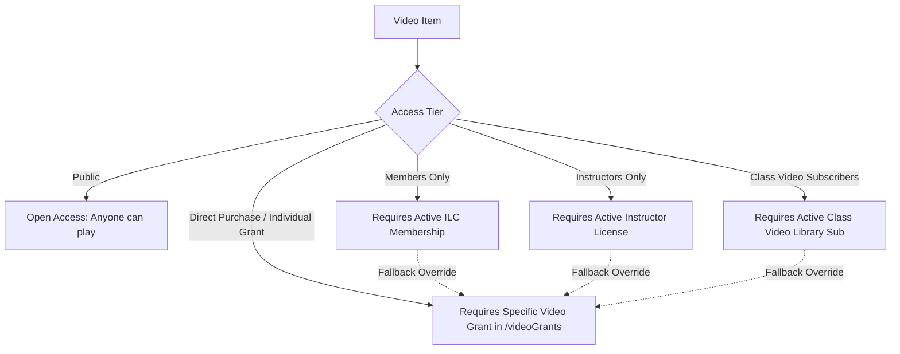
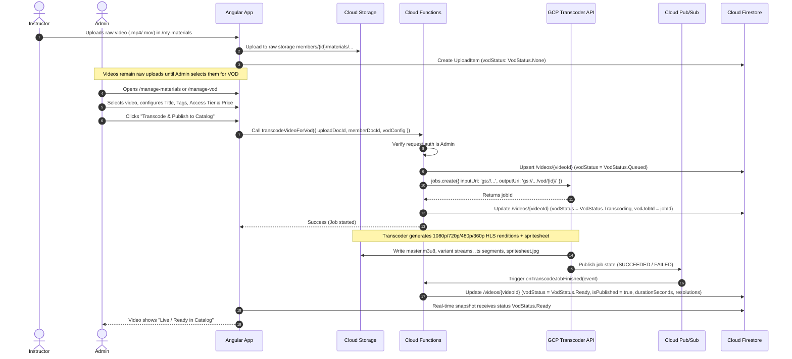
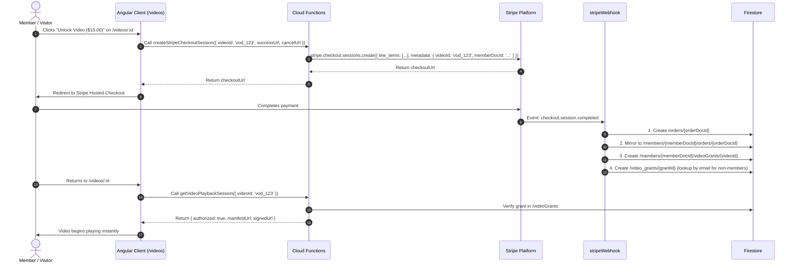
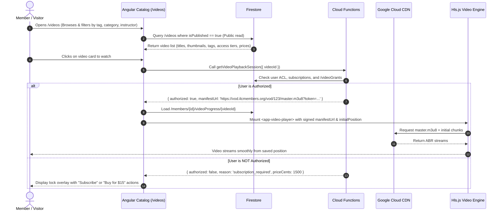
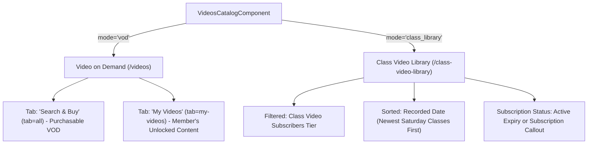
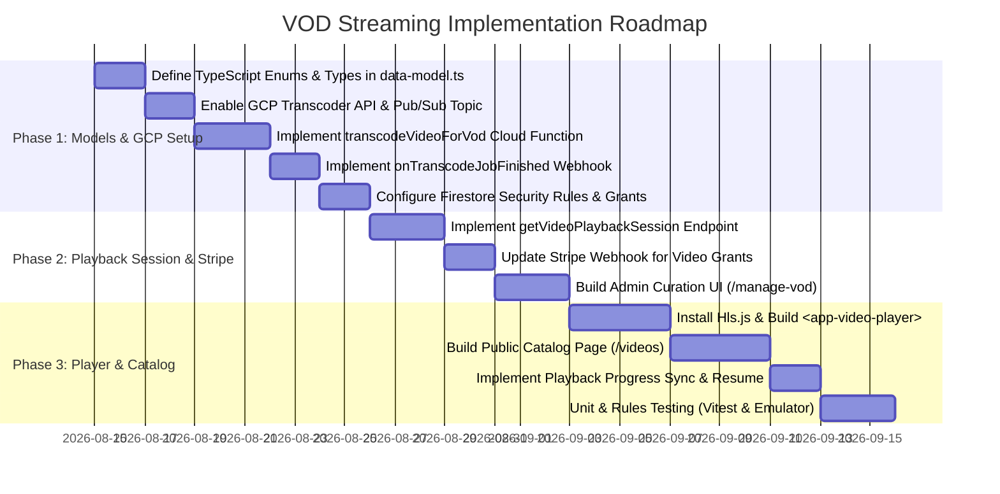

# Video-on-Demand (VOD) Streaming Playback Architecture Plan

This document defines the end-to-end architecture, backend pipelines, Google Cloud service integrations, permission models, data models (using TypeScript enums), security rules, and client-side player implementation for **Video-on-Demand (VOD) Streaming** in the ILC Members Manager platform.

---

## 1. Executive Summary & Goals

### Problem Statement
Instructors upload seminar recordings, technique demos, grading preparation videos, and workshop captures to the platform (stored as raw `.mp4`, `.mov`, or `.m4v` files in Google Cloud Storage via `/my-materials` or `/events/:id/edit`). Currently, these are only available as raw file downloads or basic HTML5 video elements without adaptive bitrate streaming. This causes high buffering on mobile/poor connections, high bandwidth egress costs, and lacks granular access control, monetization (Stripe purchases/subscriptions), or playback progress tracking.

### Core Objectives
1. **Selective Admin Curation**: Raw uploaded materials are **never** automatically transcoded. Administrators review uploads in `/manage-materials` or `/manage-vod`, curate metadata, set access layers, and explicitly trigger transcoding.
2. **Adaptive Bitrate (ABR) Streaming**: Leverage **Google Cloud Transcoder API** to transcode selected raw videos into multi-bitrate **HLS (HTTP Live Streaming)** packages (1080p, 720p, 480p, 360p) with AAC audio and thumbnail spritesheets for scrub previews.
3. **Flexible Access Layers & Monetization**:
   - **Public**: Free for all visitors & members (promotional clips, introductory material).
   - **Members Only**: Active ILC membership required.
   - **Instructors Only**: Licensed instructors only.
   - **Class Video Subscribers**: Active Class Video Library subscription required (see [`docs/orders-and-subscriptions.md`](./orders-and-subscriptions.md)).
   - **Direct Video Purchase / Individual Grant**: Specific videos granted to specific individuals (with or without active membership) via Stripe checkout or manual admin grant.
4. **Public Video Catalog & Browse Page (`/videos`)**: A fast, searchable catalog open for public browsing with tags, category filters, instructor profiles, trailers, and dynamic entitlement badges (*"Watch Now"*, *"Included in Membership"*, *"Subscribe to Class Library"*, *"Unlock for $15"*).
5. **Secure Playback Gating**: Deliver streaming playback via short-lived **Cloud CDN Signed URLs / Session Tokens** issued by a secure Cloud Function that validates orders, subscriptions, and grants.
6. **Modern Angular Client Player**: Responsive, accessible `<app-video-player>` component built with Angular Signals and **Hls.js** with custom controls, quality selector, playback speed options, scrubbing thumbnail previews, Picture-in-Picture, and keyboard shortcuts.
7. **Playback Resume & Progress Tracking**: Automatically store and sync member watch progress (`/members/{memberDocId}/videoProgress/{videoId}`) for seamless "Continue Watching" carousels.

---

## 2. System Architecture & Google Cloud Services

```mermaid
flowchart TD
    subgraph Ingest["1. Instructor Ingest (Raw Storage)"]
        UI_Inst["Instructor Uploads Video\n(/my-materials or /events/:id/edit)"]
        GCS_Raw["GCS Bucket: Raw Ingest\nmembers/{memberDocId}/materials/..."]
        FS_Uploads["Firestore: /members/{memberDocId}/uploads/{id}"]
    end

    subgraph AdminCuration["2. Admin Curation & Job Trigger"]
        UI_Admin["Admin Video Management\n(/manage-materials & /manage-vod)"]
        CF_Trigger["Cloud Function (Callable):\ntranscodeVideoForVod()"]
    end

    subgraph GCP_Pipeline["3. Google Cloud Transcoding Pipeline"]
        GCP_Transcoder["Google Cloud Transcoder API\n(transcoder.googleapis.com)"]
        GCP_PubSub["Cloud Pub/Sub Topic:\nvod-transcode-notifications"]
        GCS_VOD["GCS Bucket: VOD Output\nvod/{videoId}/master.m3u8 + segments + sprites"]
        CF_Webhook["Cloud Function (Pub/Sub Trigger):\nonTranscodeJobFinished"]
    end

    subgraph Catalog_Auth["4. Catalog, Security & Session Gating"]
        FS_Videos["Firestore: /videos/{videoId}\n(Publicly readable catalog metadata)"]
        FS_Grants["Firestore: /members/{id}/videoGrants/{videoId}\n(Per-user purchases & grants)"]
        FS_Orders["Firestore: /orders & /members/{id}/orders\n(Stripe subscriptions & purchases)"]
        CF_Session["Cloud Function (Callable):\ngetVideoPlaybackSession()"]
    end

    subgraph CDN_Delivery["5. Edge Delivery & Playback"]
        CloudCDN["Google Cloud CDN / Media CDN\n(Origin-shielded, Signed URL validation)"]
        Client_Portal["Public Browse & Search Catalog\n(/videos)"]
        Client_Player["Angular Video Player (<app-video-player>)\nHls.js + Signals + Scrub Previews"]
        FS_Progress["Firestore: /members/{id}/videoProgress/{videoId}"]
    end

    UI_Inst -->|Upload original file| GCS_Raw
    UI_Inst -->|Record metadata| FS_Uploads
    GCS_Raw -.->|Source file| GCP_Transcoder

    UI_Admin -->|Selects & publishes video| CF_Trigger
    CF_Trigger -->|Creates Transcoder Job| GCP_Transcoder

    GCP_Transcoder -->|Writes HLS segments & spritesheet| GCS_VOD
    GCP_Transcoder -->|Publishes job completion| GCP_PubSub

    GCP_PubSub -->|Triggers| CF_Webhook
    CF_Webhook -->|Updates status to 'ready'| FS_Videos

    Client_Portal -->|Queries catalog metadata| FS_Videos
    Client_Portal -->|User requests playback| CF_Session

    CF_Session -->|Checks membership / subscription| FS_Orders
    CF_Session -->|Checks individual video grants| FS_Grants
    CF_Session -->|Generates Signed Stream URL| Client_Player

    GCS_VOD -->|Origin Storage| CloudCDN
    CloudCDN -->|Streams HLS (.m3u8 & .ts)| Client_Player

    Client_Player -->|Saves position every 5s| FS_Progress
```

### Google Cloud Services Matrix

| Service | Role & Responsibility |
|---|---|
| **Google Cloud Transcoder API** (`transcoder.googleapis.com`) | Managed video processing engine. Converts raw video files into multi-bitrate HLS stream ladders and generates timeline thumbnail spritesheets for scrub previews. |
| **Google Cloud Storage (GCS)** | Ingest storage for raw uploads and high-availability object storage for master playlists, variant playlists, video chunks, and thumbnail spritesheets. |
| **Google Cloud CDN / Media CDN** | Caching proxy at Google edge POPs with Signed URL verification to ensure low-latency, zero-buffer video delivery and minimal egress cost. |
| **Cloud Pub/Sub** | Asynchronous event broker receiving job status events (`SUCCEEDED` / `FAILED`) from the Transcoder API. |
| **Firebase Cloud Functions v2** | Serverless orchestration for initiating transcoding jobs, processing Stripe webhooks, verifying user entitlements, generating signed playback sessions, and handling Pub/Sub webhooks. |
| **Cloud Firestore** | Real-time database for the public video catalog (`/videos`), individual user video grants (`/members/{id}/videoGrants`), order history, and playback progress. |

---

## 3. Access Layers & Permission Model

### 3.1 The 5 Access Layers

Videos in the public catalog (`/videos/{videoId}`) are configured with an access tier:



1. **Public (`VodAccessTier.Public`)**:
   - Free for all visitors and members (promotional clips, introductory videos, public interviews).
2. **Members Only (`VodAccessTier.MembersOnly`)**:
   - Available to any member with an active membership (`member.currentMembershipExpires >= today` or `member.membershipType === MembershipType.Life`).
3. **Instructors Only (`VodAccessTier.InstructorsOnly`)**:
   - Available to licensed instructors with an active license (`member.instructorLicenseExpires >= today`).
4. **Class Video Subscribers (`VodAccessTier.ClassVideoSubscribers`)**:
   - Available to members with an active Class Video Library subscription (`member.classVideoLibrarySubscription === true` and `member.classVideoLibraryExpirationDate >= today`).
5. **Direct Video Purchase / Individual Grant (`VodAccessTier.DirectPurchase` or individual grant override)**:
   - Specific videos can be unlocked individually via Stripe one-off purchase or admin grant.
   - **Important**: Any gated video (Members Only, Class Subscribers, etc.) can *also* be unlocked for a specific person if an explicit grant exists in `/members/{memberDocId}/videoGrants/{videoId}` or `/video_grants/{grantId}`. This allows non-members or non-subscribers to buy standalone access to individual premium seminar recordings!

### 3.2 Gating Architecture: Secure Playback Session Endpoint

To prevent unauthorized sharing of raw video files and HLS manifest URLs, direct bucket URLs are **never** made public. Instead, playback is authorized through a secure Cloud Function:

```typescript
// Client invokes callable Cloud Function:
const session = await getVideoPlaybackSession({ videoId: 'vod_123' });
```

**Verification Flow in `getVideoPlaybackSession`**:
1. **Admin Check**: If caller is an admin (`isAdmin`), access is immediately granted.
2. **Public Tier Check**: If video `accessTier === VodAccessTier.Public`, access is granted.
3. **Explicit Grant Check**: Checks if `/members/{memberDocId}/videoGrants/{videoId}` exists (or if `/video_grants/` contains a valid grant matching the user's email). If found and active (not expired), access is granted.
4. **Subscription / Membership Checks**:
   - If `accessTier === VodAccessTier.MembersOnly`: checks caller's `currentMembershipExpires >= today`.
   - If `accessTier === VodAccessTier.InstructorsOnly`: checks caller's `instructorLicenseExpires >= today`.
   - If `accessTier === VodAccessTier.ClassVideoSubscribers`: checks `classVideoLibrarySubscription === true && classVideoLibraryExpirationDate >= today`.
5. **Outcome**:
   - **Authorized**: Generates a short-lived (e.g. 6-hour) **Cloud CDN Signed URL** to `master.m3u8` with an HMAC token covering all child `.ts` segments, and returns `{ authorized: true, manifestUrl: signedUrl }`.
   - **Unauthorized**: Returns `{ authorized: false, reason: 'subscription_required' | 'purchase_required', priceCents: 2500, stripePriceId: 'price_...' }`. The client UI displays the purchase or subscribe call-to-action.

---

## 4. End-to-End Workflows & Sequence Diagrams

### 4.1 Instructor Upload & Admin Selective Transcoding



### 4.2 Stripe Checkout & Direct Video Grant Provisioning



### 4.3 Catalog Browsing & Playback Session Resolution



---

## 5. TypeScript Data Models (Using Real Enums)

All domain models are defined in [`functions/src/data-model.ts`](../functions/src/data-model.ts) and shared across backend functions and the Angular frontend.

### 5.1 Enums

```typescript
/** Access tiers determining who can stream the video. */
export enum VodAccessTier {
  Public = 'public',
  MembersOnly = 'members_only',
  InstructorsOnly = 'instructors_only',
  ClassVideoSubscribers = 'class_video_subscribers',
  DirectPurchase = 'direct_purchase',
  AdminOnly = 'admin_only',
}

/** Processing state of the video transcoding job. */
export enum VodStatus {
  None = 'none',
  Queued = 'queued',
  Transcoding = 'transcoding',
  Ready = 'ready',
  Failed = 'failed',
}

/** Categories for catalog organization and filtering. */
export enum VodCategory {
  SeminarRecording = 'seminar_recording',
  TechniqueBreakdown = 'technique_breakdown',
  GradingSyllabus = 'grading_syllabus',
  FormDemonstration = 'form_demonstration',
  InstructorTraining = 'instructor_training',
  Workshop = 'workshop',
  HistoricalArchive = 'historical_archive',
  ClassArchive = 'class_archive',
}

/** Source origin of an individual video access grant. */
export enum VideoGrantKind {
  StripePurchase = 'stripe_purchase',
  AdminGrant = 'admin_grant',
  EventAttendance = 'event_attendance',
  Complimentary = 'complimentary',
}
```

### 5.2 Public Video Catalog Document (`/videos/{videoId}`)

```typescript
export interface VideoItem {
  docId: string;                     // Matches videoId / source uploadDocId
  sourceUploadDocId: string;         // Original UploadItem docId in /members/{id}/uploads/
  sourceMemberDocId: string;         // Member docId who uploaded the original video
  
  // Public Catalog & Search Metadata
  title: string;                     // Curated video title
  description: string;               // Markdown or plain text description
  category: VodCategory;             // Enum category
  tags: string[];                    // Searchable tags (e.g. ['spinning_hands', 'level_3', 'paris_2026'])
  
  // Instructor & Event Credits
  instructorDocId: string;           // Featured instructor memberDocId
  instructorName: string;            // Display name snapshot (e.g. "Sam Chin [INST-001]")
  instructorId: string;              // Cached instructor ID (e.g. "1")
  eventDocId: string;                // Linked IlcEvent docId (or '' if standalone)
  eventTitle: string;                // Cached event title
  recordedDate: string;              // YYYY-MM-DD
  location: string;                  // Venue / City

  // Access & Pricing Configuration
  accessTier: VodAccessTier;         // Enum access tier
  minLevel?: number;                 // Optional minimum student level requirement (e.g. Level 3+)
  priceCents?: number;               // Direct purchase price in cents (e.g. 1500 for $15.00)
  currency?: string;                 // e.g. 'usd'
  stripeProductId?: string;          // Stripe prod_... ID if purchasable
  stripePriceId?: string;            // Stripe price_... ID if purchasable
  
  // Publishing & Curation Flags
  isPublished: boolean;              // Visible in public catalog
  featured: boolean;                 // Displayed in top hero banner
  publishedAt: string;               // ISO Timestamp
  publishedByMemberDocId: string;    // Admin who approved/published the video

  // Technical & Transcoding Data
  vodStatus: VodStatus;              // Enum transcoding status
  vodJobId?: string;                 // GCP Transcoder Job ID
  vodError?: string;                 // Transcoding error log if failed
  
  // Media Endpoints
  thumbnailUrl: string;              // Public CDN URL for poster image
  trailerUrl?: string;               // Optional short preview trailer URL
  spriteSheetUrl?: string;           // Scrubber preview sprite sheet (e.g. "spritesheet.jpg")
  spriteIntervalSeconds: number;     // e.g. 5
  spriteWidth: number;               // 160 px
  spriteHeight: number;              // 90 px
  
  // Video Metrics
  durationSeconds: number;           // Total video length in seconds
  resolutions: string[];             // e.g. ['360p', '480p', '720p', '1080p']
  originalSize: number;              // Raw upload size in bytes

  createdAt: string;                 // ISO Date
  lastUpdated: string;               // ISO Date
}

export function initVideoItem(): VideoItem {
  return {
    docId: '',
    sourceUploadDocId: '',
    sourceMemberDocId: '',
    title: '',
    description: '',
    category: VodCategory.SeminarRecording,
    tags: [],
    instructorDocId: '',
    instructorName: '',
    instructorId: '',
    eventDocId: '',
    eventTitle: '',
    recordedDate: '',
    location: '',
    accessTier: VodAccessTier.MembersOnly,
    isPublished: false,
    featured: false,
    publishedAt: '',
    publishedByMemberDocId: '',
    vodStatus: VodStatus.None,
    thumbnailUrl: '',
    spriteIntervalSeconds: 5,
    spriteWidth: 160,
    spriteHeight: 90,
    durationSeconds: 0,
    resolutions: [],
    originalSize: 0,
    createdAt: '',
    lastUpdated: '',
  };
}
```

### 5.3 User Video Grant Document (`/members/{memberDocId}/videoGrants/{videoId}`)

```typescript
export interface VideoGrant {
  docId: string;                     // Matches videoId
  videoId: string;                   // Matches VideoItem docId
  memberDocId: string;               // Member document ID
  memberEmail: string;               // Email snapshot
  grantKind: VideoGrantKind;         // Enum: StripePurchase, AdminGrant, etc.
  orderDocId?: string;               // Reference to /orders/{orderDocId}
  stripeSessionId?: string;          // Stripe checkout session ID
  amountPaidCents?: number;          // In cents
  grantedByMemberDocId?: string;     // Admin docId if granted manually
  notes?: string;                    // Reason / reference notes
  grantedAt: string;                 // ISO Timestamp
  expiresAt?: string;                // Optional expiration timestamp (for rentals or temporary access)
}

export function initVideoGrant(videoId: string, memberDocId: string): VideoGrant {
  return {
    docId: videoId,
    videoId,
    memberDocId,
    memberEmail: '',
    grantKind: VideoGrantKind.StripePurchase,
    grantedAt: new Date().toISOString(),
  };
}
```

### 5.4 Member Watch Progress Document (`/members/{memberDocId}/videoProgress/{videoId}`)

```typescript
export interface VideoProgress {
  videoId: string;                   // Matches VideoItem docId
  memberDocId: string;
  lastPositionSeconds: number;       // e.g. 420.5
  durationSeconds: number;           // Total video length
  completed: boolean;                // true if >= 90% watched
  completedAt?: string;              // ISO Timestamp
  lastWatchedAt: string;             // ISO Timestamp
}

export function initVideoProgress(videoId: string, memberDocId: string): VideoProgress {
  return {
    videoId,
    memberDocId,
    lastPositionSeconds: 0,
    durationSeconds: 0,
    completed: false,
    lastWatchedAt: new Date().toISOString(),
  };
}
```

---

## 6. Google Cloud Transcoder API & Storage Pipeline

### 6.1 Selective Transcoding Policy
- Uploading materials in `/my-materials` or `/events/:id/edit` saves raw media directly to GCS (`members/{id}/materials/...`) with `vodStatus: VodStatus.None`.
- Transcoder API jobs are **only invoked when an Admin explicitly clicks "Publish to VOD"** in `/manage-materials` or `/manage-vod`.

### 6.2 Transcoder Job Configuration

The Transcoder API creates an Adaptive Bitrate HLS package in `gs://<VOD_BUCKET>/vod/{videoId}/`:

| Rendition | Resolution | Video Bitrate | Frame Rate | Audio Bitrate | Format |
|---|---|---|---|---|---|
| **1080p Full HD** | 1920x1080 | 4,500 kbps | 30 fps (or source) | 192 kbps AAC | H.264 / TS |
| **720p HD** | 1280x720 | 2,500 kbps | 30 fps | 128 kbps AAC | H.264 / TS |
| **480p SD** | 854x480 | 1,200 kbps | 30 fps | 96 kbps AAC | H.264 / TS |
| **360p Low** | 640x360 | 600 kbps | 30 fps | 64 kbps AAC | H.264 / TS |

**Generated Assets in Destination Folder**:
- `master.m3u8` — Top-level HLS manifest referencing variant playlists.
- `1080p/stream.m3u8`, `720p/stream.m3u8`, `480p/stream.m3u8`, `360p/stream.m3u8` — Rendition playlists.
- `1080p/segment_000.ts`, etc. — 4-second video transport stream segments.
- `spritesheet_0000000000.jpg` — 10x10 thumbnail grid (160x90px per frame, 1 frame every 5s) for instant hover preview scrubbing.

---

## 7. Firestore Security Rules

Update [`firestore.rules`](../firestore.rules) to protect the catalog, grants, and progress:

```javascript
// 1. Public Video Catalog: Publicly readable for browsing & search
match /videos/{videoId} {
  // Anyone can browse published videos (or admins can view all)
  allow read: if isAdmin() || resource.data.isPublished == true;

  // Writes restricted exclusively to Admins
  allow write: if isAdmin();
}

// 2. Individual Video Grants (Per-member subcollection)
match /members/{memberDocId}/videoGrants/{videoId} {
  function isOwner() {
    return memberDocId in getUserMemberDocIds() ||
           request.auth.token.email in get(/databases/$(database)/documents/members/$(memberDocId)).data.emails;
  }
  // Members can read their own grants; Admins can read all
  allow read: if isOwner() || isAdmin();
  // Writes exclusively performed by Cloud Functions via Admin SDK (Stripe webhook / Admin action)
  allow write: if isAdmin();
}

// 3. Global Video Grants (For looking up grants by email for visitors)
match /video_grants/{grantId} {
  allow read: if isAdmin() || (
    request.auth != null && (
      request.auth.token.email == resource.data.memberEmail ||
      resource.data.memberDocId in getUserMemberDocIds()
    )
  );
  allow write: if isAdmin();
}

// 4. Member Video Watch Progress
match /members/{memberDocId}/videoProgress/{videoId} {
  function isOwner() {
    return memberDocId in getUserMemberDocIds() ||
           request.auth.token.email in get(/databases/$(database)/documents/members/$(memberDocId)).data.emails;
  }
  allow read, write: if isOwner() || isAdmin();
}
```

---

## 8. Admin Selection & VOD Management Interface

Admins manage VOD curation across two interfaces:

### 8.1 Entry Point 1: Integrated in `/manage-materials`
Next to any uploaded video in the materials table/grid, an action button **"Publish to VOD"** / **"VOD Settings"** opens the curation dialog.

### 8.2 Entry Point 2: Dedicated VOD Hub (`/manage-vod`)

A dedicated management console to monitor transcoding pipelines, edit catalog metadata, set pricing/tiers, and feature items.

| Preview & Quality | Title & Details | Instructor & Event | Access Tier & Price | Transcoder Status | Actions |
|---|---|---|---|---|---|
| **[Thumbnail]**<br>1080p HLS (1h 24m) | **2026 European Seminar**<br>Day 1: Spinning Hands & Neutral Point | Sam Chin<br>`[INST-001]` | `Members Only`<br>*(Included)* | **Ready**<br>(4 Renditions) | `[ Play ]`<br>`[ Edit ]`<br>`[ Unpublish ]` |
| **[Thumbnail]**<br>720p / 1080p | **Form Section 3 Breakdown**<br>Footwork Alignment & Flow | Alex K<br>`[INST-014]` | `Class Subscribers`<br>or **$15.00 Buy** | **Transcoding**<br>(68% complete) | `[ View Log ]`<br>`[ Cancel ]` |
| **[Thumbnail]**<br>Ingest Raw | **2025 Regional Workshop**<br>Introductory Discussion | Joshua Craig<br>`[INST-008]` | `Public`<br>*(Free Preview)* | **Failed**<br>(Corrupt input moov) | `[ Retry ]`<br>`[ Delete ]` |

### 8.3 Admin Curation Modal Fields
- **VOD Title**: Clean title for the catalog.
- **Description**: Rich markdown description with chapter outline and prerequisites.
- **Category**: Select from `VodCategory` enum.
- **Tags**: Comma-separated or chip-based tags (e.g. `#spinning-hands`, `#level-3`, `#2026`).
- **Instructor Credit**: Autocomplete selector for instructor profile.
- **Linked Event**: Optional linked `IlcEvent`.
- **Access Tier**:
  - `Public` (Free for all)
  - `Members Only` (Requires active membership)
  - `Instructors Only` (Requires instructor license)
  - `Class Video Subscribers` (Requires class video library subscription)
  - `Direct Purchase` (Buy-to-watch standalone)
- **Direct Purchase Price**: Optional price in USD cents (e.g. `1500` for `$15.00`) to allow members/non-members to purchase standalone access.
- **Featured**: Toggle to spotlight in the hero banner of `/videos`.

---

## 9. Public Video Catalog, Class Video Library & Browse Pages

The streaming platform provides two distinct, tailored browse experiences sharing a unified high-performance catalog component (`VideosCatalogComponent`):



### 9.1 Video on Demand Hub (`/videos`)
1. **Top-Level Pill-Bar Tabs**:
   - **`Search & Buy`** (`tab=all`): Displays all purchasable VOD items with prices and buy buttons.
   - **`My Videos`** (`tab=my-videos`): Filtered view showing only videos the member has access to (via direct purchase video grants, active membership, instructor license, or class subscription).
2. **Hero Spotlight**: Large video banner spotlighting the featured masterclass recording with instant playback or trailer view.
3. **"Continue Watching" Carousel**: Real-time row for logged-in members showing their in-progress videos with percentage bars and 1-click resume.
4. **Filter, Search & Sort Toolbar**:
   - **Search Bar**: Instant fuzzy search across title, description, tags, instructor name, and location.
   - **Tag Chips & Autocomplete**: Filter by tags (`#spinning-hands`, `#sticky-hands`, `#level-3`, `#applications`).
   - **Instructor Filter**: Autocomplete selector for instructor masterclasses.
   - **Sort Dropdown**: Sort by `Recorded Date`, `Title`, `Duration`, or `Price` with ascending/descending toggle.
5. **Standalone Trailers Excluded**: Videos flagged with `isTrailer: true` are hidden from the catalog list and linked directly within parent video entries (`trailerVideoId`).
6. **Video Grid Cards**:
   - High-res thumbnail with duration badge (`1h 24m`) and resolution badge (`1080p HD`).
   - Category pill and date/location tags.
   - Dynamic Call-to-Action / Status Badge:
     - **"Watch Now"** (Green button with play icon — if user has access).
     - **"Members Only — Join to Watch"** (Links to membership checkout).
     - **"Class Video Subscribers — Subscribe"** (Links to Class Library subscription).
     - **"Unlock for $15.00"** (Launches Stripe one-off checkout).
### 9.2 Dedicated Class Video Library Page (`/class-video-library`)
1. **Curated Class Archives**: Pre-filtered to Saturday online class recordings (`VodAccessTier.ClassVideoSubscribers`).
2. **Chronological Sorting**: Default sort is by `recordedDate` descending (newest Saturday classes first).
3. **Subscription Status Card**:
   - For active subscribers: Displays active subscription badge with renewal/expiration date and link to manage orders.
   - For non-subscribers: Displays a prominent subscription callout banner linking to `/class-video-library-subscription`.

### 9.3 Video Detail, Trailer Playback & Stripe Purchase (`/videos/:id`)
1. **Dual Playback Modes**:
   - **Unauthorized Viewers with Trailer**: If the user is unauthorized for the full video and a trailer exists (`trailerVideoId` / `trailerManifestUrl`), the player automatically loads and streams the trailer preview, displaying a `🎬 Preview Trailer` banner and a prominent `Buy Full Video ($XX.XX)` button.
   - **Authorized Viewers**: Plays the full video by default and provides a mode switcher (`[ ▶ Full Video ]` / `[ 🎬 Watch Trailer ]`) so the trailer can still be watched at any time.
   - **Unauthorized Viewers without Trailer**: Shows locked screen gating card with purchase/subscribe actions.
2. **Instant Stripe Checkout**: Direct checkout session with `videoId` and `orderType: 'vod'` in metadata, redirecting the user back to the video page for immediate unlock upon webhook fulfillment.
3. **Smart Breadcrumb**: Dynamically routes back to `Class Video Library` for Saturday class recordings, or `Video Catalog` for general VOD recordings.

---

## 10. Client-Side Video Player Component (`<app-video-player>`)

### 10.1 Technology Choice: **Hls.js**
- Lightweight (~70KB gzipped), no external jQuery or legacy player baggage.
- Deep integration with HTML5 `<video>` and Angular 21+ Signals.
- Complete support for adaptive bitrate (ABR) switching, buffering events, manual level selection, and native Safari HLS fallback.

### 10.2 TypeScript Component (`src/app/video-player/video-player.ts`)

```typescript
import {
  Component,
  ElementRef,
  Input,
  OnInit,
  OnDestroy,
  ViewChild,
  signal,
  computed,
  ChangeDetectionStrategy,
  output,
} from '@angular/core';
import { CommonModule } from '@angular/common';
import Hls from 'hls.js';
import { VideoItem } from '../../../functions/src/data-model';
import { IconComponent } from '../icons/icon.component';
import { SpinnerComponent } from '../spinner/spinner.component';

export interface QualityLevel {
  id: number;      // -1 for Auto, 0..N for discrete levels
  label: string;   // 'Auto', '1080p', '720p', '480p', '360p'
  bitrate: number;
  height: number;
}

@Component({
  selector: 'app-video-player',
  standalone: true,
  imports: [CommonModule, IconComponent, SpinnerComponent],
  templateUrl: './video-player.html',
  styleUrl: './video-player.scss',
  changeDetection: ChangeDetectionStrategy.OnPush,
})
export class VideoPlayerComponent implements OnInit, OnDestroy {
  @ViewChild('videoElement', { static: true }) videoRef!: ElementRef<HTMLVideoElement>;
  @ViewChild('playerContainer', { static: true }) containerRef!: ElementRef<HTMLDivElement>;

  // Inputs
  video = signal<VideoItem | null>(null);
  @Input({ required: true }) set videoData(val: VideoItem) {
    this.video.set(val);
  }
  @Input({ required: true }) manifestUrl = '';
  @Input() initialPositionSeconds = 0;
  @Input() autoplay = false;

  // Outputs
  timeUpdated = output<number>();
  videoCompleted = output<void>();

  private hls: Hls | null = null;
  private saveIntervalId: ReturnType<typeof setInterval> | null = null;

  // Player State Signals
  isPlaying = signal(false);
  isBuffering = signal(false);
  currentTime = signal(0);
  duration = signal(0);
  volume = signal(1);
  isMuted = signal(false);
  playbackRate = signal(1);
  isFullscreen = signal(false);
  controlsVisible = signal(true);
  
  // Quality Selection
  availableQualities = signal<QualityLevel[]>([]);
  currentQualityId = signal<number>(-1); // -1 = Auto
  currentResolutionLabel = signal('Auto');

  // Menus
  showSettingsMenu = signal(false);
  showQualityMenu = signal(false);
  showSpeedMenu = signal(false);

  private hideControlsTimeout: ReturnType<typeof setTimeout> | null = null;

  ngOnInit(): void {
    const videoEl = this.videoRef.nativeElement;
    if (!this.manifestUrl) return;

    this.setupHls(this.manifestUrl, videoEl);
    this.setupNativeEvents(videoEl);

    // Save playback position every 5s
    this.saveIntervalId = setInterval(() => {
      if (this.isPlaying()) {
        this.timeUpdated.emit(this.currentTime());
      }
    }, 5000);
  }

  private setupHls(src: string, videoEl: HTMLVideoElement): void {
    if (Hls.isSupported()) {
      this.hls = new Hls({
        capLevelToPlayerSize: true,
        autoStartLoad: true,
        startPosition: this.initialPositionSeconds > 0 ? this.initialPositionSeconds : -1,
      });

      this.hls.loadSource(src);
      this.hls.attachMedia(videoEl);

      this.hls.on(Hls.Events.MANIFEST_PARSED, (event, data) => {
        const levels: QualityLevel[] = [
          { id: -1, label: 'Auto', bitrate: 0, height: 0 },
          ...data.levels.map((lvl, index) => ({
            id: index,
            label: `${lvl.height}p`,
            bitrate: lvl.bitrate,
            height: lvl.height,
          })).reverse(),
        ];
        this.availableQualities.set(levels);

        if (this.autoplay) {
          videoEl.play().catch(() => this.isPlaying.set(false));
        }
      });

      this.hls.on(Hls.Events.LEVEL_SWITCHED, (event, data) => {
        const lvl = this.hls?.levels[data.level];
        if (lvl && this.currentQualityId() === -1) {
          this.currentResolutionLabel.set(`Auto (${lvl.height}p)`);
        }
      });

      this.hls.on(Hls.Events.ERROR, (event, data) => {
        if (data.fatal) {
          switch (data.type) {
            case Hls.ErrorTypes.NETWORK_ERROR:
              this.hls?.startLoad();
              break;
            case Hls.ErrorTypes.MEDIA_ERROR:
              this.hls?.recoverMediaError();
              break;
            default:
              this.hls?.destroy();
              break;
          }
        }
      });
    } else if (videoEl.canPlayType('application/vnd.apple.mpegurl')) {
      // Native Apple Safari HLS
      videoEl.src = src;
      if (this.initialPositionSeconds > 0) {
        videoEl.currentTime = this.initialPositionSeconds;
      }
      if (this.autoplay) {
        videoEl.play().catch(() => this.isPlaying.set(false));
      }
    }
  }

  private setupNativeEvents(videoEl: HTMLVideoElement): void {
    videoEl.addEventListener('play', () => this.isPlaying.set(true));
    videoEl.addEventListener('pause', () => {
      this.isPlaying.set(false);
      this.timeUpdated.emit(this.currentTime());
    });
    videoEl.addEventListener('waiting', () => this.isBuffering.set(true));
    videoEl.addEventListener('playing', () => this.isBuffering.set(false));
    videoEl.addEventListener('timeupdate', () => {
      this.currentTime.set(videoEl.currentTime);
      if (this.duration() > 0 && (videoEl.currentTime / this.duration()) >= 0.95) {
        this.videoCompleted.emit();
      }
    });
    videoEl.addEventListener('durationchange', () => this.duration.set(videoEl.duration));
  }

  togglePlay(): void {
    const videoEl = this.videoRef.nativeElement;
    if (videoEl.paused) {
      videoEl.play();
    } else {
      videoEl.pause();
    }
  }

  seek(seconds: number): void {
    const videoEl = this.videoRef.nativeElement;
    videoEl.currentTime = Math.max(0, Math.min(seconds, this.duration()));
    this.currentTime.set(videoEl.currentTime);
  }

  skip(secondsDelta: number): void {
    this.seek(this.currentTime() + secondsDelta);
  }

  setVolume(vol: number): void {
    const videoEl = this.videoRef.nativeElement;
    videoEl.volume = Math.max(0, Math.min(vol, 1));
    this.volume.set(videoEl.volume);
    this.isMuted.set(videoEl.volume === 0);
  }

  toggleMute(): void {
    const videoEl = this.videoRef.nativeElement;
    videoEl.muted = !videoEl.muted;
    this.isMuted.set(videoEl.muted);
  }

  setQuality(levelId: number): void {
    if (!this.hls) return;
    this.currentQualityId.set(levelId);
    this.hls.currentLevel = levelId;
    if (levelId === -1) {
      this.currentResolutionLabel.set('Auto');
    } else {
      const q = this.availableQualities().find(item => item.id === levelId);
      this.currentResolutionLabel.set(q ? q.label : 'Auto');
    }
    this.showQualityMenu.set(false);
    this.showSettingsMenu.set(false);
  }

  setSpeed(rate: number): void {
    const videoEl = this.videoRef.nativeElement;
    videoEl.playbackRate = rate;
    this.playbackRate.set(rate);
    this.showSpeedMenu.set(false);
    this.showSettingsMenu.set(false);
  }

  toggleFullscreen(): void {
    const container = this.containerRef.nativeElement;
    if (!document.fullscreenElement) {
      container.requestFullscreen().then(() => this.isFullscreen.set(true));
    } else {
      document.exitFullscreen().then(() => this.isFullscreen.set(false));
    }
  }

  async togglePictureInPicture(): Promise<void> {
    const videoEl = this.videoRef.nativeElement;
    if (document.pictureInPictureElement) {
      await document.exitPictureInPicture();
    } else if (document.pictureInPictureEnabled) {
      await videoEl.requestPictureInPicture();
    }
  }

  onKeyDown(event: KeyboardEvent): void {
    switch (event.key.toLowerCase()) {
      case ' ':
      case 'k':
        event.preventDefault();
        this.togglePlay();
        break;
      case 'f':
        event.preventDefault();
        this.toggleFullscreen();
        break;
      case 'm':
        event.preventDefault();
        this.toggleMute();
        break;
      case 'arrowleft':
      case 'j':
        event.preventDefault();
        this.skip(-10);
        break;
      case 'arrowright':
      case 'l':
        event.preventDefault();
        this.skip(10);
        break;
      case 'arrowup':
        event.preventDefault();
        this.setVolume(this.volume() + 0.1);
        break;
      case 'arrowdown':
        event.preventDefault();
        this.setVolume(this.volume() - 0.1);
        break;
    }
  }

  onMouseMove(): void {
    this.controlsVisible.set(true);
    if (this.hideControlsTimeout) clearTimeout(this.hideControlsTimeout);
    if (this.isPlaying()) {
      this.hideControlsTimeout = setTimeout(() => {
        this.controlsVisible.set(false);
        this.showSettingsMenu.set(false);
      }, 3000);
    }
  }

  formatTime(seconds: number): string {
    if (isNaN(seconds)) return '00:00';
    const hrs = Math.floor(seconds / 3600);
    const mins = Math.floor((seconds % 3600) / 60);
    const secs = Math.floor(seconds % 60);
    const pad = (n: number) => n.toString().padStart(2, '0');
    if (hrs > 0) {
      return `${hrs}:${pad(mins)}:${pad(secs)}`;
    }
    return `${pad(mins)}:${pad(secs)}`;
  }

  ngOnDestroy(): void {
    if (this.saveIntervalId) clearInterval(this.saveIntervalId);
    if (this.hideControlsTimeout) clearTimeout(this.hideControlsTimeout);
    if (this.hls) {
      this.hls.destroy();
      this.hls = null;
    }
  }
}
```

---

## 11. Cost Estimation, Quotas & Performance Optimizations

### 11.1 Google Cloud Transcoder Pricing
- **Pricing**: ~$0.015 per minute of HD video output (1080p).
- **Example**: Transcoding a 60-minute seminar recording into a 4-rendition ABR ladder costs ~$0.90 one-time.
- **Cost Protection**: Because transcoding is gated strictly by Admin selection, costs scale predictably with curated catalog size rather than total user uploads.

### 11.2 Storage & Bandwidth Optimization via Cloud CDN
- **HLS Chunk Caching**: Cloud CDN caches the 4-second `.ts` segments globally.
- **Egress Savings**: Typical cache hit ratio for on-demand video ranges from 90% to 96%, reducing outbound storage bandwidth costs by up to 80%.

---

## 12. Implementation Roadmap & Execution Plan



### Phase 1: Data Models & GCP Infrastructure
1. Add `VodAccessTier`, `VodStatus`, `VodCategory`, and `VideoGrantKind` enums and `VideoItem`, `VideoGrant`, `VideoProgress` interfaces to [`functions/src/data-model.ts`](../functions/src/data-model.ts).
2. Enable `transcoder.googleapis.com` and set up the Pub/Sub topic `vod-transcode-notifications`.
3. Implement `transcodeVideoForVod` (callable) and `onTranscodeJobFinished` (Pub/Sub trigger).
4. Update `firestore.rules` for `/videos`, `/members/{id}/videoGrants`, and `/video_grants`.

### Phase 2: Playback Session Security & Stripe Purchasing
1. Implement `getVideoPlaybackSession` callable function to validate entitlements against membership, Class Video Library subscription, or specific video grants and return signed CDN URLs.
2. Extend `functions/src/stripe-webhook.ts` and fulfillment handlers to create `/members/{memberDocId}/videoGrants/{videoId}` on video purchase.
3. Build the Admin curation modal in `/manage-materials` and the `/manage-vod` monitoring dashboard.

### Phase 3: Angular Player & Public Video Catalog
1. Install `hls.js` and build `<app-video-player>` with standalone signals, adaptive ABR switching, speed controls, and keyboard shortcuts.
2. Build the Public Video Catalog (`/videos`) with instant text search, tag filtering, category navigation, and dynamic call-to-action badges (*"Watch Now"*, *"Included in Membership"*, *"Subscribe"*, *"Unlock for $15"*).
3. Connect real-time playback position sync to `/members/{id}/videoProgress/{videoId}`.
4. Verify all flows with Vitest unit tests and Firestore emulator security rule tests.

---

## 13. Stripe Product & Price Synchronization CLI Tool

To automate the creation and synchronization of Stripe Products and Prices for purchasable VOD items, an idempotent CLI tool is available:

```bash
# Dry run: check which videos will have products/prices created or verified
pnpm sync:video-products -- --dry-run

# Sync test mode Stripe products for all purchasable videos:
pnpm sync:video-products

# Target a specific video ID:
pnpm sync:video-products -- --videoId vimeo_1189216257

# Run in live mode with explicit GCP project:
pnpm sync:video-products -- --live --project ilc-paris-class-tracker
```

### Key Behaviors:
- **Filtering**: Automatically scans Firestore `/videos` for published videos where `priceCents > 0` or `isBuyable === true` or `direct_purchase` tier is active, excluding standalone trailers (`!isTrailer`).
- **Idempotency**: Searches Stripe for existing active products matching `metadata['videoId']` or `stripeProductId`, and active matching one-time prices.
- **Database Linking**: Updates `stripeProductId` and `stripePriceId` back onto the Firestore `/videos/{videoId}` document.

