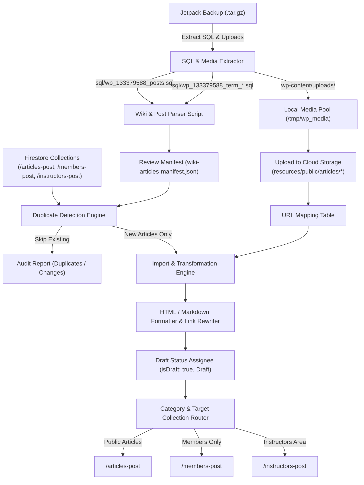

# Plan: WordPress Wiki & Historical Article Import

## Executive Summary
This plan outlines the end-to-end process for extracting, reviewing, and importing historical articles—specifically the ~149 wiki articles (`yada_wiki` custom post type) and any unimported blog/page articles—from the newly obtained full Jetpack backup archive (`jetpack-backup-iliqchuanblog-wordpress-com-2026-09-19-02-36-03.tar.gz`) into the ILC Members Manager platform.

All newly imported articles will be imported in **Draft status** (`isDraft: true`, `status: BlogPostStatus.Draft`) to allow editorial review before publication, with strict **duplicate prevention** against already imported content in Firestore (`articles-post`, `members-post`, and `instructors-post`). The work will be developed and executed in an isolated **git worktree**.

---

## 1. Archive Inspection & Findings

The backup archive `~/Downloads/jetpack-backup-iliqchuanblog-wordpress-com-2026-09-19-02-36-03.tar.gz` (8.8 GB) has been inspected:

1. **Table Prefix**: The WordPress.com Atomic / multisite blog ID is `133379588`, with table prefix `wp_133379588_`.
2. **Missing Wiki Content Located**: 
   - Earlier XML exports only contained `post` and `page` types.
   - `sql/wp_133379588_posts.sql` contains **~149 `yada_wiki` articles**, along with standard posts (227), pages (176), and product/media items.
3. **Taxonomy Data**:
   - Wiki categories (`wiki_cats`) and tags (`wiki_tags`) are stored in `wp_133379588_term_taxonomy.sql` and `wp_133379588_terms.sql`.
4. **Media Files**:
   - The archive includes the complete `wp-content/uploads/` directory, providing original high-resolution media and eliminating the need for slow network downloads or Wayback Machine scraping.

---

## 2. Git Worktree & Environment Setup

All migration scripts and tools will be developed on a dedicated branch in a separate git worktree to keep the primary working tree clean:

```bash
# 1. Create a dedicated worktree and branch off dev
git worktree add -b feat/import-wordpress-wiki-articles ../ilc-wiki-import dev

# 2. Navigate to worktree and install dependencies
cd ../ilc-wiki-import
pnpm install
```

---

## 3. Architecture & Data Flow



---

## 4. Phase-by-Phase Implementation Plan

### Phase 1: SQL & Media Extraction and Parsing
* **Goal**: Extract raw SQL dumps and parse all `yada_wiki`, `post`, and `page` records along with their taxonomy and postmeta.
* **Artifacts**:
  - `scripts/wordpress-migration/parse-jetpack-sql.ts`
  - Output: `/tmp/wp_parsed_articles.json`
* **Details**:
  - Extract `sql/wp_133379588_posts.sql`, `sql/wp_133379588_postmeta.sql`, and term tables.
  - Parse rows into typed records:
    - ID, post_name (slug), post_title, post_content, post_date, post_author, post_type.
    - Resolve taxonomy terms (`wiki_cats`, `wiki_tags`, `category`, `post_tag`).
    - Resolve featured thumbnail attachment IDs from `postmeta` (`_thumbnail_id`).

### Phase 2: Content Review & Catalog Generation
* **Goal**: Generate a human-readable and machine-readable review catalog before modifying any database.
* **Artifacts**:
  - Output report: `docs/plans/wiki-articles-review-catalog.md`
* **Details**:
  - Group articles by category (e.g. *Sifu Says*, *Magazine Articles*, *Philosophy*, *Curriculum*, *Forms & Training*, *Instructors*).
  - Categorize by suggested destination:
    - `articles-post`: Public wiki pages, general history, interviews, essays.
    - `members-post`: Student curriculum, level guides, internal training principles.
    - `instructors-post`: Instructor handouts, syllabus guidelines, administrative guides.
  - Flag any stub articles (e.g. text < 100 characters or pure shortcodes) for manual review or exclusion.

### Phase 3: Duplicate Detection & State Matching
* **Goal**: Prevent duplicate creation or accidental overwrite of existing edited content.
* **Matching Strategy**:
  1. **Source ID Matching**: Check if `id` exists (e.g. `wp-wiki-1234`, `wp-post-5678`, `wp-page-9101`).
  2. **Slug Matching**: Match normalized `urlId` / `post_name` against existing documents across `articles-post`, `members-post`, and `instructors-post`.
  3. **Title Matching**: Fuzzy match normalized titles (lowercase, stripped punctuation).
* **Action on Existing Match**:
  - **Skip by default**: If a live article already exists with that slug/title, mark as `ALREADY_EXISTS` and skip write to avoid overwriting edits made in the modern portal.
  - Log duplicate details in an audit report.

### Phase 4: Media Upload & URL Rewriting
* **Goal**: Upload media directly from backup files to Firebase Storage and rewrite URLs in article bodies.
* **Details**:
  - Extract only media referenced in the articles from `wp-content/uploads/`.
  - Upload to Firebase Storage: `resources/public/articles/{filename}`.
  - Generate an updated `url-map.json` mapping old WordPress URLs (`iliqchuan.com/wp-content/uploads/...`, `iliqchuanblog.wordpress.com/...`) to permanent Firebase Storage URLs.
  - Convert shortcodes (`[youtube ...]`, `[vimeo ...]`) to responsive embed iframes.
  - Clean deprecated tags, empty formatting, and non-resolving broken images.

### Phase 5: Draft Import Engine Execution
* **Goal**: Commit new articles into Firestore collections as drafts.
* **Execution Details**:
  - Build `CachedBlogPost` objects conforming to [`content-cache.ts`](file:///Users/ldixon/code/zxd/ilc-members-manager/functions/src/data-model/content-cache.ts):
    ```typescript
    {
      id: `wp-wiki-${item.id}`,
      urlId: uniqueSlug,
      title: item.title,
      excerpt: generatedExcerpt,
      body: rewrittenHtml,
      bodyMarkdown: '',
      assetUrl: heroImageUrl || '',
      publishOn: postDateMs,
      addedOn: postDateMs,
      categories: resolvedCategories,
      tags: resolvedTags,
      author: authorName,
      kind: BlogPostSourceKind.WordPress,
      isDraft: true,
      status: BlogPostStatus.Draft,
      lastUpdated: new Date().toISOString()
    }
    ```
  - Use batched writes (`db.batch()`) with 20 items per batch.
  - Support both local Firestore Emulator (`--emulator`) and production targets.

### Phase 6: Verification & Validation
1. **Emulator Verification**:
   - Run complete pipeline against Firestore Emulator.
   - Log into portal as Admin (`member-us536@example.com`) and open `/articles`, `/members-post`, `/instructors-post`.
   - Verify that draft badges appear, content renders cleanly, and media loads from storage.
2. **Link & Asset Health Check**:
   - Verify zero 404 image URLs in imported content.
   - Verify internal links to other imported articles route correctly to `/articles/post/{slug}`.
3. **Production Run**:
   - Once reviewed and approved by user, run import against production Firestore with `--dry-run` verification first.

---

## 5. Review & Decision Points for User

1. **Target Collection Routing Rules**:
   - Should all `wiki_cats: sifu-says` and general articles go to public `/articles-post`?
   - Should any specific categories (e.g. *Discipleship*, *Curriculum*) be routed directly to `/members-post` or `/instructors-post`?
2. **Author Attribution**:
   - Default author attribution for historical wiki entries will be set to Grandmaster Sam FS Chin unless an individual author was recorded in `post_author`.
