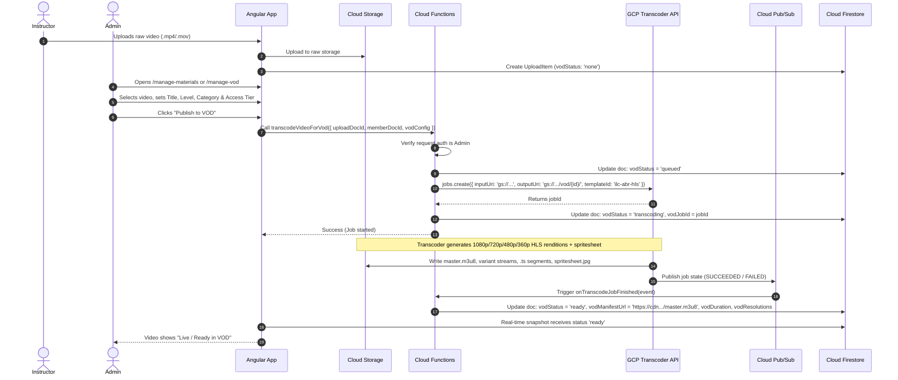
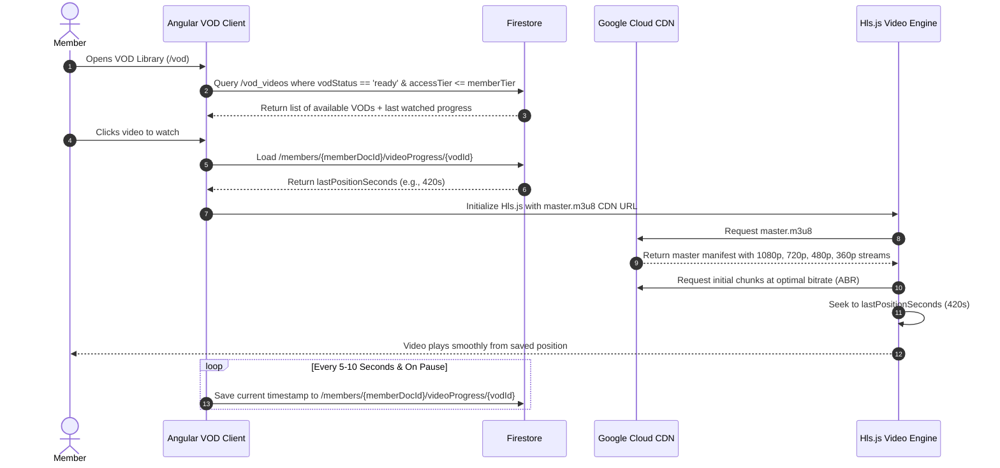
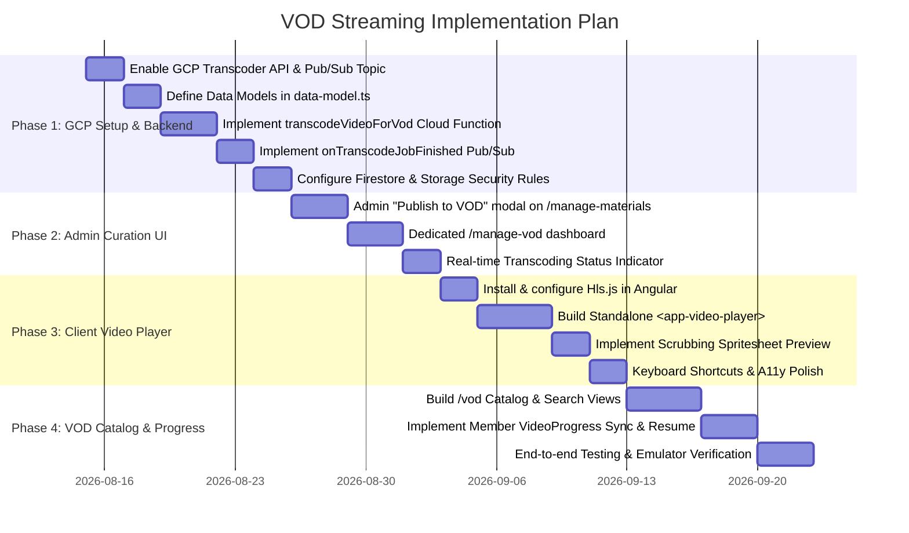

# Video-on-Demand (VOD) Streaming Playback Architecture Plan

This document defines the end-to-end architecture, backend pipelines, Google Cloud service integrations, data models, security rules, and client-side player implementation for **Video-on-Demand (VOD) Streaming** in the ILC Members Manager platform.

---

## 1. Executive Summary & Goals

### Problem Statement
Instructors upload seminar recordings, technique demos, grading preparation videos, and workshop captures to the platform (stored as raw `.mp4`, `.mov`, or `.m4v` files in Google Cloud Storage). Currently, these are only available as direct file downloads or basic HTML5 video tags without adaptive bitrate streaming. This leads to excessive buffering on mobile/poor connections, high bandwidth egress costs, and lack of controlled access or playback progress tracking.

### Core Objectives
1. **Adaptive Bitrate (ABR) Streaming**: Leverage **Google Cloud Transcoder API** to transcode raw uploaded videos into multi-bitrate **HLS (HTTP Live Streaming)** packages (1080p, 720p, 480p, 360p) with optimized AAC audio and thumbnail spritesheets.
2. **Admin Curation & Publishing**: Allow administrators to review instructor-uploaded materials in `/manage-materials` (or dedicated `/manage-vod`), select specific videos for VOD publication, configure metadata (title, category, level, tags, visibility tier), and trigger asynchronous transcoding jobs.
3. **High-Performance Global CDN Delivery**: Serve HLS manifests (`.m3u8`) and video segment chunks (`.ts` / `.m4s`) through **Cloud CDN / Media CDN** with global edge caching.
4. **Modern Angular Client Player**: Provide a responsive, accessible `<app-video-player>` component built with Angular Signals and **Hls.js** featuring custom controls, quality selector, playback speed options, scrubbing previews, Picture-in-Picture, and keyboard shortcuts.
5. **Playback Resume & Progress Tracking**: Automatically store and sync member watch progress (`/members/{memberDocId}/videoProgress/{vodId}`) to enable seamless "Continue Watching" carousels.
6. **Tiered Access Control**: Restrict playback based on member status (Public, Active Members, Licensed Instructors, or Level-gated).

---

## 2. System Architecture & Google Cloud Services

```mermaid
flowchart TD
    subgraph Instructors["Instructor & Event Uploads"]
        UI_Inst["Instructor Uploads Video\n(/my-materials or /events/:id/edit)"]
        GCS_Raw["GCS Bucket: Raw Ingest\nmembers/{memberDocId}/materials/..."]
        FS_Uploads["Firestore: /members/{memberDocId}/uploads/{id}"]
    end

    subgraph AdminCuration["Admin Curation & Control"]
        UI_Admin["Admin Video Management\n(/manage-materials & /manage-vod)"]
        CF_Trigger["Cloud Function (Callable):\ntranscodeVideoForVod()"]
    end

    subgraph GCP_Pipeline["Google Cloud Video Pipeline"]
        GCP_Transcoder["Google Cloud Transcoder API\n(transcoder.googleapis.com)"]
        GCP_PubSub["Cloud Pub/Sub Topic:\nvod-transcode-notifications"]
        GCS_VOD["GCS Bucket: VOD Output\nvod/{vodId}/master.m3u8 + segments"]
        CF_Webhook["Cloud Function (Pub/Sub Trigger):\nonTranscodeJobFinished"]
    end

    subgraph CDN_Delivery["Edge Delivery & Storage"]
        CloudCDN["Google Cloud CDN / Media CDN\nhttps://vod.ilcmembers.org/..."]
        FS_VOD["Firestore: /vod_videos/{vodId}\n(or extended UploadItem metadata)"]
    end

    subgraph MemberClient["Member Client (Angular 21+)"]
        VOD_Portal["VOD Portal & Catalog (/vod)"]
        VOD_Player["VOD Player Component (<app-video-player>)\nHls.js + Signals + Progress Tracking"]
        FS_Progress["Firestore: /members/{id}/videoProgress/{vodId}"]
    end

    UI_Inst -->|Upload original file| GCS_Raw
    UI_Inst -->|Record metadata| FS_Uploads
    GCS_Raw -.->|Source file| GCP_Transcoder

    UI_Admin -->|Selects & publishes video| CF_Trigger
    CF_Trigger -->|Creates Transcoding Job| GCP_Transcoder

    GCP_Transcoder -->|Writes HLS segments & spritesheet| GCS_VOD
    GCP_Transcoder -->|Publishes job completion| GCP_PubSub

    GCP_PubSub -->|Triggers| CF_Webhook
    CF_Webhook -->|Updates VOD status to 'ready'| FS_VOD

    GCS_VOD -->|Origin Storage| CloudCDN
    CloudCDN -->|Streams HLS (.m3u8 & .ts)| VOD_Player

    VOD_Portal -->|Queries published videos| FS_VOD
    VOD_Portal -->|Launches| VOD_Player
    VOD_Player -->|Saves position every 5s| FS_Progress
```

### Google Cloud Services Utilized

| Service | Role & Responsibility |
|---|---|
| **Google Cloud Transcoder API** (`transcoder.googleapis.com`) | Managed video processing engine. Converts raw video files into multi-bitrate HLS / DASH stream ladders and generates timeline thumbnail spritesheets for scrub previews. |
| **Google Cloud Storage (GCS)** | Ingest storage for raw uploads and high-availability object storage for master playlists, variant playlists, and video chunks. |
| **Google Cloud CDN / Media CDN** | Caching proxy at Google edge POPs to ensure low-latency, zero-buffer video delivery and minimal egress cost. |
| **Cloud Pub/Sub** | Asynchronous event broker receiving job status events from the Transcoder API. |
| **Firebase Cloud Functions v2** | Serverless orchestration for initiating transcoding jobs, verifying admin credentials, processing Pub/Sub webhooks, and updating Firestore records. |
| **Cloud Firestore** | Real-time database for VOD catalog metadata, access permissions, categorization, and member playback progress. |

---

## 3. End-to-End Workflows & Sequence Diagrams

### 3.1. Admin Curation & Transcoding Flow



### 3.2. Member Video Playback & Progress Sync Flow



---

## 4. Firestore Data Models & Types

All domain types will reside in [`functions/src/data-model.ts`](../functions/src/data-model.ts) and be shared across Cloud Functions and Angular components.

### 4.1. VOD Video Metadata (`VodItem`)

```typescript
export type VodStatus = 'none' | 'queued' | 'transcoding' | 'ready' | 'failed';

export type VodAccessTier = 
  | 'public'          // Visible to all visitors (previews, public demos)
  | 'members'         // Active paying members only
  | 'instructors'     // Licensed instructors only
  | 'level_restricted'// Restricted to students at or above a specific ILC Level
  | 'admin';          // Admin-only preview

export type VodCategory =
  | 'seminar_recording'
  | 'technique_breakdown'
  | 'grading_syllabus'
  | 'form_demonstration'
  | 'instructor_training'
  | 'workshop'
  | 'historical_archive';

export interface VodItem {
  docId: string;                     // Matches uploadDocId or unique VOD ID
  sourceUploadDocId: string;         // Original UploadItem docId
  sourceMemberDocId: string;         // Member who uploaded the original file
  
  // Display & Content metadata
  title: string;                     // Curated title for VOD catalog
  description: string;               // Markdown/text description
  instructorDocId: string;           // Featured instructor memberDocId
  instructorName: string;            // Cached instructor display name (e.g. "Sam Chin [INST-001]")
  instructorId: string;              // Cached instructor ID (e.g. "1")
  eventDocId: string;                // Linked IlcEvent docId (or '' if none)
  eventTitle: string;                // Cached event title
  category: VodCategory;
  minLevel?: number;                 // If accessTier == 'level_restricted' (e.g., Level 3+)
  tags: string[];
  recordedDate: string;              // YYYY-MM-DD
  location: string;

  // Access & Publishing
  accessTier: VodAccessTier;
  isPublished: boolean;
  featured: boolean;                 // Displayed in top hero carousel
  publishedAt: string;               // ISO Timestamp
  publishedByMemberDocId: string;    // Admin who approved/published the video

  // Transcoding & Streaming Technical Data
  vodStatus: VodStatus;
  vodJobId?: string;                 // GCP Transcoder Job ID
  vodError?: string;                 // Error message if transcoding fails
  
  // Streaming URLs (Cloud CDN edge endpoints)
  manifestUrl: string;               // HLS master manifest (e.g. "https://vod.ilcmembers.org/vod/{id}/master.m3u8")
  dashManifestUrl?: string;          // Optional MPEG-DASH manifest (.mpd)
  thumbnailUrl: string;              // High-res poster/thumbnail image
  spriteSheetUrl?: string;           // Scrubber preview sprite sheet (e.g. "spritesheet.jpg")
  spriteIntervalSeconds?: number;    // e.g. 5 (one thumbnail every 5 seconds)
  spriteWidth?: number;              // Thumbnail frame width in sprite (e.g. 160px)
  spriteHeight?: number;             // Thumbnail frame height in sprite (e.g. 90px)

  // Media characteristics
  durationSeconds: number;           // Total video duration
  resolutions: string[];             // e.g. ['360p', '480p', '720p', '1080p']
  originalSize: number;              // Raw uploaded size in bytes

  createdAt: string;                 // ISO Date
  lastUpdated: string;               // ISO Date
}

export function initVodItem(): VodItem {
  return {
    docId: '',
    sourceUploadDocId: '',
    sourceMemberDocId: '',
    title: '',
    description: '',
    instructorDocId: '',
    instructorName: '',
    instructorId: '',
    eventDocId: '',
    eventTitle: '',
    category: 'seminar_recording',
    tags: [],
    recordedDate: '',
    location: '',
    accessTier: 'members',
    isPublished: false,
    featured: false,
    publishedAt: '',
    publishedByMemberDocId: '',
    vodStatus: 'none',
    manifestUrl: '',
    thumbnailUrl: '',
    durationSeconds: 0,
    resolutions: [],
    originalSize: 0,
    createdAt: '',
    lastUpdated: '',
  };
}
```

### 4.2. Member Video Watch Progress (`VideoProgress`)

Stored in Firestore under subcollection: `/members/{memberDocId}/videoProgress/{vodId}`

```typescript
export interface VideoProgress {
  vodId: string;                     // Matches VodItem docId
  memberDocId: string;
  lastPositionSeconds: number;       // Last playback position (e.g., 420.5)
  durationSeconds: number;           // Total video duration
  completed: boolean;                // true if watched >= 90%
  completedAt?: string;              // ISO Timestamp
  lastWatchedAt: string;             // ISO Timestamp
}

export function initVideoProgress(vodId: string, memberDocId: string): VideoProgress {
  return {
    vodId,
    memberDocId,
    lastPositionSeconds: 0,
    durationSeconds: 0,
    completed: false,
    lastWatchedAt: new Date().toISOString(),
  };
}
```

---

## 5. Google Cloud Transcoder API Specification

### 5.1. Adaptive Bitrate (ABR) Encoding Ladder

The Transcoder job is configured with standard, high-efficiency H.264 video and AAC audio renditions packaged into HLS:

| Rendition | Resolution | Video Bitrate | Frame Rate | Audio Bitrate | Target Use Case |
|---|---|---|---|---|---|
| **1080p Full HD** | 1920x1080 | 4,500 kbps | 30 fps (or source) | 192 kbps AAC | High-speed desktop / TV |
| **720p HD** | 1280x720 | 2,500 kbps | 30 fps | 128 kbps AAC | Laptops, tablets, standard broadband |
| **480p SD** | 854x480 | 1,200 kbps | 30 fps | 96 kbps AAC | 4G/LTE mobile networks |
| **360p Low** | 640x360 | 600 kbps | 30 fps | 64 kbps AAC | Slow mobile / low-bandwidth connections |

### 5.2. Scrubbing Preview Sprite Sheet
The Transcoder API creates a periodic thumbnail sprite sheet during transcoding:
- Interval: 1 thumbnail frame every 5 seconds.
- Frame size: 160x90 px (16:9).
- Stored as `spritesheet_0000000000.jpg` alongside `master.m3u8`.
- The client player uses this image to display instant hover preview thumbnails when the user hovers over the progress scrub bar.

### 5.3. Transcoder Job Configuration Payload (TypeScript / GCP SDK)

```typescript
import { TranscoderServiceClient } from '@google-cloud/video-transcoder';

export function createVodJobConfig(
  inputGcsUri: string, 
  outputGcsFolder: string,
  pubsubTopicUri: string
) {
  return {
    inputUri: inputGcsUri,
    outputUri: outputGcsFolder,
    config: {
      elementaryStreams: [
        // Video Streams
        {
          key: 'video-1080p',
          videoStream: {
            h264: {
              heightPixels: 1080,
              widthPixels: 1920,
              bitrateBps: 4500000,
              frameRate: 30,
              pixelFormat: 'yuv420p',
              rateControlMode: 'vbr',
            },
          },
        },
        {
          key: 'video-720p',
          videoStream: {
            h264: {
              heightPixels: 720,
              widthPixels: 1280,
              bitrateBps: 2500000,
              frameRate: 30,
              pixelFormat: 'yuv420p',
              rateControlMode: 'vbr',
            },
          },
        },
        {
          key: 'video-480p',
          videoStream: {
            h264: {
              heightPixels: 480,
              widthPixels: 854,
              bitrateBps: 1200000,
              frameRate: 30,
              pixelFormat: 'yuv420p',
              rateControlMode: 'vbr',
            },
          },
        },
        {
          key: 'video-360p',
          videoStream: {
            h264: {
              heightPixels: 360,
              widthPixels: 640,
              bitrateBps: 600000,
              frameRate: 30,
              pixelFormat: 'yuv420p',
              rateControlMode: 'vbr',
            },
          },
        },
        // Audio Stream
        {
          key: 'audio-main',
          audioStream: {
            codec: 'aac',
            bitrateBps: 128000,
            channelCount: 2,
            sampleRateHertz: 48000,
          },
        },
      ],
      muxStreams: [
        {
          key: 'hls-1080p',
          fileName: '1080p/stream.m3u8',
          container: 'ts',
          elementaryStreams: ['video-1080p', 'audio-main'],
          segmentSettings: { segmentDuration: { seconds: 4 } },
        },
        {
          key: 'hls-720p',
          fileName: '720p/stream.m3u8',
          container: 'ts',
          elementaryStreams: ['video-720p', 'audio-main'],
          segmentSettings: { segmentDuration: { seconds: 4 } },
        },
        {
          key: 'hls-480p',
          fileName: '480p/stream.m3u8',
          container: 'ts',
          elementaryStreams: ['video-480p', 'audio-main'],
          segmentSettings: { segmentDuration: { seconds: 4 } },
        },
        {
          key: 'hls-360p',
          fileName: '360p/stream.m3u8',
          container: 'ts',
          elementaryStreams: ['video-360p', 'audio-main'],
          segmentSettings: { segmentDuration: { seconds: 4 } },
        },
      ],
      manifests: [
        {
          fileName: 'master.m3u8',
          type: 'HLS',
          muxStreams: ['hls-1080p', 'hls-720p', 'hls-480p', 'hls-360p'],
        },
      ],
      spriteSheets: [
        {
          format: 'jpeg',
          filePrefix: 'spritesheet',
          spriteWidthPixels: 160,
          spriteHeightPixels: 90,
          columnCount: 10,
          rowCount: 10,
          interval: { seconds: 5 },
          quality: 85,
        },
      ],
      pubsubDestination: {
        topic: pubsubTopicUri,
      },
    },
  };
}
```

---

## 6. Cloud Functions & Backend API Design

Defined under [`functions/src/`](../functions/src/):

### 6.1. `transcodeVideoForVod` (Callable Cloud Function)
- **File**: `functions/src/vod/transcode-video.ts`
- **Permissions**: Requires authenticated user with Admin privileges (`isAdmin(context.auth)`).
- **Inputs**:
  - `uploadDocId`: string (ID of the original uploaded item)
  - `memberDocId`: string (Uploader's member document ID)
  - `vodConfig`: Object containing `title`, `description`, `category`, `accessTier`, `minLevel`, `tags`, `featured`, `instructorDocId`.
- **Workflow**:
  1. Reads original `UploadItem` from Firestore (`/members/{memberDocId}/uploads/{uploadDocId}`).
  2. Verifies MIME type is a supported video (`video/mp4`, `video/quicktime`, etc.).
  3. Creates or updates the `/vod_videos/{vodId}` Firestore document with `vodStatus: 'queued'`.
  4. Invokes Google Cloud Transcoder API client (`TranscoderServiceClient.createJob()`) targeting the output bucket `gs://<VOD_BUCKET>/vod/{vodId}/`.
  5. Stores the returned `job.name` in Firestore and transitions `vodStatus: 'transcoding'`.

### 6.2. `onTranscodeJobFinished` (Pub/Sub Triggered Function)
- **File**: `functions/src/vod/on-transcode-finished.ts`
- **Trigger**: Pub/Sub topic `vod-transcode-notifications` (message published automatically by Google Transcoder on job state change).
- **Workflow**:
  1. Decodes Pub/Sub payload containing job name, state (`SUCCEEDED` / `FAILED`), and error details.
  2. Finds corresponding Firestore doc by `vodJobId`.
  3. If `SUCCEEDED`:
     - Sets `vodStatus = 'ready'`.
     - Sets `manifestUrl = 'https://<CDN_DOMAIN>/vod/{vodId}/master.m3u8'`.
     - Sets `thumbnailUrl = 'https://<CDN_DOMAIN>/vod/{vodId}/spritesheet_0000000000.jpg'`.
     - Sets `spriteSheetUrl = 'https://<CDN_DOMAIN>/vod/{vodId}/spritesheet_0000000000.jpg'`.
     - Populates `durationSeconds` and `resolutions = ['360p', '480p', '720p', '1080p']`.
     - Sets `isPublished = true` and `publishedAt = new Date().toISOString()`.
  4. If `FAILED`:
     - Sets `vodStatus = 'failed'` and logs `vodError` with GCP error message.
  5. Writes update to Firestore.

### 6.3. `deleteVodVideo` (Callable Cloud Function)
- **File**: `functions/src/vod/delete-vod.ts`
- **Permissions**: Admin-only.
- **Workflow**:
  1. Recursively deletes all HLS segments, playlists, and sprites from GCS (`gs://<VOD_BUCKET>/vod/{vodId}/*`).
  2. Removes the `/vod_videos/{vodId}` document from Firestore.
  3. Cleans up associated `videoProgress` subcollections.

---

## 7. Security Rules & Access Control

### 7.1. Cloud Firestore Security Rules ([`firestore.rules`](../firestore.rules))

```javascript
match /vod_videos/{vodId} {
  // Helper to check member login status and level
  function isMember() {
    return request.auth != null && getUserMemberDocIds().size() > 0;
  }

  function isInstructor() {
    return request.auth != null && getUserInstructorIds().size() > 0;
  }

  function meetsLevelRequirement() {
    let minLevel = resource.data.get('minLevel', 0);
    return minLevel == 0 || (
      request.auth != null && 
      get(/databases/$(database)/documents/members/$(getUserMemberDocIds()[0])).data.get('level', 0) >= minLevel
    );
  }

  // Reading VOD metadata
  allow read: if isAdmin() || (
    resource.data.isPublished == true &&
    resource.data.vodStatus == 'ready' && (
      resource.data.accessTier == 'public' ||
      (resource.data.accessTier == 'members' && isMember()) ||
      (resource.data.accessTier == 'instructors' && isInstructor()) ||
      (resource.data.accessTier == 'level_restricted' && isMember() && meetsLevelRequirement())
    )
  );

  // Only Admins can create, update, or delete VOD records
  allow write: if isAdmin();
}

// User watch progress tracking
match /members/{memberDocId}/videoProgress/{vodId} {
  allow read, write: if isAdmin() || (
    request.auth != null && memberDocId in getUserMemberDocIds()
  );
}
```

### 7.2. Cloud Storage Rules ([`storage.rules`](../storage.rules))

```javascript
// Raw uploads remain private to the uploader and admins
match /members/{memberDocId}/materials/{allPaths=**} {
  allow read, write: if isAdmin() || (
    request.auth != null && memberDocId in getUserMemberDocIds()
  );
}

// Transcoded VOD output bucket: Managed via Cloud CDN and origin rules
match /vod/{vodId}/{allFiles=**} {
  // Read access governed by Cloud CDN cache policies and origin rules
  allow read: if true; // Publicly cached at CDN edge; access controlled via metadata query & app routing
  allow write: if false; // Only Cloud Functions / GCP Transcoder service account writes via Admin SDK
}
```

---

## 8. Admin Selection & VOD Management Interface

Admins can manage VOD videos through two entry points:
1. **Directly from `/manage-materials`**: Next to any video item, an action button **"Publish to VOD"** / **"VOD Settings"** opens a curation modal.
2. **Dedicated VOD Hub (`/manage-vod`)**: A dedicated management console to view all queued, transcoding, ready, and failed VOD streams.

```
+---------------------------------------------------------------------------------------------------+
|  Manage Video on Demand (VOD)                                      [ + Transcode New Video ]       |
+---------------------------------------------------------------------------------------------------+
|  [ All Categories v ]  [ All Instructors v ]  [ All Tiers v ]  [ Status: All v ]  [ Search... ]   |
+---------------------------------------------------------------------------------------------------+
| PREVIEW     TITLE & DETAILS           INSTRUCTOR        TIER       STATUS         ACTIONS         |
+---------------------------------------------------------------------------------------------------+
| [Thumbnail] 2026 European Seminar     Sam Chin          Members    [ READY ]      [ Play ] [ Edit ]
| 1080p HLS   Day 1: Spinning Hands     [INST-001]                   4 Renditions   [ Unpublish ]   |
| 1h 24m      Category: Seminar Record                                                              |
+---------------------------------------------------------------------------------------------------+
| [Thumbnail] Form Section 3 Breakdown  Alex K            Level 3+   [ TRANSCODING] [ View Log ]    |
| 720p / 1080p Technique Demonstration  [INST-014]                   (68% done)     [ Cancel ]      |
+---------------------------------------------------------------------------------------------------+
| [Thumbnail] 2025 Regional Workshop    Joshua Craig      Public     [ FAILED ]     [ Retry ]       |
| Ingest Raw  Introductory Talk         [INST-008]                   Corrupt moov   [ Delete ]      |
+---------------------------------------------------------------------------------------------------+
```

### Admin Curation Modal Fields
- **VOD Title**: Pre-filled from upload filename/notes, editable for clean catalog display.
- **Description / Outline**: Rich text/markdown notes, timestamps for chapters.
- **Category**: Seminar Recording, Technique Breakdown, Grading Prep, Form Demo, etc.
- **Instructor Credit**: Autocomplete dropdown to select or confirm featured instructor.
- **Access Tier**: Public | Members Only | Instructors Only | Level Restricted (with Level slider).
- **Featured**: Checkbox to spotlight on the Member Dashboard hero banner.
- **Transcoding Profile**: Standard ABR Ladder (1080p, 720p, 480p, 360p) + Scrubber Spritesheet.

---

## 9. Client-Side Video Player & VOD Portal Architecture

### 9.1. Player Technology Choice: **Hls.js**

We select **Hls.js** as the core streaming engine for the following reasons:
- **Lightweight & Fast**: Compact footprint (~70KB gzipped), no bloated dependencies.
- **Broad Browser Compatibility**: Uses HTML5 `<video>` and W3C Media Source Extensions (MSE) on Chrome, Firefox, Edge, and Android; falls back seamlessly to native HLS on Apple Safari (iOS / macOS).
- **Fine-Grained Signal Integration**: Emits discrete events (`MANIFEST_PARSED`, `LEVEL_SWITCHED`, `FRAG_BUFFERED`, `ERROR`) that map directly to Angular Signals.
- **Automatic & Manual Quality Switching**: Supports seamless ABR (adaptive bitrate) or explicit user quality locking (e.g., forcing 1080p).

### 9.2. Angular Standalone Component: `<app-video-player>`

#### Component Hierarchy
```
src/app/video-player/
├── video-player.ts          # Angular 21+ Standalone Component with Signals & Hls.js
├── video-player.html        # Custom accessible controls, timeline, quality menu
├── video-player.scss        # Responsive 16:9 container, sleek dark theme, animations
└── video-player.spec.ts     # Vitest component unit tests
```

#### TypeScript Implementation (`src/app/video-player/video-player.ts`)

```typescript
import {
  Component,
  ElementRef,
  Input,
  OnInit,
  OnDestroy,
  ViewChild,
  signal,
  computed,
  effect,
  inject,
  ChangeDetectionStrategy,
  output,
} from '@angular/core';
import { CommonModule } from '@angular/common';
import Hls from 'hls.js';
import { VodItem } from '../../../functions/src/data-model';
import { IconComponent } from '../icons/icon.component';
import { SpinnerComponent } from '../spinner/spinner.component';

export interface QualityLevel {
  id: number;      // -1 for Auto, 0..N for explicit levels
  label: string;   // 'Auto', '1080p', '720p', '480p', '360p'
  bitrate: number;
  height: number;
}

@Component({
  selector: 'app-video-player',
  standalone: true,
  imports: [CommonModule, IconComponent, SpinnerComponent],
  templateUrl: './video-player.html',
  styleUrl: './video-player.scss',
  changeDetection: ChangeDetectionStrategy.OnPush,
})
export class VideoPlayerComponent implements OnInit, OnDestroy {
  @ViewChild('videoElement', { static: true }) videoRef!: ElementRef<HTMLVideoElement>;
  @ViewChild('playerContainer', { static: true }) containerRef!: ElementRef<HTMLDivElement>;

  // Inputs
  vod = signal<VodItem | null>(null);
  @Input({ required: true }) set videoData(val: VodItem) {
    this.vod.set(val);
  }
  @Input() initialPositionSeconds = 0;
  @Input() autoplay = false;

  // Outputs
  timeUpdated = output<number>();
  videoCompleted = output<void>();

  private hls: Hls | null = null;
  private saveIntervalId: ReturnType<typeof setInterval> | null = null;

  // Player State Signals
  isPlaying = signal(false);
  isBuffering = signal(false);
  currentTime = signal(0);
  duration = signal(0);
  volume = signal(1);
  isMuted = signal(false);
  playbackRate = signal(1);
  isFullscreen = signal(false);
  controlsVisible = signal(true);
  
  // Quality Levels
  availableQualities = signal<QualityLevel[]>([]);
  currentQualityId = signal<number>(-1); // -1 = Auto
  currentResolutionLabel = signal('Auto');

  // Scrubbing & Thumbnail Preview Signals
  isScrubbing = signal(false);
  hoverPositionPercent = signal(0);
  hoverTime = signal(0);
  hoverSpriteX = signal(0);
  hoverSpriteY = signal(0);
  showHoverThumbnail = signal(false);

  // Menus
  showSettingsMenu = signal(false);
  showQualityMenu = signal(false);
  showSpeedMenu = signal(false);

  private hideControlsTimeout: ReturnType<typeof setTimeout> | null = null;

  ngOnInit(): void {
    const video = this.videoRef.nativeElement;
    const vodItem = this.vod();
    if (!vodItem) return;

    this.setupHls(vodItem.manifestUrl, video);
    this.setupNativeEvents(video);

    // Sync progress to server every 5 seconds
    this.saveIntervalId = setInterval(() => {
      if (this.isPlaying()) {
        this.timeUpdated.emit(this.currentTime());
      }
    }, 5000);
  }

  private setupHls(src: string, video: HTMLVideoElement): void {
    if (Hls.isSupported()) {
      this.hls = new Hls({
        capLevelToPlayerSize: true,
        autoStartLoad: true,
        startPosition: this.initialPositionSeconds > 0 ? this.initialPositionSeconds : -1,
      });

      this.hls.loadSource(src);
      this.hls.attachMedia(video);

      this.hls.on(Hls.Events.MANIFEST_PARSED, (event, data) => {
        const levels: QualityLevel[] = [
          { id: -1, label: 'Auto', bitrate: 0, height: 0 },
          ...data.levels.map((lvl, index) => ({
            id: index,
            label: `${lvl.height}p`,
            bitrate: lvl.bitrate,
            height: lvl.height,
          })).reverse(),
        ];
        this.availableQualities.set(levels);

        if (this.autoplay) {
          video.play().catch(() => this.isPlaying.set(false));
        }
      });

      this.hls.on(Hls.Events.LEVEL_SWITCHED, (event, data) => {
        const lvl = this.hls?.levels[data.level];
        if (lvl && this.currentQualityId() === -1) {
          this.currentResolutionLabel.set(`Auto (${lvl.height}p)`);
        }
      });

      this.hls.on(Hls.Events.ERROR, (event, data) => {
        if (data.fatal) {
          switch (data.type) {
            case Hls.ErrorTypes.NETWORK_ERROR:
              this.hls?.startLoad();
              break;
            case Hls.ErrorTypes.MEDIA_ERROR:
              this.hls?.recoverMediaError();
              break;
            default:
              this.hls?.destroy();
              break;
          }
        }
      });
    } else if (video.canPlayType('application/vnd.apple.mpegurl')) {
      // Native Safari HLS
      video.src = src;
      if (this.initialPositionSeconds > 0) {
        video.currentTime = this.initialPositionSeconds;
      }
      if (this.autoplay) {
        video.play().catch(() => this.isPlaying.set(false));
      }
    }
  }

  private setupNativeEvents(video: HTMLVideoElement): void {
    video.addEventListener('play', () => this.isPlaying.set(true));
    video.addEventListener('pause', () => {
      this.isPlaying.set(false);
      this.timeUpdated.emit(this.currentTime());
    });
    video.addEventListener('waiting', () => this.isBuffering.set(true));
    video.addEventListener('playing', () => this.isBuffering.set(false));
    video.addEventListener('timeupdate', () => {
      this.currentTime.set(video.currentTime);
      if (this.duration() > 0 && (video.currentTime / this.duration()) >= 0.95) {
        this.videoCompleted.emit();
      }
    });
    video.addEventListener('durationchange', () => this.duration.set(video.duration));
  }

  // Playback Control Methods
  togglePlay(): void {
    const video = this.videoRef.nativeElement;
    if (video.paused) {
      video.play();
    } else {
      video.pause();
    }
  }

  seek(seconds: number): void {
    const video = this.videoRef.nativeElement;
    video.currentTime = Math.max(0, Math.min(seconds, this.duration()));
    this.currentTime.set(video.currentTime);
  }

  skip(secondsDelta: number): void {
    this.seek(this.currentTime() + secondsDelta);
  }

  setVolume(vol: number): void {
    const video = this.videoRef.nativeElement;
    video.volume = Math.max(0, Math.min(vol, 1));
    this.volume.set(video.volume);
    this.isMuted.set(video.volume === 0);
  }

  toggleMute(): void {
    const video = this.videoRef.nativeElement;
    video.muted = !video.muted;
    this.isMuted.set(video.muted);
  }

  setQuality(levelId: number): void {
    if (!this.hls) return;
    this.currentQualityId.set(levelId);
    this.hls.currentLevel = levelId;
    if (levelId === -1) {
      this.currentResolutionLabel.set('Auto');
    } else {
      const q = this.availableQualities().find(item => item.id === levelId);
      this.currentResolutionLabel.set(q ? q.label : 'Auto');
    }
    this.showQualityMenu.set(false);
    this.showSettingsMenu.set(false);
  }

  setSpeed(rate: number): void {
    const video = this.videoRef.nativeElement;
    video.playbackRate = rate;
    this.playbackRate.set(rate);
    this.showSpeedMenu.set(false);
    this.showSettingsMenu.set(false);
  }

  toggleFullscreen(): void {
    const container = this.containerRef.nativeElement;
    if (!document.fullscreenElement) {
      container.requestFullscreen().then(() => this.isFullscreen.set(true));
    } else {
      document.exitFullscreen().then(() => this.isFullscreen.set(false));
    }
  }

  async togglePictureInPicture(): Promise<void> {
    const video = this.videoRef.nativeElement;
    if (document.pictureInPictureElement) {
      await document.exitPictureInPicture();
    } else if (document.pictureInPictureEnabled) {
      await video.requestPictureInPicture();
    }
  }

  // Keyboard Shortcuts Handler
  onKeyDown(event: KeyboardEvent): void {
    switch (event.key.toLowerCase()) {
      case ' ':
      case 'k':
        event.preventDefault();
        this.togglePlay();
        break;
      case 'f':
        event.preventDefault();
        this.toggleFullscreen();
        break;
      case 'm':
        event.preventDefault();
        this.toggleMute();
        break;
      case 'arrowleft':
      case 'j':
        event.preventDefault();
        this.skip(-10);
        break;
      case 'arrowright':
      case 'l':
        event.preventDefault();
        this.skip(10);
        break;
      case 'arrowup':
        event.preventDefault();
        this.setVolume(this.volume() + 0.1);
        break;
      case 'arrowdown':
        event.preventDefault();
        this.setVolume(this.volume() - 0.1);
        break;
    }
  }

  // Mouse activity timer for hiding overlay controls
  onMouseMove(): void {
    this.controlsVisible.set(true);
    if (this.hideControlsTimeout) clearTimeout(this.hideControlsTimeout);
    if (this.isPlaying()) {
      this.hideControlsTimeout = setTimeout(() => {
        this.controlsVisible.set(false);
        this.showSettingsMenu.set(false);
      }, 3000);
    }
  }

  formatTime(seconds: number): string {
    if (isNaN(seconds)) return '00:00';
    const hrs = Math.floor(seconds / 3600);
    const mins = Math.floor((seconds % 3600) / 60);
    const secs = Math.floor(seconds % 60);
    const pad = (n: number) => n.toString().padStart(2, '0');
    if (hrs > 0) {
      return `${hrs}:${pad(mins)}:${pad(secs)}`;
    }
    return `${pad(mins)}:${pad(secs)}`;
  }

  ngOnDestroy(): void {
    if (this.saveIntervalId) clearInterval(this.saveIntervalId);
    if (this.hideControlsTimeout) clearTimeout(this.hideControlsTimeout);
    if (this.hls) {
      this.hls.destroy();
      this.hls = null;
    }
  }
}
```

#### HTML Template (`src/app/video-player/video-player.html`)

```html
<div
  #playerContainer
  class="video-player-container"
  [class.fullscreen]="isFullscreen()"
  [class.hide-controls]="!controlsVisible() && isPlaying()"
  (mousemove)="onMouseMove()"
  (mouseleave)="controlsVisible.set(false)"
  (keydown)="onKeyDown($event)"
  tabindex="0"
>
  <!-- Video Element -->
  <video
    #videoElement
    class="video-element"
    playsinline
    (click)="togglePlay()"
    [poster]="vod()?.thumbnailUrl || ''"
  ></video>

  <!-- Buffering Spinner -->
  @if (isBuffering()) {
    <div class="buffering-overlay">
      <app-spinner></app-spinner>
    </div>
  }

  <!-- Big Center Play Button (when paused) -->
  @if (!isPlaying() && !isBuffering()) {
    <button type="button" class="big-play-btn" (click)="togglePlay()" title="Play video">
      <app-icon name="play_arrow"></app-icon>
    </button>
  }

  <!-- Gradient Overlay & Custom Controls -->
  <div class="player-controls-overlay" [class.visible]="controlsVisible() || !isPlaying()">
    
    <!-- Scrubbing Progress Bar with Tooltip & Thumbnail Preview -->
    <div class="timeline-container">
      <div
        class="timeline-track"
        (click)="seek(($any($event).offsetX / $any($event).currentTarget.clientWidth) * duration())"
      >
        <div
          class="timeline-buffered"
          [style.width.%]="(currentTime() / (duration() || 1)) * 100"
        ></div>
        <div
          class="timeline-played"
          [style.width.%]="(currentTime() / (duration() || 1)) * 100"
        >
          <div class="timeline-thumb"></div>
        </div>
      </div>
    </div>

    <!-- Bottom Controls Row -->
    <div class="controls-row">
      <!-- Left Controls: Play, Skip, Volume, Time -->
      <div class="controls-left">
        <button type="button" class="ctrl-btn" (click)="togglePlay()" [title]="isPlaying() ? 'Pause (k)' : 'Play (k)'">
          <app-icon [name]="isPlaying() ? 'pause' : 'play_arrow'"></app-icon>
        </button>
        
        <button type="button" class="ctrl-btn" (click)="skip(-10)" title="Rewind 10s (j)">
          <app-icon name="replay_10"></app-icon>
        </button>

        <button type="button" class="ctrl-btn" (click)="skip(10)" title="Forward 10s (l)">
          <app-icon name="forward_10"></app-icon>
        </button>

        <div class="volume-control-group">
          <button type="button" class="ctrl-btn" (click)="toggleMute()" title="Mute (m)">
            <app-icon [name]="isMuted() || volume() === 0 ? 'volume_off' : 'volume_up'"></app-icon>
          </button>
          <input
            type="range"
            class="volume-slider"
            min="0"
            max="1"
            step="0.05"
            [value]="isMuted() ? 0 : volume()"
            (input)="setVolume(+$any($event.target).value)"
          />
        </div>

        <div class="time-display">
          <span class="current-time">{{ formatTime(currentTime()) }}</span>
          <span class="separator">/</span>
          <span class="total-duration">{{ formatTime(duration()) }}</span>
        </div>
      </div>

      <!-- Right Controls: Speed, Quality, PiP, Fullscreen -->
      <div class="controls-right">
        <!-- Settings Toggle -->
        <div class="settings-menu-wrapper">
          <button
            type="button"
            class="ctrl-btn"
            (click)="showSettingsMenu.set(!showSettingsMenu())"
            title="Settings"
          >
            <app-icon name="settings"></app-icon>
          </button>

          <!-- Settings Dropdown -->
          @if (showSettingsMenu()) {
            <div class="settings-dropdown">
              <button type="button" class="menu-item" (click)="showQualityMenu.set(true); showSettingsMenu.set(false)">
                <span>Quality</span>
                <span class="menu-val">{{ currentResolutionLabel() }} &rsaquo;</span>
              </button>
              <button type="button" class="menu-item" (click)="showSpeedMenu.set(true); showSettingsMenu.set(false)">
                <span>Speed</span>
                <span class="menu-val">{{ playbackRate() }}x &rsaquo;</span>
              </button>
            </div>
          }

          <!-- Quality Selection Submenu -->
          @if (showQualityMenu()) {
            <div class="settings-dropdown">
              <div class="dropdown-header">
                <button type="button" class="back-btn" (click)="showQualityMenu.set(false); showSettingsMenu.set(true)">
                  &lsaquo; Back
                </button>
                <span>Quality</span>
              </div>
              @for (q of availableQualities(); track q.id) {
                <button
                  type="button"
                  class="menu-item"
                  [class.active]="currentQualityId() === q.id"
                  (click)="setQuality(q.id)"
                >
                  <span>{{ q.label }}</span>
                  @if (currentQualityId() === q.id) {
                    <app-icon name="check"></app-icon>
                  }
                </button>
              }
            </div>
          }

          <!-- Speed Selection Submenu -->
          @if (showSpeedMenu()) {
            <div class="settings-dropdown">
              <div class="dropdown-header">
                <button type="button" class="back-btn" (click)="showSpeedMenu.set(false); showSettingsMenu.set(true)">
                  &lsaquo; Back
                </button>
                <span>Speed</span>
              </div>
              @for (speed of [0.5, 0.75, 1, 1.25, 1.5, 2]; track speed) {
                <button
                  type="button"
                  class="menu-item"
                  [class.active]="playbackRate() === speed"
                  (click)="setSpeed(speed)"
                >
                  <span>{{ speed === 1 ? 'Normal (1x)' : speed + 'x' }}</span>
                  @if (playbackRate() === speed) {
                    <app-icon name="check"></app-icon>
                  }
                </button>
              }
            </div>
          }
        </div>

        <!-- Picture-in-Picture -->
        <button type="button" class="ctrl-btn" (click)="togglePictureInPicture()" title="Picture in Picture">
          <app-icon name="picture_in_picture_alt"></app-icon>
        </button>

        <!-- Fullscreen -->
        <button type="button" class="ctrl-btn" (click)="toggleFullscreen()" title="Fullscreen (f)">
          <app-icon [name]="isFullscreen() ? 'fullscreen_exit' : 'fullscreen'"></app-icon>
        </button>
      </div>
    </div>
  </div>
</div>
```

---

## 10. Member VOD Portal & Catalog Page (`/vod`)

### 10.1. Features & Layout
- **Hero Spotlight**: Large video banner displaying the latest featured seminar recording with immediate "Watch Now" action.
- **"Continue Watching" Carousel**: Visual carousel showing videos the member previously started, with accurate percentage completion bars and 1-click resume.
- **Filtering & Search**:
  - Filter by Category (Seminars, Techniques, Gradings, Workshops).
  - Filter by Featured Instructor.
  - Filter by Minimum Level (showing badges for accessible vs locked content).
  - Instant text search across video title, outline, location, and tags.
- **Theater Mode / Dedicated Watch Page (`/vod/:id`)**:
  - Embedded `<app-video-player>` with responsive 16:9 aspect ratio.
  - Collapsible syllabus/chapter list.
  - Instructor profile chip and linked Event card.

---

## 11. Cost Estimation, Quotas & Performance Optimizations

### 11.1. Google Cloud Transcoder Pricing & Budgeting
- **Transcoder Pricing**: ~$0.015 per minute of HD video (1080p output).
- **Example**: Transcoding a 60-minute seminar recording costs ~$0.90 one-time.
- **Storage**: ~$0.020 per GB/month for transcoded HLS chunks in standard GCS.
- **Bandwidth / Egress Optimization via Cloud CDN**:
  - Cloud CDN caches the 4-second `.ts` segments globally.
  - Cache hit ratio for popular videos typically exceeds 90-95%, dropping egress network costs by up to 80% compared to direct bucket access.

### 11.2. Cost Control Measures
1. **Admin Gated**: Videos are **never** automatically transcoded on upload; only selected and approved videos trigger GCP Transcoder jobs.
2. **Standard ABR Ladder**: 4 renditions (1080p, 720p, 480p, 360p) balance visual fidelity with storage footprint.
3. **Segment Duration**: 4.0-second HLS chunks provide the ideal balance between quick startup time, rapid adaptive switching, and reasonable HTTP request overhead.

---

## 12. Implementation Roadmap & Execution Plan



### Phase 1: Google Cloud Infrastructure & Backend
1. Enable `transcoder.googleapis.com` in the GCP console and configure the Pub/Sub notification topic `vod-transcode-notifications`.
2. Add `VodItem`, `VodStatus`, `VodAccessTier`, and `VideoProgress` interfaces to [`functions/src/data-model.ts`](../functions/src/data-model.ts).
3. Implement `transcodeVideoForVod` callable function and `onTranscodeJobFinished` Pub/Sub webhook trigger.
4. Update `firestore.rules` and `storage.rules` with strict access control.

### Phase 2: Admin Curation & Management
1. Enhance `/manage-materials` to allow admins to select instructor videos and click "Publish to VOD".
2. Add the VOD curation dialog with title, description, category, access tier, and instructor tags.
3. Build the `/manage-vod` view to monitor running jobs, retry failed jobs, and edit live VOD metadata.

### Phase 3: Angular Video Player Component
1. Add `hls.js` dependency to `package.json`.
2. Implement `<app-video-player>` with standalone architecture, signals, custom overlay controls, adaptive quality menu, speed controls, and keyboard shortcuts.
3. Add scrubber preview hovering with Transcoder spritesheets.

### Phase 4: VOD Portal & Playback Progress
1. Create the Member VOD Library page (`/vod`) with search, category filtering, and hero spotlight.
2. Integrate real-time progress syncing to `/members/{memberDocId}/videoProgress/{vodId}` and the "Continue Watching" row.
3. Verify full workflow with Vitest unit tests and Firestore emulator integration tests.
