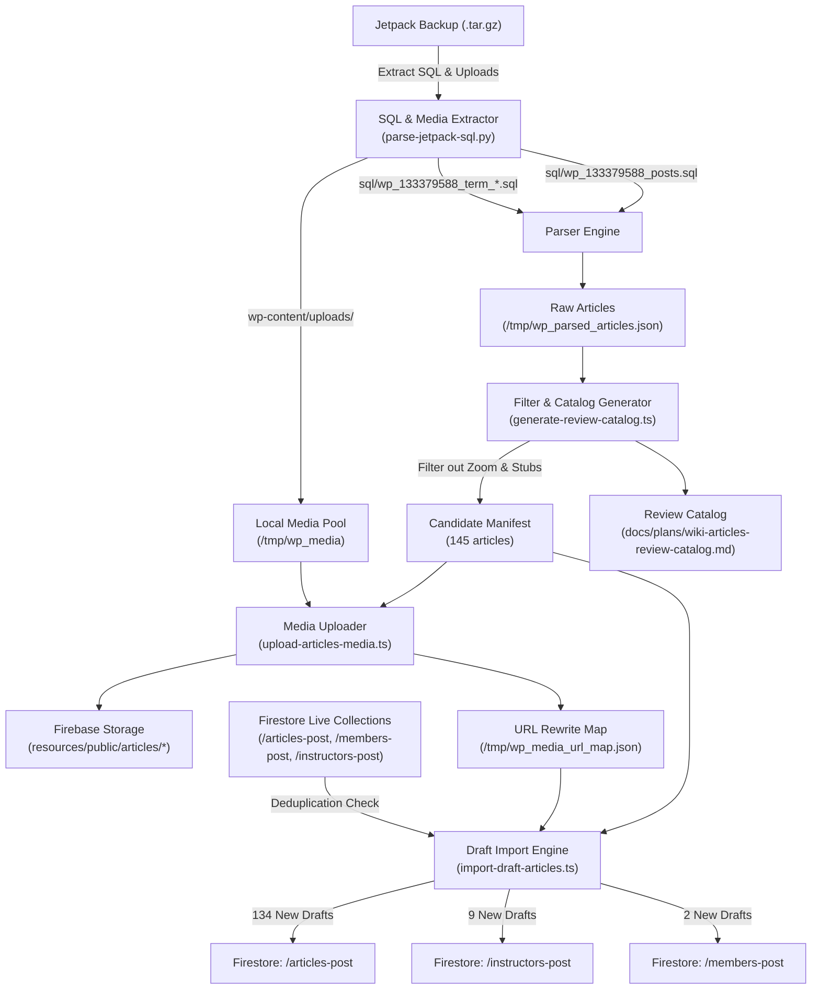

# WordPress Wiki & Historical Article Import

## Overview

This document details the migration tooling, filtering logic, media pipeline, and database changes used to extract, process, and import historical WordPress wiki articles and pages from the full Jetpack site backup archive (`jetpack-backup-iliqchuanblog-wordpress-com-2026-09-19-02-36-03.tar.gz`) into Cloud Firestore as drafts.

All imported content is preserved in **Draft status** (`isDraft: true`, `status: BlogPostStatus.Draft`) for editorial review, with strict **duplicate prevention** ensuring zero overwrites of existing live content in Firestore (`articles-post`, `members-post`, and `instructors-post`).

---

## 1. Archive Inspection & Findings

The backup archive `jetpack-backup-iliqchuanblog-wordpress-com-2026-09-19-02-36-03.tar.gz` (8.8 GB) was analyzed:

1. **Table Prefix & Blog ID**: WordPress.com Atomic blog ID is `133379588`, with table prefix `wp_133379588_`.
2. **Missing Wiki Content Located**:
   - Earlier XML exports only contained standard `post` and `page` types.
   - `sql/wp_133379588_posts.sql` contained **149 `yada_wiki` articles**, along with standard posts (226), pages (176), and attachment records.
3. **Taxonomy & Metadata**:
   - Wiki categories (`wiki_cats`) and tags (`wiki_tags`) were extracted from `wp_133379588_term_taxonomy.sql` and `wp_133379588_terms.sql`.
   - Post authors and user profiles were extracted from `wp_133379588_users.sql`.
   - Featured image IDs were mapped via `wp_133379588_postmeta.sql` (`_thumbnail_id`).
4. **Media Pool**:
   - The archive contained the complete `wp-content/uploads/` directory, allowing direct extraction and upload of original high-resolution images and diagrams to Firebase Storage without scraping or external network latency.

---

## 2. Architecture & Pipeline

---

## 3. Migration Tooling Suite

The complete migration toolchain resides in [`scripts/wordpress-migration/`](file:///Users/ldixon/code/zxd/ilc-members-manager/scripts/wordpress-migration/):

| Script | Purpose | Output / Side Effect |
|---|---|---|
| [`parse-jetpack-sql.py`](file:///Users/ldixon/code/zxd/ilc-members-manager/scripts/wordpress-migration/parse-jetpack-sql.py) | Stream-parses MySQL dumps from the archive without requiring a running database server. Extracts posts, postmeta, taxonomy, terms, and user names. | `/tmp/wp_parsed_articles.json` (551 raw records) |
| [`generate-review-catalog.ts`](file:///Users/ldixon/code/zxd/ilc-members-manager/scripts/wordpress-migration/generate-review-catalog.ts) | Filters out WooCommerce stubs, utility pages, and 172 transient Zoom class invitations. Routes remaining articles to appropriate target collections. | [`docs/plans/wiki-articles-review-catalog.md`](file:///Users/ldixon/code/zxd/ilc-members-manager/docs/plans/wiki-articles-review-catalog.md) |
| [`upload-articles-media.ts`](file:///Users/ldixon/code/zxd/ilc-members-manager/scripts/wordpress-migration/upload-articles-media.ts) | Identifies images referenced in candidate articles, extracts them from archive, uploads 400 files to Firebase Storage, and builds a comprehensive URL rewrite map (including thumbnail permutations). | `/tmp/wp_media_url_map.json`, Firebase Storage `resources/public/articles/` |
| [`import-draft-articles.ts`](file:///Users/ldixon/code/zxd/ilc-members-manager/scripts/wordpress-migration/import-draft-articles.ts) | Rewrites HTML body tags and media URLs, assigns draft status, validates against existing Firestore docs to prevent duplicates, and commits batched writes. | Writes documents to Firestore collections with `--emulator` or `--prod`. |
| [`copy-prod-articles-to-emulator.ts`](file:///Users/ldixon/code/zxd/ilc-members-manager/scripts/wordpress-migration/copy-prod-articles-to-emulator.ts) | Copies production articles collections into the local Firebase Emulator Firestore for offline testing. | Populates local emulator Firestore. |

---

## 4. Content Filtering & Deduplication

### Excluded Content
Out of 551 total records in the WordPress backup:
1. **Utility & System Pages (364 records)**:
   - WooCommerce system pages (`cart`, `checkout`, `my-account`, `shop`, `terms-and-conditions`).
   - Placeholder pages, empty revisions, draft stubs, and navigation anchors.
2. **Transient Zoom Announcements (172 records)**:
   - Posts matching "No Members Zoom Class This Week" or meeting ID/passcode announcements.
   - Filtered via title regex: `/(no\s+.*zoom|zoom\s+class\s+this\s+week|members?\s+only\s+zoom|weekly\s+zoom|zoom\s+link|zoom\s+meeting)/i`.
   - Filtered via tag matching: items tagged or categorized with `Members Only Zoom Sessions`.

### Included Candidate Manifest
A total of **145 genuine articles** were selected for import:
- **134 Wiki Articles** (`yada_wiki`): Philosophical essays, curriculum guides, master interviews, principles, and practice notes.
- **9 Instructor Pages / Guides**: Instructor syllabus references, administrative guides, and training standards.
- **2 Member Historical Posts**: Curriculum reference posts.

### 3-Layer Duplicate Prevention
To prevent overwriting articles that were previously imported or edited in modern Firestore:
1. **Document ID Match**: Check if `wp-wiki-{id}`, `wp-page-{id}`, or `wp-post-{id}` already exists.
2. **Slug Match**: Check if the normalized `urlId` / slug matches any document across `articles-post`, `members-post`, or `instructors-post`.
3. **Normalized Title Match**: Strip punctuation, lowercase, and compare against all existing article titles.

If any match is detected, the importer skips the document with status `ALREADY_EXISTS`. In the production run, 0 duplicates were overwritten and all 70 existing articles were preserved.

---

## 5. Media Upload & Storage Configuration

- **Target Bucket**: Production Firebase Storage default bucket `ilc-paris-class-tracker.firebasestorage.app` (configured under `resources/public/articles/`).
- **File Processing**:
  - 400 unique image/asset files extracted from the backup.
  - Uploaded with public read tokens (`firebaseStorageDownloadTokens`) and appropriate MIME types.
  - 35,606 regex and exact rewrite rules generated to catch WordPress thumbnail dimensions (e.g., `-300x200.jpg`, `-768x512.png`) and route them to the canonical high-resolution asset.

---

## 6. Execution Results & Database State

The import was executed against production Firestore on October 2, 2026:

| Collection | Pre-Import Count | New Drafts Imported | Post-Import Total | Status Breakdown |
|---|---|---|---|---|
| `articles-post` | 38 (19 pub, 19 draft) | **134** | **172** | 19 Published, 153 Drafts |
| `instructors-post` | 10 (10 pub, 0 draft) | **9** | **19** | 10 Published, 9 Drafts |
| `members-post` | 22 (22 pub, 0 draft) | **2** | **24** | 22 Published, 2 Drafts |
| **Totals** | **70** | **145** | **215** | **51 Published, 164 Drafts** |

All newly imported documents include:
- `isDraft: true`
- `status: BlogPostStatus.Draft`
- `tags: ['WordPress Wiki Import', ...categories]`
- `kind: BlogPostSourceKind.WordPress`

---

## 7. Associated UI & Service Fixes

During local emulator testing and verification, several related issues were identified and resolved:

1. **Empty State Button Styling**:
   - Standardized the `<a class="button primary-button create-article-btn">` in [`src/app/squarespace/squarespace-content.component.html`](file:///Users/ldixon/code/zxd/ilc-members-manager/src/app/squarespace/squarespace-content.component.html) using standard app button classes.
2. **Admin Drafts Banner**:
   - In category views where no published articles exist, an admin notification banner is rendered displaying the total number of drafts and a direct link to `/articles/category/Drafts`.
3. **Notification Service Auth Guard**:
   - Fixed a startup race condition in [`src/app/notification.service.ts`](file:///Users/ldixon/code/zxd/ilc-members-manager/src/app/notification.service.ts) where background syncs ran prior to authentication completion, causing permission denied errors. Added `loginStatus === LoginStatus.SignedIn` guard and reset sync flags on error.
4. **Emulator Configuration & Seeding**:
   - Added [`.firebaserc`](file:///Users/ldixon/code/zxd/ilc-members-manager/.firebaserc) with default project `ilc-paris-class-tracker`.
   - Configured `emailVerified: true` for emulator test users in [`functions/scripts/seed-emulator.ts`](file:///Users/ldixon/code/zxd/ilc-members-manager/functions/scripts/seed-emulator.ts) to eliminate unnecessary email verification modal prompts during development.

---

## 8. Verification & Editorial Workflow

Now that the articles reside in Firestore as drafts:
1. Administrators can log into the portal and navigate to `/articles/category/Drafts`.
2. Each draft can be reviewed, edited, assigned to final categories/tags, and published when ready.
3. Media assets load directly from Firebase Storage without external dependencies.
